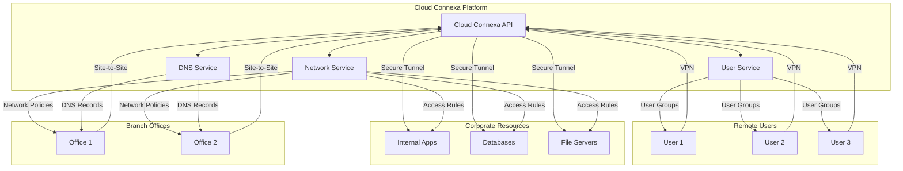

# Cloud Connexa Python Client

A Python client library for interacting with the Cloud Connexa API. This client provides a simple and intuitive interface for managing networks, users, DNS records, and other Cloud Connexa resources.

## Overview

Cloud Connexa is a secure networking platform that enables organizations to manage remote access and site-to-site connections. It provides a centralized way to:

- Connect remote users to corporate resources
- Link branch offices and data centers
- Manage access control and security policies
- Monitor network activity and performance



This Python client provides programmatic access to all Cloud Connexa features, allowing you to:

1. **Manage Networks**
   - Create and configure secure networks
   - Set up site-to-site connections
   - Define routing policies

2. **Control Access**
   - Manage user accounts and groups
   - Configure access policies
   - Monitor user activity

3. **Handle DNS**
   - Manage DNS records for networks
   - Configure DNS resolution
   - Update DNS settings

4. **Monitor & Maintain**
   - Track network performance
   - View connection status
   - Manage security settings

## Quick Start

```python
from cloudconnexa import CloudConnexaClient

# Initialize client with environment variables
client = CloudConnexaClient()

# Or with explicit configuration
client = CloudConnexaClient(
    api_url="https://api.cloudconnexa.com",
    client_id="your_client_id",
    client_secret="your_client_secret",
    api_version="1.1.0"  # Optional, defaults to latest
)

# List networks
networks = client.networks.list()
for network in networks["data"]:
    print(f"Network: {network.name}")

# Create a new network
new_network = client.networks.create(
    name="My Network",
    description="A test network"
)
```

## Installation

### From PyPI
```bash
pip install cloudconnexa
```

### From Source
```bash
git clone https://github.com/yourusername/ovpn-connexa.git
cd ovpn-connexa
pip install -e ".[dev]"
```

### As a Git Submodule
```bash
git submodule add https://github.com/yourusername/ovpn-connexa.git libs/ovpn-connexa
git submodule update --init --recursive
```

## Configuration

The client can be configured using environment variables or by passing parameters directly:

Required environment variables:
- `CLOUDCONNEXA_API_URL`: Base URL for the API
- `CLOUDCONNEXA_CLIENT_ID`: Your client ID
- `CLOUDCONNEXA_CLIENT_SECRET`: Your client secret

```python
# Using environment variables
client = CloudConnexaClient()

# Or with explicit configuration
client = CloudConnexaClient(
    api_url="https://api.cloudconnexa.com",
    client_id="your_client_id",
    client_secret="your_client_secret",
    api_version="1.1.0"  # Optional, defaults to latest
)
```

## Core Features

- Complete Cloud Connexa API v1.1.0 coverage
- Authentication and token management
- Network management
- User management
- Connector and route management
- DNS record management (v1.1.0)
- User group management (v1.1.0)
- IP service management
- Comprehensive error handling
- Rate limiting and security features

## Available Services

### Networks
- `list()`: List all networks
- `create(name, **kwargs)`: Create a new network
- `get(network_id)`: Get network details
- `update(network_id, **kwargs)`: Update network
- `delete(network_id)`: Delete network

### Users
- `list()`: List all users
- `create(email, **kwargs)`: Create a new user
- `get(user_id)`: Get user details
- `update(user_id, **kwargs)`: Update user
- `delete(user_id)`: Delete user

### DNS
- `list()`: List DNS records
- `create(domain, **kwargs)`: Create DNS record
- `get(record_id)`: Get DNS record
- `update(record_id, **kwargs)`: Update DNS record
- `delete(record_id)`: Delete DNS record

### User Groups
- `list()`: List user groups
- `create(name, **kwargs)`: Create user group
- `get(group_id)`: Get group details
- `update(group_id, **kwargs)`: Update group
- `delete(group_id)`: Delete group

### IP Services
- `list()`: List IP services
- `create(**kwargs)`: Create IP service
- `get(service_id)`: Get service details
- `update(service_id, **kwargs)`: Update service
- `delete(service_id)`: Delete service

## Error Handling

The client uses custom exceptions for different error cases:

```python
from cloudconnexa.utils.errors import (
    APIError,
    AuthenticationError,
    ConfigurationError,
    ResourceNotFoundError,
    ValidationError,
    RateLimitError
)

try:
    network = client.networks.get("non-existent-id")
except ResourceNotFoundError as e:
    print(f"Network not found: {e}")
except APIError as e:
    print(f"API error: {e}")
```

## Project Structure

```
cloudconnexa/
├── client/           # Core client implementation
├── services/         # API service implementations
│   ├── networks/     # Network management
│   ├── users/        # User management
│   ├── dns/         # DNS record management
│   ├── ip_services/ # IP service management
│   └── user_groups/ # User group management
├── models/          # Data models
├── utils/           # Utilities and helpers
└── exceptions.py    # Custom exceptions
```

## Documentation

- [API Reference](docs/api/README.md)
- [Examples](docs/examples/README.md)
- [Architecture](docs/architecture/README.md)
- [Development Guide](docs/development/README.md)
- [Testing Guide](docs/testing/README.md)

## Development

### Setting Up Development Environment

1. Clone the repository
2. Create a virtual environment:
   ```bash
   python -m venv .venv
   source .venv/bin/activate  # Linux/Mac
   # or
   .venv\Scripts\activate  # Windows
   ```
3. Install development dependencies:
   ```bash
   pip install -e ".[dev]"
   ```

### Running Tests

```bash
pytest
```

### Code Style

We use black for code formatting and flake8 for linting:

```bash
black .
flake8
```

## Contributing

Contributions are welcome! Please feel free to submit a Pull Request. For major changes, please open an issue first to discuss what you would like to change.

## License

This project is licensed under the MIT License - see the LICENSE file for details.

## References

- [Cloud Connexa API Documentation](https://openvpn.net/cloud-docs/developer/cloudconnexa-api-v1-1-0.html)
- [Original Go Client](https://github.com/OpenVPN/cloudconnexa-go-client)
