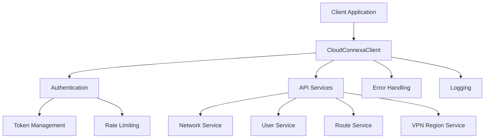

# Cloud Connexa Python Client

A Python client for the Cloud Connexa API, providing a simple and intuitive interface for managing Cloud Connexa resources.

## Quick Start

```bash
# First-time setup made easy
./start.sh
```

This script will help you set up the development environment and run tests to verify your installation.

## Quick Reference

```python
# Authentication
from cloudconnexa import CloudConnexaClient
client = CloudConnexaClient(
    api_url="https://your-cloud-id.api.openvpn.com",
    client_id="your-client-id",
    client_secret="your-client-secret"
)

# API Version Compatibility (supports both v1.0 and v1.1.0)
client_default = CloudConnexaClient(...)  # Uses latest version (1.1.0) by default
client_v1 = CloudConnexaClient(..., api_version="1.0")  # Explicitly use v1.0
print(f"Using API version: {client.api_version}")  # Check current version

# Common operations
networks = client.networks.list()                  # List all networks
users = client.users.list()                        # List all users
groups = client.user_groups.list()                 # List all user groups
connectors = client.connectors.list(network_id)    # List network connectors
routes = client.routes.list(network_id, connector_id)  # List connector routes
profiles = client.profiles.list(user_id)           # List user VPN profiles
audit_logs = client.audit_logs.list()              # Get audit logs for monitoring
connections = client.connections.list(network_id)  # View active VPN connections
```

## Developer Story: Automating Project Team VPN Access

A common business need is granting secure VPN access to project teams, then revoking access when the project completes. Here's how to automate this workflow:

```python
import os
from cloudconnexa import CloudConnexaClient

# Initialize the client
client = CloudConnexaClient(
    api_url=os.environ.get("CLOUDCONNEXA_API_URL"),
    client_id=os.environ.get("CLOUDCONNEXA_CLIENT_ID"),
    client_secret=os.environ.get("CLOUDCONNEXA_CLIENT_SECRET")
)

# 1. Create a project-specific network
project_network = client.networks.create(
    name="Project-Alpha",
    description="Secure network for Project Alpha team",
    internet_access="split_tunnel_on"
)

# 2. Create a user group for the project team
team_group = client.user_groups.create(name="Project-Alpha-Team")

# 3. Grant the group access to the network
client.network_accesses.create(
    network_id=project_network.id,
    group_id=team_group.id
)

# 4. Add team members to the group
team_members = ["alice@example.com", "bob@example.com", "charlie@example.com"]
for email in team_members:
    # Find or create the user
    users = [u for u in client.users.list() if u.email.lower() == email.lower()]
    user = users[0] if users else client.users.create(
        email=email,
        first_name=email.split("@")[0],  # Simple placeholder
        last_name="",
        role="member"
    )
    
    # Add to project group
    client.user_groups.add_user(
        group_id=team_group.id,
        user_id=user.id
    )
    
    # Generate VPN profile
    profile = client.profiles.create(
        user_id=user.id,
        network_id=project_network.id,
        name=f"Project-Alpha-{email.split('@')[0]}"
    )
    print(f"Created profile for {email}: {profile.name}")

# When project ends:
# client.user_groups.delete(group_id=team_group.id)
# client.networks.delete(network_id=project_network.id)
```

This example demonstrates creating a network, managing group-based access, and generating VPN profiles - all common tasks for securing project resources.

## Getting Started

### Authentication

First, obtain API credentials from the CloudConnexa Administration portal:

1. Log in to your Administration portal (e.g., `https://your-company.openvpn.com`)
2. Navigate to **API & Logs > API**
3. Click **Create Credentials**
4. Copy and securely store your Client ID and Client Secret
5. Enable the API using the toggle button

Then use these credentials to initialize the client:

```python
from cloudconnexa import CloudConnexaClient
import os

# Initialize client with secure credential handling
client = CloudConnexaClient(
    api_url=os.getenv("CLOUDCONNEXA_API_URL"),      # https://your-cloud-id.api.openvpn.com
    client_id=os.getenv("CLOUDCONNEXA_CLIENT_ID"),  # Your API client ID
    client_secret=os.getenv("CLOUDCONNEXA_CLIENT_SECRET")  # Your API client secret
)
```

### Basic Operations

Once authenticated, you can manage your Cloud Connexa resources:

```python
# List networks
networks = client.networks.list()
print(f"Found {len(networks)} networks")

# Create a new network
network = client.networks.create(
    name="test-network",
    description="Test network created via API",
    internet_access="split_tunnel_on",
    egress=True
)
print(f"Created network: {network.name} (ID: {network.id})")

# Create a connector in the network
connector = client.connectors.create(
    network_id=network.id,
    name="test-connector",
    vpn_region="us-east-1"  # Use client.vpn_regions.list() to get available regions
)
print(f"Created connector: {connector.name} (ID: {connector.id})")

# Add a route to the connector
route = client.routes.create(
    network_id=network.id,
    connector_id=connector.id,
    cidr="10.0.0.0/8",
    description="Internal network"
)
print(f"Added route: {route.cidr}")
```

For more comprehensive examples, check our developer guides below.

### Developer Guides

We provide guides for common VPN administration tasks:

#### [Common VPN Operations](docs/examples/common_tasks.md)
Task-focused guides for everyday VPN management:

| Task | Description | Guide Section |
|------|-------------|--------------|
| 🔑 **Access Control** | Grant/revoke network access to users and groups | [VPN Access Control](docs/examples/common_tasks.md#9-vpn-access-control-management) |
| 👤 **User Onboarding** | Add users and assign them to groups | [User Onboarding](docs/examples/common_tasks.md#1-user-onboarding-workflow) |
| 📱 **Client Profiles** | Generate and distribute VPN configurations | [Profile Management](docs/examples/common_tasks.md#10-vpn-client-profile-management) |
| 🔍 **Audit & Monitoring** | Track activity and view connections | [Audit Logs](docs/examples/common_tasks.md#11-audit-logs-and-usage-monitoring) |
| 🌐 **Network Setup** | Create and configure networks | [Network Configuration](docs/examples/common_tasks.md#2-network-configuration-management) |
| 🔄 **Identity Integration** | Sync with SCIM providers and HR systems | [Identity Provider Integration](docs/examples/common_tasks.md#12-identity-provider-integration-and-user-provisioning) |

#### [Security and Automation Guides](docs/examples/)

Additional guides for specific scenarios:

* [**Security & Troubleshooting**](docs/examples/security_troubleshooting.md): Emergency access revocation, key rotation, and security audits
* [**Automation & Infrastructure as Code**](docs/examples/automation_iac.md): Terraform, CI/CD, and Kubernetes integration
* [**API Integration Patterns**](docs/examples/api_integration_patterns.md): Web services, serverless functions, and microservices integration
* [**Monitoring & Observability**](docs/examples/monitoring_observability.md): Setting up metrics collection and alerts
* [**API Version Compatibility**](docs/examples/api_versioning.md): Working with both v1.0 and v1.1.0 API versions seamlessly

For the full list of guides, see our [Examples Documentation](docs/examples/README.md).

## Installation

### From PyPI
```bash
pip install ovpn-connexa
```

### From Source
```bash
git clone https://github.com/yourusername/ovpn-connexa.git
cd ovpn-connexa
pip install -e ".[dev]"
```

### As a Git Submodule
```bash
git submodule add https://github.com/yourusername/ovpn-connexa.git libs/ovpn-connexa
git submodule update --init --recursive
```

For detailed installation instructions, see [Development Documentation](docs/development/README.md).

## Project Documentation

The project documentation is organized into the following sections:

- **[Examples](docs/examples/README.md)** - Usage examples for common and advanced scenarios
- **[API Documentation](docs/api/README.md)** - API endpoints and usage
- **[Architecture](docs/architecture/README.md)** - Design decisions and patterns
- **[Development](docs/development/README.md)** - Setup and contributing guides
- **[Testing](docs/testing/README.md)** - Testing strategy and specifications

## Project Overview

This library provides a Python interface to the Cloud Connexa API, allowing developers to programmatically manage their Cloud Connexa resources. The library is designed to be easy to use while providing complete coverage of the Cloud Connexa API functionality.

## Architecture



## Key Features

- Complete Cloud Connexa API v1.1.0 coverage
- Authentication and token management
- Network management
- User management
- Connector and route management
- DNS record management (v1.1.0)
- User group management (v1.1.0)
- IP service management
- Comprehensive error handling
- Rate limiting and security features

For detailed feature information, see [API Documentation](docs/api/README.md).

## Project Structure

The project follows a clean, modular structure with:

- `src/cloudconnexa/` - Main package with client, services, and models
  - `client/` - API client with version detection and authentication
  - `models/` - Data models for DNS records, user groups, and IP services
  - `services/` - Service implementations with version compatibility
  - `utils/` - Utilities for error handling, validation, and version management
- `tests/` - Comprehensive test suite
  - `unit/` - Unit tests for individual components
  - `integration/` - Integration tests for API version compatibility
  - `functional/` - Real-world functional tests
- `docs/` - Comprehensive documentation
  - `api/` - API reference documentation
  - `examples/` - Usage examples for common and advanced scenarios
  - `testing/` - Testing strategy and specifications
  - `planning/` - Project plans, status reports, and version migration guides
    - [`status.md`](docs/planning/status.md) - Current project status and roadmap

This structure ensures clear separation of concerns and makes the version compatibility features easy to maintain across the codebase.

For detailed structure, see [Development Documentation](docs/development/README.md).

## Project Status

For the current project status, roadmap, and timeline, see our [Project Status](docs/planning/status.md) document.

## Security Features

- Secure credential management
- Request signing for API authentication
- TLS/SSL verification
- Input validation and sanitization
- Protection against common security vulnerabilities

For detailed security information, see [Security Architecture](docs/architecture/security.md).

## Testing

The project uses pytest for comprehensive testing including:

- Component tests for core functionality
- Cross-component integration tests
- API version compatibility tests

For testing details, see [Testing Documentation](docs/testing/README.md).

## Contributing

Contributions are welcome! Please feel free to submit a Pull Request. For major changes, please open an issue first to discuss what you would like to change.

For contribution guidelines, see [Development Documentation](docs/development/README.md).

## License

This project is free and open-source, licensed under the MIT license. See the LICENSE file for details.


## References

- [Cloud Connexa API Documentation](https://openvpn.net/cloud-docs/developer/cloudconnexa-api-v1-1-0.html)
- [Original Go Client](https://github.com/OpenVPN/cloudconnexa-go-client) 