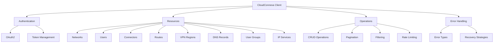
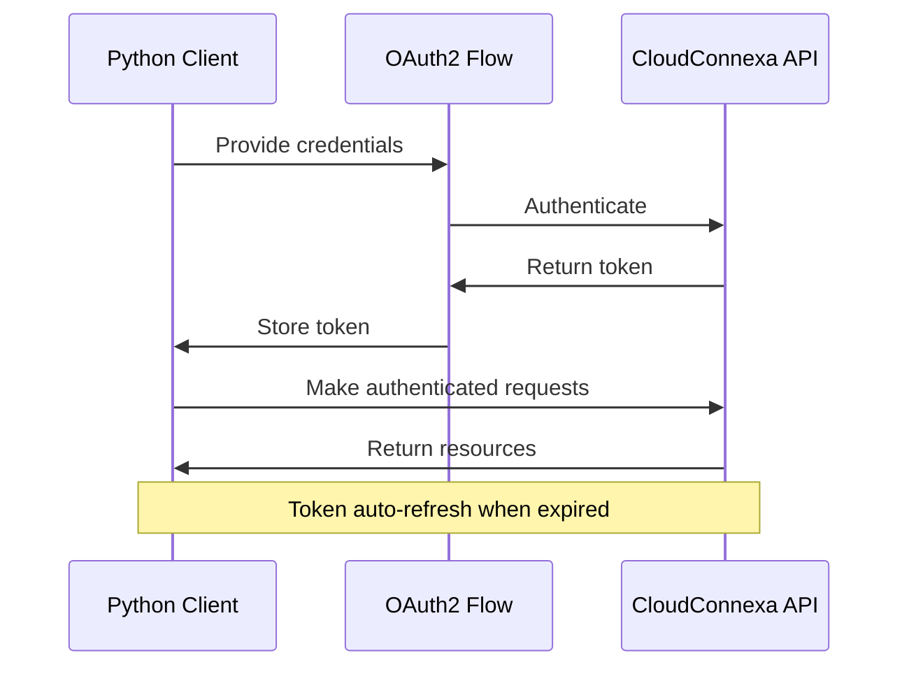
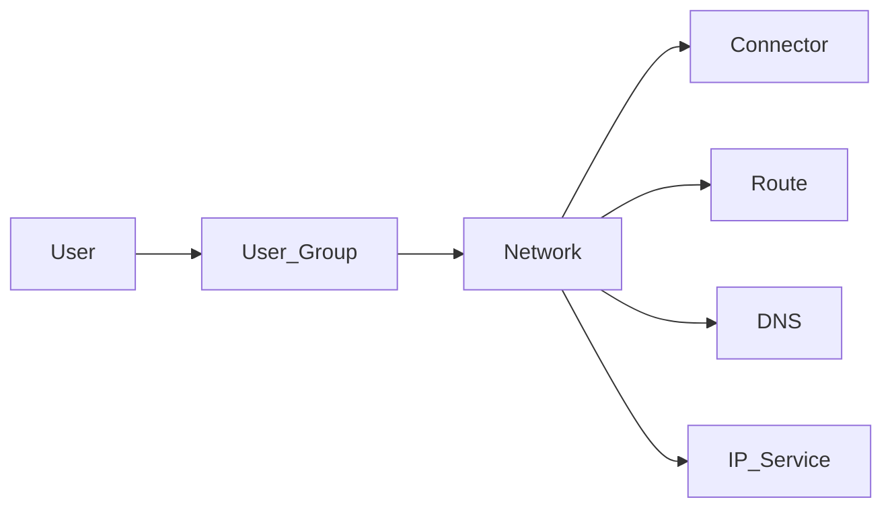
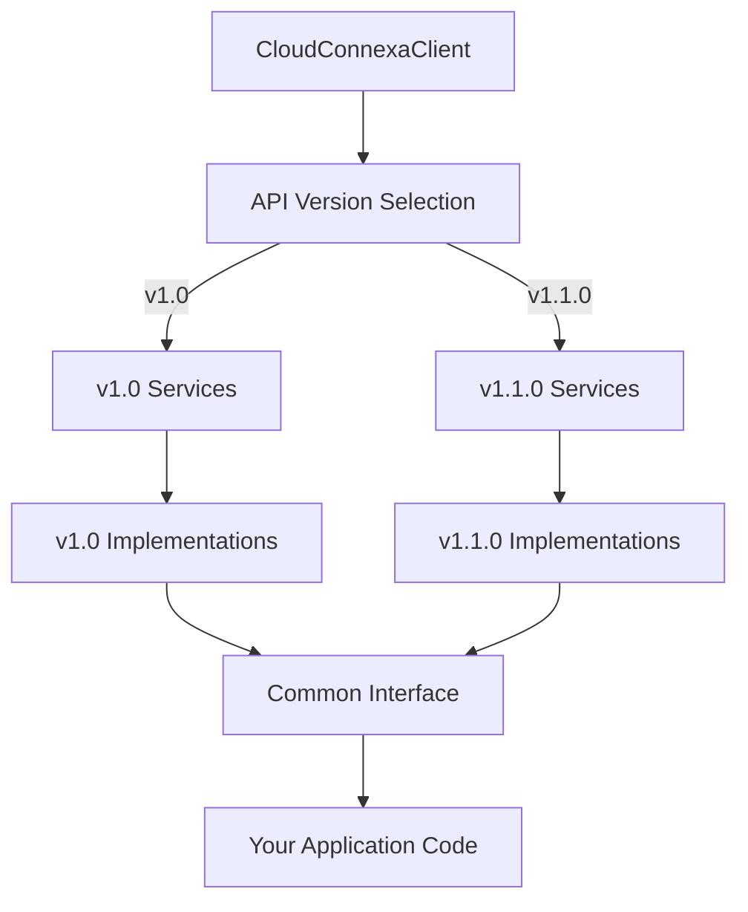
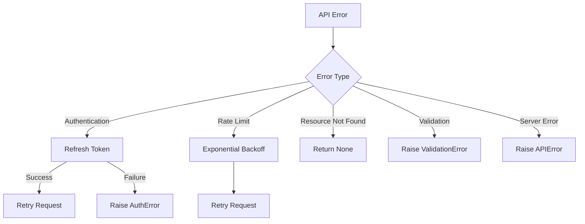

# CloudConnexa API Client Documentation

## Overview


This directory provides documentation for the Python client implementation of the [CloudConnexa API v1.1.0](https://openvpn.net/cloud-docs/developer/cloudconnexa-api-v1-1-0.html). It focuses on how our client library implements the API, with code examples and usage patterns.

## Client Implementation Focus

### Authentication Flow


### Resource Relationships


## Key Implementation Features

1. **Credentials Management**
   - Environment variables and config file support
   - Secure token storage
   - Automatic token refresh

2. **Resource Objects**
   - Type-hinted models for all resources
   - Serialization/deserialization
   - Validation helpers

3. **Service Layer**
   - Consistent interface for all resources
   - Pagination handling
   - Error transformation

4. **v1.1.0 Features**
   - Single DNS record retrieval
   - Single User Group retrieval
   - Updated IP Service DTO handling

## API Version Strategy

The client implements a comprehensive versioning strategy to support both current (v1.1.0) and previous (v1.0) API versions:



### Version Selection

You can specify which API version to use when initializing the client:

```python
# Default to latest version (1.1.0)
client = CloudConnexaClient(
    api_url="https://api.cloudconnexa.com",
    client_id="your_client_id",
    client_secret="your_client_secret"
)

# Explicitly use older version
client_v1_0 = CloudConnexaClient(
    api_url="https://api.cloudconnexa.com",
    client_id="your_client_id",
    client_secret="your_client_secret",
    api_version="1.0"
)
```

### Version Implementation Details

The client uses different implementation classes based on the selected version while maintaining a consistent interface:

1. **For v1.0:**
   ```python
   # Example of v1.0 service implementation
   class DNSServiceV1:
       def get(self, record_id):
           # v1.0 doesn't have single record endpoint,
           # so list and filter
           records = self.list(record_id=record_id)
           return records[0] if records else None
   ```

2. **For v1.1.0:**
   ```python
   # Example of v1.1.0 service implementation
   class DNSServiceV110:
       def get(self, record_id):
           # v1.1.0 has a dedicated endpoint
           response = self.client.execute_request(
               "GET", f"/dns/{record_id}"
           )
           return DNSAdapter.to_model(response.json(), version="1.1.0")
   ```

### Key Version Differences

| Feature | v1.0 | v1.1.0 | Implementation Approach |
|---------|------|--------|-------------------------|
| DNS Record Retrieval | List and filter | Direct endpoint | Abstracted in client |
| User Group Retrieval | List and filter | Direct endpoint | Abstracted in client |
| IP Service DTO | With routing | Without routing | Adapter handles differences |

### Migrating Between Versions

For applications transitioning from v1.0 to v1.1.0:

1. **Simple Approach:** Update client initialization to use the new version
2. **Gradual Approach:** Use feature detection and fallbacks
3. **Hybrid Approach:** Maintain separate clients during transition

For detailed migration guidance, see [API Versioning and Migration](../examples/api_versioning.md).

## Usage Pattern
All API resources follow this consistent pattern:

```python
# Resource listing with optional filters
resources = client.resource_type.list(filter_param="value")

# Single resource retrieval (using v1.1.0 endpoints where available)
resource = client.resource_type.get("resource_id")

# Resource creation
new_resource = client.resource_type.create({
    "name": "Resource name",
    "property": "value"
})

# Resource update
updated_resource = client.resource_type.update("resource_id", {
    "property": "new value"
})

# Resource deletion
client.resource_type.delete("resource_id")
```

## Error Handling Strategy


### Production-Grade Error Handling

For applications with critical uptime requirements, the client provides robust error handling capabilities:

#### 1. Configurable Retry Policies

```python
# Configure client with custom retry policy
client = CloudConnexaClient(
    # ... authentication credentials ...
    retry_policy=RetryPolicy(
        max_retries=5,
        retry_codes=[408, 429, 500, 502, 503, 504],
        backoff_factor=0.5,
        backoff_max=120,  # Maximum backoff in seconds
        backoff_jitter=True,  # Add randomness to prevent thundering herd
    )
)
```

#### 2. Circuit Breaker Pattern

Prevents cascading failures by temporarily stopping requests to failing services:

```python
# Configure client with circuit breaker
client = CloudConnexaClient(
    # ... authentication credentials ...
    circuit_breaker=CircuitBreaker(
        failure_threshold=10,  # Number of failures before opening circuit
        recovery_timeout=300,  # Seconds before attempting recovery
        expected_exceptions=(ServerError, NetworkError),  # Exceptions that count as failures
    )
)
```

#### 3. Exception Hierarchy for Precise Handling

```python
try:
    networks = client.networks.list()
except AuthenticationError as e:
    # Handle authentication failures
    if e.requires_reauth:
        # Trigger re-authentication flow
    else:
        # Token refresh failed, report error
except RateLimitError as e:
    # Handle rate limiting
    wait_time = e.retry_after or 30
    # Schedule retry after wait_time
except ResourceNotFoundError:
    # Resource doesn't exist, handle gracefully
    networks = []
except ValidationError as e:
    # Invalid request parameters
    log_validation_error(e)
    # Fix parameters and retry
except ServerError as e:
    if e.is_transient:
        # Likely temporary, can retry later
    else:
        # Persistent server error, fallback to alternative
except NetworkError as e:
    # Network connectivity issues
    # Use cached data if available
except CloudConnexaError as e:
    # Catch-all for other client errors
```

#### 4. Timeout Configuration

Control request timeouts to prevent long-running operations from blocking your application:

```python
client = CloudConnexaClient(
    # ... authentication credentials ...
    timeout=(5, 30),  # Connect timeout, read timeout in seconds
)
```

#### 5. Fallback Strategies

```python
def get_networks_with_fallback():
    """Get networks with fallback to cache if API is unavailable."""
    try:
        # Try the API first
        return client.networks.list()
    except (ServerError, NetworkError, RateLimitError):
        # API unavailable, use cache
        cached = cache.get("networks")
        if cached:
            logger.warning("Using cached network data")
            return cached
        else:
            # No cache, return empty list as last resort
            logger.error("No network data available")
            return []
```

#### 6. Logging and Monitoring

```python
# Enhanced error with context for debugging
try:
    network = client.networks.get("network_id")
except CloudConnexaError as e:
    # Log structured error with context
    logger.error(
        "Failed to retrieve network",
        extra={
            "error_code": e.code,
            "error_type": type(e).__name__,
            "network_id": "network_id",
            "request_id": e.context.get("request_id"),
            "status_code": e.response.status_code if hasattr(e, "response") else None,
            "troubleshooting_hint": e.get_troubleshooting_hint(),
        }
    )
    # Report to monitoring system
    metrics.increment("api.error", tags={"type": type(e).__name__})
```

#### 7. Error Event Hooks

```python
# Register error event handlers for centralized error management
client.on_error(lambda e, request, response: 
    sentry.capture_exception(e, extra={
        "request_method": request.method,
        "request_url": request.url,
        "status_code": response.status_code if response else None,
    })
)
```

### Error Type Reference

| Error Type | Description | Recovery Strategy |
|------------|-------------|-------------------|
| `AuthenticationError` | Authentication failed | Refresh token or re-authenticate |
| `TokenRefreshError` | Token refresh failed | Requires re-authentication |
| `ValidationError` | Invalid request parameters | Fix parameters and retry |
| `ResourceNotFoundError` | Resource doesn't exist | Handle gracefully or create resource |
| `RateLimitError` | API rate limit exceeded | Wait and retry with backoff |
| `ServerError` | API server error (5xx) | Retry with backoff or use fallback |
| `NetworkError` | Network connectivity issue | Retry or use cached data |
| `ServiceUnavailableError` | Service is temporarily down | Use circuit breaker pattern |
| `ConfigurationError` | Client misconfiguration | Fix configuration issue |

For more detailed implementation information, see [Error Handling ADR](../architecture/decisions/003_error_handling.md).

## Implementation Notes

For detailed API endpoint documentation, please refer to the [official CloudConnexa API documentation](https://openvpn.net/cloud-docs/developer/cloudconnexa-api-v1-1-0.html). This documentation focuses on how our client implements and interacts with those endpoints.

Each resource has its own implementation file in the `src/cloudconnexa/services/` directory with corresponding models in `src/cloudconnexa/models/`. 