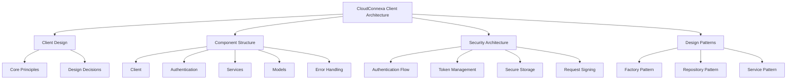
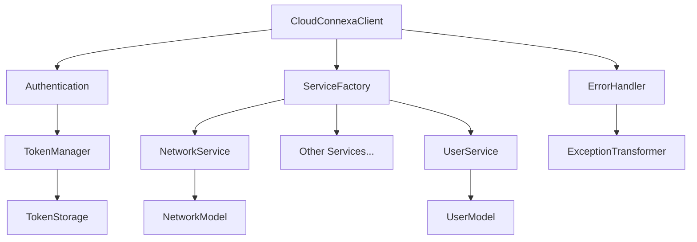
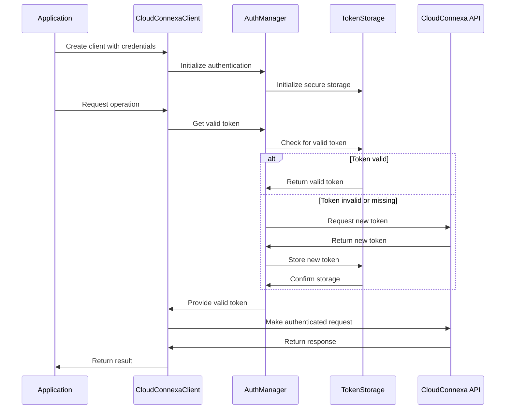

# Architecture Documentation

## Overview


This directory contains the architectural documentation that guides the Cloud Connexa Python client design and implementation. It documents key design decisions, component interactions, security considerations, and design patterns.

## Core Architectural Principles

1. **Separation of Concerns**
   - Clear separation between client, authentication, services, and models
   - Each component has a single responsibility
   - Modular design for easier testing and maintenance

2. **Consistent Interface**
   - All services follow the same interface pattern
   - Predictable method naming and behavior
   - Consistent error handling across all operations

3. **Extensibility**
   - Design supports new API versions
   - Easy to add new services and endpoints
   - Flexible model structure for evolving DTOs

4. **Security by Design**
   - Secure credential management
   - Token handling with automatic refresh
   - Proper request signing and validation

## Component Architecture



## Security Architecture



## Key Documents

- [**architecture.md**](architecture.md) - Detailed system architecture
- [**security.md**](security.md) - Security architecture and considerations
- [**design_patterns.md**](design_patterns.md) - Design patterns used in the project
- [**component_interactions.md**](component_interactions.md) - Component interactions and dependencies
- [**decisions/**](decisions/) - Architecture Decision Records (ADRs)
  - [**001_client_structure.md**](decisions/001_client_structure.md) - Client structure decisions
  - [**002_authentication_flow.md**](decisions/002_authentication_flow.md) - Authentication flow decisions
  - [**003_error_handling.md**](decisions/003_error_handling.md) - Error handling strategy
  - [**004_versioning.md**](decisions/004_versioning.md) - API versioning approach

## Implementation References

When implementing features, refer to these architecture documents to ensure consistency with the overall design. Key implementation patterns include:

1. **Service Implementation**
   ```python
   class ResourceService:
       def __init__(self, client):
           self.client = client
           
       def list(self, **kwargs):
           # Common listing pattern
           
       def get(self, resource_id):
           # Common retrieval pattern
           
       # Other standard operations
   ```

2. **Model Implementation**
   ```python
   class ResourceModel:
       def __init__(self, data):
           self.id = data.get('id')
           # Other properties
           
       def to_dict(self):
           # Serialization pattern
           
       @classmethod
       def from_dict(cls, data):
           # Deserialization pattern
   ```

3. **Error Handling**
   ```python
   try:
       # API operation
   except HTTPError as e:
       if e.response.status_code == 401:
           # Authentication error handling
       elif e.response.status_code == 429:
           # Rate limiting handling
       else:
           # Other error handling
   ```

## Notes for AI
- ADRs (Architecture Decision Records) document key design decisions
- Security architecture is critical and must be followed
- Component interactions are documented for system understanding
- Design patterns should be referenced when implementing features
- Data flow diagrams help understand system behavior
- Architecture decisions should be consistent with existing patterns 