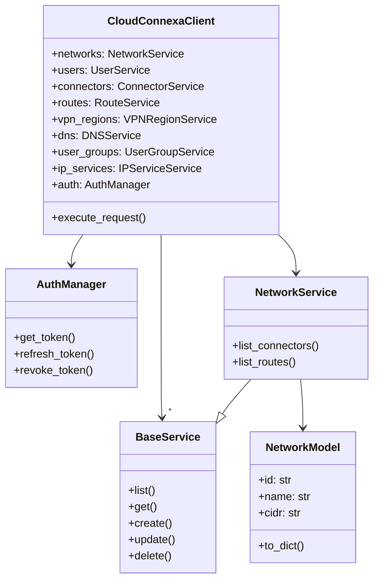

# ADR 001: Client Structure

## Context

When designing the Cloud Connexa Python client, we needed to determine the overall structure of the client library. The structure needs to support:

1. Multiple API versions (v1.0 and v1.1.0 initially)
2. Multiple resources (networks, users, connectors, etc.)
3. Consistent interface across resources
4. Secure authentication
5. Proper error handling
6. Extensibility for future API changes

## Decision

We have decided to implement a modular client structure with the following components:

1. **Main Client Class** (`CloudConnexaClient`)
   - Serves as the primary entry point
   - Manages authentication
   - Provides access to service instances

2. **Service Classes** (one per resource type)
   - Implement resource-specific operations
   - Handle serialization/deserialization
   - Implement version-specific behaviors

3. **Model Classes** (one per resource type)
   - Represent API resources as Python objects
   - Provide type hints and validation
   - Enable IDE auto-completion

4. **Authentication Module**
   - Manages OAuth2 flow
   - Handles token refresh
   - Secures credential storage

5. **Error Handling Module**
   - Defines exception hierarchy
   - Transforms API errors into Python exceptions
   - Provides contextual error information

## Structure



## Code Examples

### Main Client

```python
class CloudConnexaClient:
    def __init__(self, api_url, client_id, client_secret, api_version="1.1.0"):
        self.api_url = api_url
        self.api_version = api_version
        self.auth = AuthManager(client_id, client_secret)
        
        # Initialize services using factory pattern
        self.networks = ServiceFactory.create_service("network", self)
        self.users = ServiceFactory.create_service("user", self)
        # ... other services
        
    def execute_request(self, method, endpoint, **kwargs):
        """Execute an API request with auth and error handling."""
        # Add authentication
        token = self.auth.get_token()
        headers = kwargs.get("headers", {})
        headers["Authorization"] = f"Bearer {token}"
        kwargs["headers"] = headers
        
        # Execute request
        url = f"{self.api_url}/{endpoint.lstrip('/')}"
        response = requests.request(method, url, **kwargs)
        
        # Handle errors
        if not response.ok:
            self._handle_error(response)
            
        return response
```

### Service Base Class

```python
class BaseService:
    def __init__(self, client):
        self.client = client
        
    def list(self, **kwargs):
        """List resources."""
        raise NotImplementedError()
        
    def get(self, resource_id):
        """Get a single resource."""
        raise NotImplementedError()
        
    def create(self, data):
        """Create a resource."""
        raise NotImplementedError()
        
    def update(self, resource_id, data):
        """Update a resource."""
        raise NotImplementedError()
        
    def delete(self, resource_id):
        """Delete a resource."""
        raise NotImplementedError()
```

## Alternative Approaches Considered

### Single Monolithic Class

**Pros:**
- Simpler implementation
- Fewer files

**Cons:**
- Harder to maintain
- Less modular
- Difficult versioning
- No separation of concerns

### Function-Based API

**Pros:**
- Potentially simpler for basic usage
- Familiar to users of other function-based clients

**Cons:**
- Less object-oriented
- Harder to extend
- Doesn't leverage Python's OO features
- Less IDE assistance (type hints, etc.)

## Consequences

### Positive

- Clear separation of concerns
- Each component has a single responsibility
- Easy to extend with new resources
- Easy to add support for new API versions
- Consistent interface across resources
- Type hints enable IDE auto-completion

### Negative

- More complex implementation
- More files to maintain
- Potential overhead from abstraction layers

## Implementation Notes

- Use consistent naming across all service and model classes
- Implement abstract base classes to enforce interfaces
- Use type hints throughout for better IDE support
- Document public interfaces thoroughly

## Related Decisions

- [002: Authentication Flow](002_authentication_flow.md)
- [003: Error Handling](003_error_handling.md)
- [004: Versioning](004_versioning.md) 