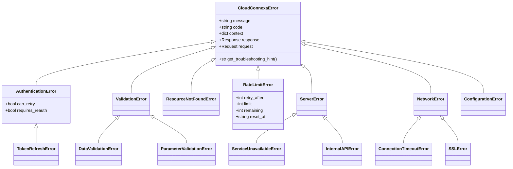
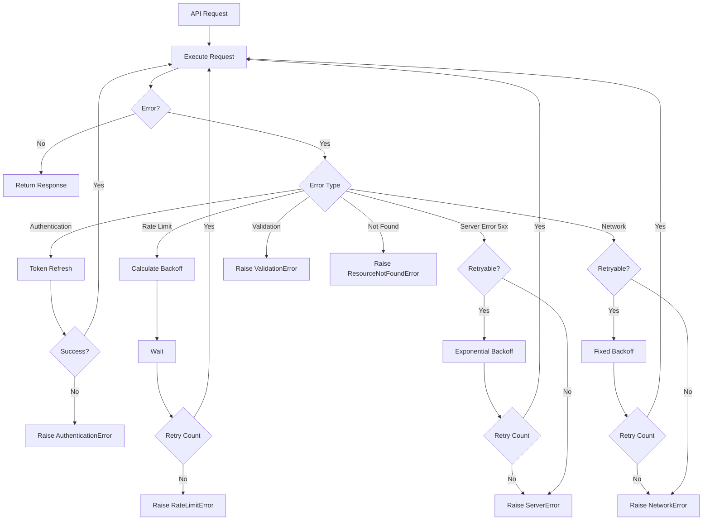

# ADR 003: Error Handling Strategy

## Context

When designing the Cloud Connexa Python client, we needed to determine a comprehensive error handling strategy that would support:

1. Production applications with critical uptime requirements
2. Different types of API errors (authentication, validation, rate limiting, server errors)
3. Appropriate recovery mechanisms for different failure scenarios
4. Consistent error reporting and logging
5. Graceful degradation when API services are unavailable

## Decision

We have decided to implement a multi-layered error handling strategy with:

1. **Typed Exception Hierarchy**
   - Clear exception types for different error categories
   - Rich error details including response data, request context, and troubleshooting hints
   - Standardized error codes across the client

2. **Automatic Recovery Mechanisms**
   - Token refresh for authentication failures
   - Exponential backoff with jitter for rate limiting
   - Configurable retry policies for transient errors
   - Circuit breaker implementation for persistent failures

3. **Graceful Degradation**
   - Fallback mechanisms for critical operations
   - Caching strategies for read operations
   - Offline mode capabilities where applicable

4. **Comprehensive Logging**
   - Structured error logs with contextual information
   - Sanitized sensitive data in logs
   - Correlation IDs for request tracing

## Exception Hierarchy



## Recovery Strategy by Error Type



## Retry Mechanism

The client implements configurable retry mechanisms:

```python
class RetryPolicy:
    def __init__(
        self,
        max_retries=3,
        retry_codes=[408, 429, 500, 502, 503, 504],
        backoff_factor=0.3,
        backoff_max=60,
        backoff_jitter=True,
    ):
        self.max_retries = max_retries
        self.retry_codes = retry_codes
        self.backoff_factor = backoff_factor
        self.backoff_max = backoff_max
        self.backoff_jitter = backoff_jitter
        
    def should_retry(self, exception, retry_count):
        """Determine if the request should be retried based on exception and retry count."""
        if retry_count >= self.max_retries:
            return False
            
        if isinstance(exception, RateLimitError):
            return True
            
        if isinstance(exception, ServerError) and exception.status_code in self.retry_codes:
            return True
            
        if isinstance(exception, NetworkError) and not isinstance(exception, SSLError):
            return True
            
        if isinstance(exception, AuthenticationError) and exception.can_retry and retry_count == 0:
            return True
            
        return False
        
    def get_backoff_time(self, retry_count, exception=None):
        """Calculate the backoff time based on retry count and exception."""
        if isinstance(exception, RateLimitError) and exception.retry_after:
            return exception.retry_after
            
        # Exponential backoff with optional jitter
        backoff = min(self.backoff_max, self.backoff_factor * (2 ** retry_count))
        
        if self.backoff_jitter:
            backoff = backoff * (0.5 + random.random())
            
        return backoff
```

## Circuit Breaker Pattern

For production systems with critical uptime requirements, the client implements a circuit breaker pattern:

```python
class CircuitBreaker:
    """Circuit breaker to prevent repeated calls to failing services."""
    
    CLOSED = 'closed'  # Normal operation, requests go through
    OPEN = 'open'      # Service is failing, requests immediately return error
    HALF_OPEN = 'half_open'  # Testing if service has recovered
    
    def __init__(
        self,
        failure_threshold=5,
        recovery_timeout=60,
        expected_exceptions=(ServerError, NetworkError),
    ):
        self.failure_threshold = failure_threshold
        self.recovery_timeout = recovery_timeout
        self.expected_exceptions = expected_exceptions
        self.state = self.CLOSED
        self.failure_count = 0
        self.last_failure_time = None
        self.lock = threading.RLock()
        
    def __call__(self, func):
        """Decorator to wrap API calls with circuit breaker logic."""
        @functools.wraps(func)
        def wrapper(*args, **kwargs):
            with self.lock:
                if self.state == self.OPEN:
                    if time.time() - self.last_failure_time > self.recovery_timeout:
                        self.state = self.HALF_OPEN
                    else:
                        raise ServiceUnavailableError(
                            "Service is currently unavailable (circuit breaker open)",
                            code="circuit_breaker_open"
                        )
                        
            try:
                result = func(*args, **kwargs)
                
                with self.lock:
                    if self.state == self.HALF_OPEN:
                        self.state = self.CLOSED
                        self.failure_count = 0
                        
                return result
                
            except self.expected_exceptions as e:
                with self.lock:
                    self.last_failure_time = time.time()
                    
                    if self.state == self.CLOSED:
                        self.failure_count += 1
                        if self.failure_count >= self.failure_threshold:
                            self.state = self.OPEN
                            
                    elif self.state == self.HALF_OPEN:
                        self.state = self.OPEN
                        
                raise
                
        return wrapper
```

## Production Example Usage

```python
# Configure client with production-grade error handling
client = CloudConnexaClient(
    api_url=os.getenv("CLOUDCONNEXA_API_URL"),
    client_id=os.getenv("CLOUDCONNEXA_CLIENT_ID"),
    client_secret=os.getenv("CLOUDCONNEXA_CLIENT_SECRET"),
    retry_policy=RetryPolicy(
        max_retries=5,
        backoff_factor=0.5,
        backoff_max=120,
    ),
    circuit_breaker=CircuitBreaker(
        failure_threshold=10,
        recovery_timeout=300,
    ),
    timeout=(5, 30),  # Connect timeout, read timeout
)

# Application-level error handling
try:
    networks = client.networks.list()
except AuthenticationError as e:
    logger.error("Authentication failed", exc_info=e)
    # Trigger re-authentication flow
    # ...
except RateLimitError as e:
    logger.warning(f"Rate limited, retry after {e.retry_after}s", exc_info=e)
    # Schedule retry with appropriate backoff
    # ...
except (ServerError, NetworkError) as e:
    logger.error(f"API error: {e.code}", exc_info=e)
    # Fall back to cached data if available
    networks = cache.get("networks", [])
except ResourceNotFoundError:
    # Handle gracefully
    networks = []
except CloudConnexaError as e:
    logger.error(f"Unexpected client error: {e}", exc_info=e)
    # General fallback strategy
    # ...
```

## Alternative Approaches Considered

### Simple Exception Wrapping

**Pros:**
- Simpler implementation
- Less code to maintain

**Cons:**
- Less context in errors
- No automatic recovery
- Poor support for production requirements

### Function-Based Error Handling

**Pros:**
- Potentially simpler for basic usage
- Less overhead

**Cons:**
- Less robust for production use cases
- Limited recovery options
- More complex implementation for the client user

## Consequences

### Positive

- Production-ready error handling
- Automatic recovery from transient failures
- Protection against cascading failures
- Rich error context for debugging
- Consistent behavior across different error types

### Negative

- Increased complexity
- More configuration options to understand
- Slight performance overhead
- More dependencies

## Implementation Notes

- Error handling should be consistent across all services
- Recovery mechanisms should be configurable but have sensible defaults
- Logging should be comprehensive but careful with sensitive data
- Error messages should be clear and actionable

## Related Decisions

- [001: Client Structure](001_client_structure.md)
- [002: Authentication Flow](002_authentication_flow.md)
- [004: Versioning](004_versioning.md) 