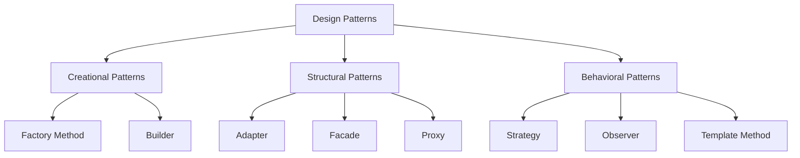

# Design Patterns

## Overview

The Cloud Connexa Python client uses several design patterns to ensure code maintainability, extensibility, and readability. This document outlines the key patterns used in the implementation and provides examples of how they are applied.



## Creational Patterns

### Factory Method Pattern

The Factory Method pattern is used to create service instances without specifying their concrete classes. This allows for flexibility in creating different service implementations for different API versions.

```python
class ServiceFactory:
    """Factory for creating service instances."""
    
    @classmethod
    def create_service(cls, service_type, client, version=None):
        """Create a service instance based on type and version."""
        if version is None:
            version = client.api_version
            
        if service_type == "network":
            if version == "1.0":
                return NetworkServiceV1(client)
            elif version == "1.1.0":
                return NetworkServiceV110(client)
        elif service_type == "user":
            if version == "1.0":
                return UserServiceV1(client)
            elif version == "1.1.0":
                return UserServiceV110(client)
        # Other service types...
        
        raise ValueError(f"Unsupported service type or version: {service_type}, {version}")
```

### Builder Pattern

The Builder pattern is used for constructing complex objects like request parameters:

```python
class RequestBuilder:
    """Builder for API request parameters."""
    
    def __init__(self):
        self.params = {}
        self.headers = {}
        self.body = {}
        
    def with_param(self, key, value):
        """Add query parameter."""
        if value is not None:
            self.params[key] = value
        return self
        
    def with_header(self, key, value):
        """Add request header."""
        if value is not None:
            self.headers[key] = value
        return self
        
    def with_body_field(self, key, value):
        """Add body field."""
        if value is not None:
            self.body[key] = value
        return self
        
    def build(self):
        """Build the request parameters."""
        return {
            "params": self.params,
            "headers": self.headers,
            "json": self.body if self.body else None
        }
```

## Structural Patterns

### Facade Pattern

The main `CloudConnexaClient` class implements the Facade pattern, providing a simplified interface to the complex subsystem of API services:

```python
class CloudConnexaClient:
    """Facade for Cloud Connexa API services."""
    
    def __init__(self, api_url, client_id, client_secret, api_version="1.1.0"):
        self.api_url = api_url
        self.api_version = api_version
        self.auth = AuthManager(client_id, client_secret)
        
        # Initialize services
        self.networks = ServiceFactory.create_service("network", self)
        self.users = ServiceFactory.create_service("user", self)
        self.connectors = ServiceFactory.create_service("connector", self)
        self.routes = ServiceFactory.create_service("route", self)
        self.vpn_regions = ServiceFactory.create_service("vpn_region", self)
        self.dns = ServiceFactory.create_service("dns", self)
        self.user_groups = ServiceFactory.create_service("user_group", self)
        self.ip_services = ServiceFactory.create_service("ip_service", self)
```

### Adapter Pattern

The Adapter pattern is used to adapt different API response formats to a consistent model interface:

```python
class NetworkAdapter:
    """Adapter for network response data."""
    
    @classmethod
    def to_model(cls, data, version=None):
        """Convert API response to model."""
        if version == "1.0":
            # Handle v1.0 format
            return NetworkModel(
                id=data.get("id"),
                name=data.get("name"),
                cidr=data.get("cidr"),
                internet_access=data.get("internetAccess", "split_tunnel_on"),
                egress=data.get("egress", False),
            )
        else:
            # Handle v1.1.0 format (same as v1.0 for networks)
            return NetworkModel(
                id=data.get("id"),
                name=data.get("name"),
                cidr=data.get("cidr"),
                internet_access=data.get("internetAccess", "split_tunnel_on"),
                egress=data.get("egress", False),
            )
```

### Proxy Pattern

The Proxy pattern is used to control access to the API, handling authentication and error processing:

```python
class ApiProxy:
    """Proxy for API requests that handles auth and errors."""
    
    def __init__(self, auth_manager):
        self.auth_manager = auth_manager
        
    def request(self, method, url, **kwargs):
        """Make an API request with authentication and error handling."""
        # Add authentication
        token = self.auth_manager.get_valid_token()
        headers = kwargs.get("headers", {})
        headers["Authorization"] = f"Bearer {token}"
        kwargs["headers"] = headers
        
        # Make the request
        response = requests.request(method, url, **kwargs)
        
        # Handle errors
        if not response.ok:
            self._handle_error(response)
            
        return response
```

## Behavioral Patterns

### Strategy Pattern

The Strategy pattern is used for implementing different authentication strategies:

```python
class AuthStrategy:
    """Base class for authentication strategies."""
    
    def authenticate(self, client):
        """Authenticate with the API."""
        raise NotImplementedError()

class ClientCredentialsStrategy(AuthStrategy):
    """OAuth2 client credentials strategy."""
    
    def authenticate(self, client):
        """Authenticate using client credentials."""
        data = {
            "grant_type": "client_credentials",
            "client_id": client.client_id,
            "client_secret": client.client_secret
        }
        response = requests.post(f"{client.auth_url}/token", data=data)
        if not response.ok:
            raise AuthenticationError("Failed to authenticate", response=response)
            
        return response.json()

class PasswordStrategy(AuthStrategy):
    """OAuth2 password grant strategy."""
    
    def __init__(self, username, password):
        self.username = username
        self.password = password
        
    def authenticate(self, client):
        """Authenticate using password grant."""
        data = {
            "grant_type": "password",
            "client_id": client.client_id,
            "client_secret": client.client_secret,
            "username": self.username,
            "password": self.password
        }
        response = requests.post(f"{client.auth_url}/token", data=data)
        if not response.ok:
            raise AuthenticationError("Failed to authenticate", response=response)
            
        return response.json()
```

### Observer Pattern

The Observer pattern is used to notify components about events like token refresh:

```python
class TokenManager:
    """Manages authentication tokens and notifies observers."""
    
    def __init__(self):
        self.observers = []
        
    def add_observer(self, observer):
        """Add an observer to be notified of token events."""
        self.observers.append(observer)
        
    def remove_observer(self, observer):
        """Remove an observer."""
        self.observers.remove(observer)
        
    def notify_token_refresh(self, new_token):
        """Notify observers that the token has been refreshed."""
        for observer in self.observers:
            observer.on_token_refresh(new_token)
            
    def refresh_token(self, refresh_token):
        """Refresh the token and notify observers."""
        # ... token refresh logic ...
        new_token = self._perform_refresh(refresh_token)
        self.notify_token_refresh(new_token)
        return new_token
```

### Template Method Pattern

The Template Method pattern is used to define the skeleton of CRUD operations, allowing subclasses to override specific steps:

```python
class BaseService:
    """Base service with CRUD template methods."""
    
    def __init__(self, client):
        self.client = client
        
    def list(self, **kwargs):
        """Template method for listing resources."""
        # Prepare request
        params = self._prepare_list_params(kwargs)
        
        # Make request
        response = self._make_list_request(params)
        
        # Process response
        return self._process_list_response(response)
        
    def get(self, resource_id):
        """Template method for getting a resource."""
        # Prepare request
        endpoint = self._get_resource_endpoint(resource_id)
        
        # Make request
        response = self._make_get_request(endpoint)
        
        # Process response
        return self._process_get_response(response)
        
    # Methods to be overridden by subclasses
    def _prepare_list_params(self, kwargs):
        return kwargs
        
    def _make_list_request(self, params):
        raise NotImplementedError()
        
    def _process_list_response(self, response):
        raise NotImplementedError()
        
    def _get_resource_endpoint(self, resource_id):
        raise NotImplementedError()
        
    def _make_get_request(self, endpoint):
        raise NotImplementedError()
        
    def _process_get_response(self, response):
        raise NotImplementedError()
```

## Implementation Best Practices

When implementing these patterns in the Cloud Connexa Python client, follow these best practices:

1. **Consistency**: Use patterns consistently throughout the codebase
2. **Modularity**: Keep implementations modular and focused
3. **Documentation**: Document the pattern usage in docstrings
4. **Testing**: Test each component in isolation
5. **Simplicity**: Use the simplest pattern that meets the requirements

## Pattern Selection Guide

Use these guidelines when selecting patterns for new features:

| Pattern | When to Use |
|---------|-------------|
| Factory | When creating different object variants |
| Builder | For complex object construction with many optional parameters |
| Facade | To provide a simple interface to a complex subsystem |
| Adapter | When adapting between different data formats or interfaces |
| Proxy | For controlling access to resources (auth, validation, etc.) |
| Strategy | When multiple algorithms or behaviors should be interchangeable |
| Observer | For event notification between loosely coupled components |
| Template Method | When defining a skeleton algorithm with customizable steps | 