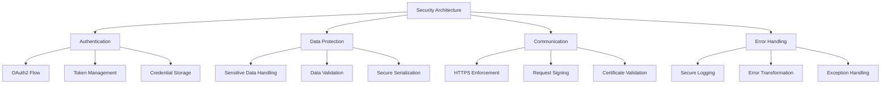
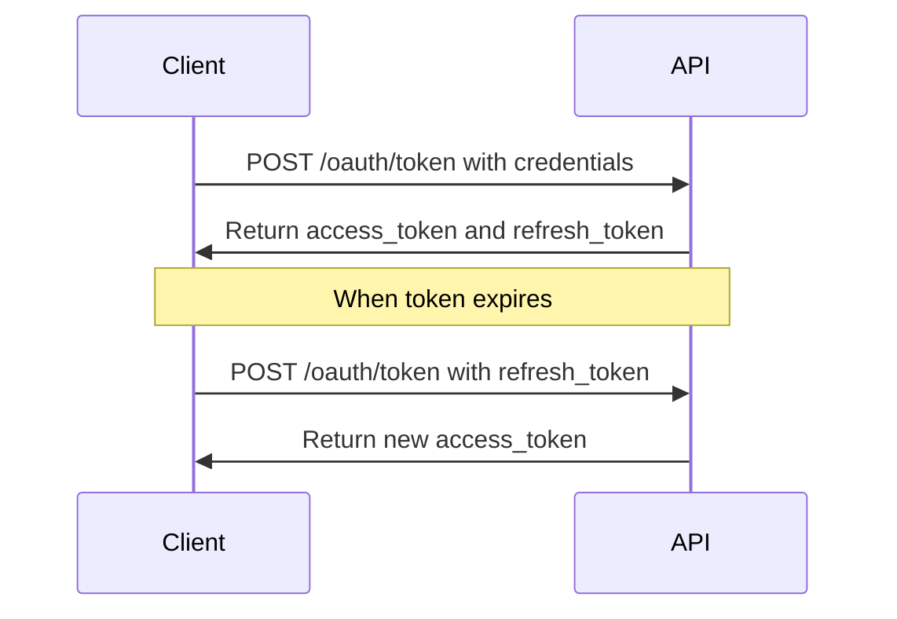

# Security Architecture

## Overview

The Cloud Connexa Python client implements a comprehensive security architecture to ensure secure communication with the API, protection of credentials, and proper handling of sensitive data.



## Authentication Security

### OAuth2 Implementation

The client implements the OAuth2 password grant flow for authentication with the Cloud Connexa API:



### Token Management

```python
class TokenManager:
    def __init__(self, client_id, client_secret, token_storage):
        self.client_id = client_id
        self.client_secret = client_secret
        self.storage = token_storage
        
    def get_valid_token(self):
        """Get a valid token, refreshing if necessary."""
        token = self.storage.get_token()
        
        if not token or self._is_expired(token):
            if token and token.refresh_token:
                token = self._refresh_token(token.refresh_token)
            else:
                token = self._request_new_token()
                
            self.storage.store_token(token)
            
        return token.access_token
```

### Secure Credential Storage

The client supports multiple secure credential storage options:

1. **Environment Variables** (preferred for production)
   ```python
   # Credentials stored in environment variables
   client = CloudConnexaClient.from_env()
   ```

2. **Configuration File** (with proper permissions)
   ```python
   # Credentials stored in ~/.cloudconnexa/config (chmod 600)
   client = CloudConnexaClient.from_config()
   ```

3. **Keyring/Secret Management** (platform-specific secure storage)
   ```python
   # Using system keyring
   client = CloudConnexaClient.from_keyring()
   ```

## Data Protection

### Sensitive Data Handling

The client implements these practices for sensitive data handling:

1. Never log credentials or tokens
2. Mask sensitive data in error messages and logs
3. Avoid storing sensitive data in memory longer than necessary
4. Use secure string handling for credentials

```python
def _log_request(self, request):
    """Log request details without sensitive information."""
    sanitized_headers = {
        k: v if k.lower() not in ['authorization', 'api-key'] else '[REDACTED]'
        for k, v in request.headers.items()
    }
    
    # Log sanitized request
    logger.debug(f"Request: {request.method} {request.url}")
    logger.debug(f"Headers: {sanitized_headers}")
```

### Input Validation

All input to the API is validated before sending:

```python
def validate_network_data(data):
    """Validate network data before sending to the API."""
    required_fields = ['name']
    for field in required_fields:
        if field not in data:
            raise ValidationError(f"Missing required field: {field}")
            
    if 'cidr' in data and not _is_valid_cidr(data['cidr']):
        raise ValidationError(f"Invalid CIDR format: {data['cidr']}")
```

## Secure Communication

### HTTPS Enforcement

The client enforces HTTPS for all API communication:

```python
def _build_url(self, endpoint):
    """Build API URL, ensuring HTTPS is used."""
    base_url = self.api_url
    
    if not base_url.startswith('https://'):
        raise SecurityError("API URL must use HTTPS")
        
    return f"{base_url.rstrip('/')}/{endpoint.lstrip('/')}"
```

### Certificate Validation

The client verifies TLS certificates by default:

```python
def _make_request(self, method, endpoint, **kwargs):
    """Make HTTP request with certificate validation."""
    url = self._build_url(endpoint)
    
    # Ensure certificate validation
    kwargs.setdefault('verify', True)
    
    response = requests.request(method, url, **kwargs)
    return response
```

### Request Signing

For APIs that require it, the client implements request signing:

```python
def _sign_request(self, request, timestamp):
    """Sign the request using HMAC-SHA256."""
    # Create string to sign
    string_to_sign = f"{request.method}\n{request.path}\n{timestamp}"
    
    # Create signature
    signature = hmac.new(
        self.signing_key.encode(),
        string_to_sign.encode(),
        hashlib.sha256
    ).hexdigest()
    
    return signature
```

## Error Handling

### Secure Error Messages

Error messages are sanitized to prevent leaking sensitive information:

```python
def _handle_error(self, response):
    """Handle API error response securely."""
    try:
        error_data = response.json()
        error_code = error_data.get('error', 'unknown_error')
        error_msg = error_data.get('error_description', 'Unknown error')
    except ValueError:
        error_code = f"http_{response.status_code}"
        error_msg = "Could not parse error response"
    
    # Sanitize error message
    sanitized_msg = self._sanitize_error_message(error_msg)
    
    raise APIError(sanitized_msg, code=error_code, response=response)
```

### Security Exception Handling

The client implements specific security-related exceptions:

```python
class SecurityError(CloudConnexaError):
    """Raised when a security constraint is violated."""
    pass
    
class AuthenticationError(CloudConnexaError):
    """Raised when authentication fails."""
    pass
    
class AuthorizationError(CloudConnexaError):
    """Raised when authorization fails."""
    pass
```

## Security Best Practices

### For Client Users

1. **Credential Management**
   - Store credentials in environment variables or secure storage
   - Use least-privilege credentials
   - Rotate credentials regularly

2. **Token Handling**
   - Let the client handle token management automatically
   - Don't extract and store tokens separately
   - Use the built-in secure storage mechanisms

3. **Error Handling**
   - Catch and handle security exceptions specifically
   - Don't log full error responses
   - Watch for authentication errors that may indicate compromise

### For Client Developers

1. **Code Security**
   - Validate all input and output
   - Never disable certificate validation
   - Use secure defaults for all settings
   - Follow OWASP guidelines for secure coding

2. **Testing**
   - Include security tests in test suite
   - Test error handling paths
   - Verify secure token management
   - Test against invalid certificates

3. **Deployment**
   - Verify package integrity with checksums
   - Use dependency scanning to check for vulnerabilities
   - Follow secure CI/CD practices

## Security Compliance

The client is designed to help users comply with security standards:

1. **Data Protection**
   - No sensitive data is stored in plaintext
   - Proper handling of authentication tokens
   - Minimizes data exposure

2. **Communication Security**
   - TLS 1.2+ enforcement
   - Certificate validation
   - Secure HTTP headers

3. **Authentication**
   - Secure implementation of OAuth2
   - Protection against token leakage
   - Proper token refresh handling 