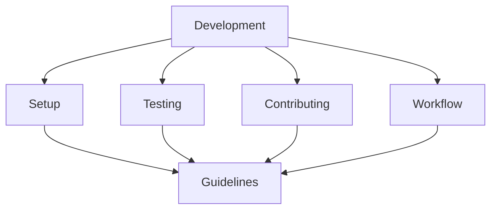

# Development Guides

## Summary


This directory contains essential guides for developers working on the project. It covers everything from initial setup to contributing guidelines, ensuring consistent development practices across the project.

## Notes for AI
- Development guides should be followed when making changes
- Testing requirements must be met
- Code style should be consistent
- Security practices must be followed
- Documentation should be updated with changes
- Workflow guidelines should be respected

## Contents
- Setup and installation guide
- Testing guide
- Contributing guidelines
- Code style guide
- Development workflow
- Debugging guide

These guides help developers get started with the project and maintain consistent development practices.

# Development Guide

This guide explains how to set up and contribute to the Cloud Connexa Python client project using Test-Driven Development (TDD).

## Getting Started with Test-Driven Development

This project follows a test-driven development approach. The basic workflow is:

1. Write a failing test that defines the functionality you want to implement
2. Implement the minimum code required to make the test pass
3. Refactor your code while keeping the tests passing
4. Repeat for the next piece of functionality

## Setting Up Your Development Environment

The easiest way to set up your development environment is using the provided Makefile:

```bash
# Clone the repository
git clone https://github.com/yourusername/ovpn-connexa.git
cd ovpn-connexa

# Set up the development environment (creates venv and installs dependencies)
make setup
```

That's it! All Makefile commands automatically use the virtual environment, so you don't need to activate it manually.

## Running Tests

To run the test suite:

```bash
# Run all tests
make test

# Or run a specific test directly
make PYTEST_ARGS="tests/unit/test_client.py -v" test
```

## Development Workflow

1. **Start with a failing test**: Create or modify a test in the appropriate test directory:
   - `tests/unit/` for unit tests
   - `tests/integration/` for integration tests
   - `tests/functional/` for functional tests

2. **Run the test to verify it fails**:
   ```bash
   make PYTEST_ARGS="tests/unit/your_test_file.py -v" test
   ```

3. **Implement the feature**: Write the minimal code required to make the test pass

4. **Run the test again to verify it passes**:
   ```bash
   make PYTEST_ARGS="tests/unit/your_test_file.py -v" test
   ```

5. **Refactor**: Clean up your code while keeping the tests passing

6. **Commit**: Commit your changes with a descriptive message

## Project Structure

- `src/cloudconnexa/` - Main package code
- `tests/` - Test suite
  - `unit/` - Unit tests
  - `integration/` - Integration tests
  - `functional/` - Functional tests
- `docs/` - Documentation
- `setup.py` - Package installation setup
- `requirements.txt` - Project dependencies
- `Makefile` - Development workflow commands

## Helpful Commands

```bash
# Run the application in development mode
make dev

# Run linters
make lint

# Clean up development artifacts
make clean

# Install the package in development mode
make install

# Get an interactive shell with the virtual environment activated (if needed)
make shell
```

## Contributing

1. Create a new branch for your feature
2. Follow the TDD workflow described above
3. Ensure all tests pass and linting is clean
4. Submit a pull request with a clear description of your changes 