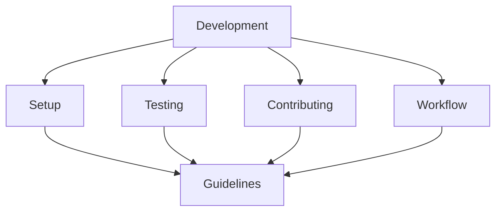

# Development Guides

## Summary

This directory contains essential guides for developers working on the project. It covers everything from initial setup to contributing guidelines, ensuring consistent development practices across the project.

## Notes for AI
- Development guides should be followed when making changes
- Testing requirements must be met
- Code style should be consistent
- Security practices must be followed
- Documentation should be updated with changes
- Workflow guidelines should be respected

## Contents
- Setup and installation guide
- Testing guide
- Contributing guidelines
- Code style guide
- Development workflow
- Debugging guide

These guides help developers get started with the project and maintain consistent development practices. 