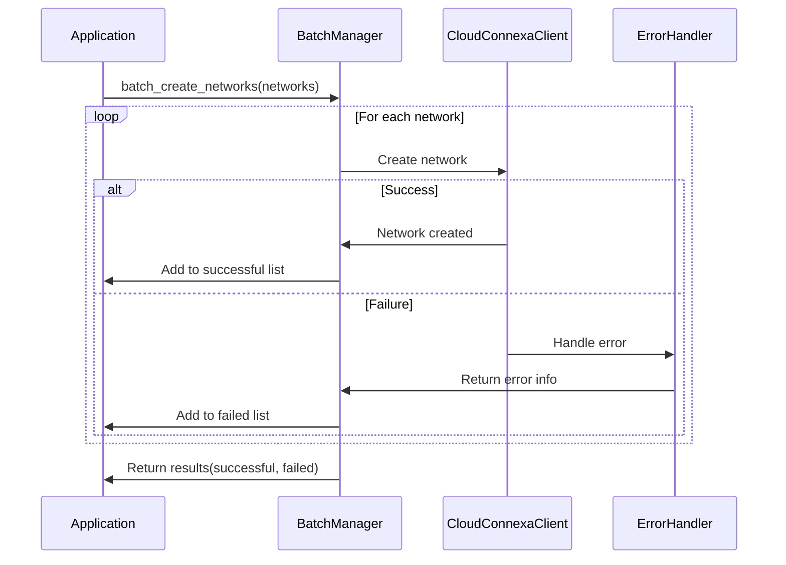

# Batch Operations and Resource Management

This example demonstrates how to efficiently perform batch operations on multiple Cloud Connexa resources, handle partial failures, and implement strategies for optimizing large-scale resource management.

## Overview

When managing infrastructure at scale, performing operations one at a time can be inefficient and error-prone. This example shows how to:

1. Implement batch creation, update, and deletion of resources
2. Handle partial failures during batch operations
3. Track and report on operation status
4. Optimize performance for large batches
5. Implement rollback mechanisms for failed operations

## Batch Creation Pattern



### Implementation

```python
from typing import Dict, List, Tuple, Any, Optional
from cloudconnexa import CloudConnexaClient
from cloudconnexa.exceptions import CloudConnexaError, ValidationError
import concurrent.futures
import logging

class BatchManager:
    """Manager for batch operations on Cloud Connexa resources."""
    
    def __init__(self, client: CloudConnexaClient, logger=None):
        """
        Initialize with a Cloud Connexa client.
        
        Args:
            client: Initialized CloudConnexaClient
            logger: Optional logger instance
        """
        self.client = client
        self.logger = logger or logging.getLogger(__name__)
    
    def batch_create_networks(
        self, 
        networks: List[Dict[str, Any]], 
        parallel: bool = False,
        max_workers: int = 5
    ) -> Tuple[List[Dict[str, Any]], List[Dict[str, Any]]]:
        """
        Create multiple networks in batch.
        
        Args:
            networks: List of network definitions
            parallel: Whether to create networks in parallel
            max_workers: Maximum number of parallel workers (if parallel=True)
            
        Returns:
            Tuple of (successful_networks, failed_networks) where failed_networks
            includes error information.
        """
        successful = []
        failed = []
        
        # Parallel processing
        if parallel:
            with concurrent.futures.ThreadPoolExecutor(max_workers=max_workers) as executor:
                # Submit all network creation tasks
                future_to_network = {
                    executor.submit(self._create_single_network, network): network 
                    for network in networks
                }
                
                # Process results as they complete
                for future in concurrent.futures.as_completed(future_to_network):
                    network = future_to_network[future]
                    try:
                        result = future.result()
                        if result.get("success"):
                            successful.append(result.get("data"))
                        else:
                            failed.append({
                                "network": network,
                                "error": result.get("error"),
                                "error_type": result.get("error_type"),
                                "error_detail": result.get("error_detail")
                            })
                    except Exception as e:
                        self.logger.error(f"Unexpected error in batch creation: {e}")
                        failed.append({
                            "network": network,
                            "error": str(e),
                            "error_type": type(e).__name__,
                            "error_detail": None
                        })
        # Serial processing
        else:
            for network in networks:
                result = self._create_single_network(network)
                if result.get("success"):
                    successful.append(result.get("data"))
                else:
                    failed.append({
                        "network": network,
                        "error": result.get("error"),
                        "error_type": result.get("error_type"),
                        "error_detail": result.get("error_detail")
                    })
        
        return successful, failed
    
    def _create_single_network(self, network: Dict[str, Any]) -> Dict[str, Any]:
        """
        Helper method to create a single network and handle errors.
        
        Returns dict with keys:
            - success: bool
            - data: network data if successful
            - error, error_type, error_detail: error info if failed
        """
        try:
            created_network = self.client.networks.create(**network)
            return {
                "success": True,
                "data": created_network
            }
        except ValidationError as e:
            self.logger.warning(f"Validation error creating network: {e}")
            return {
                "success": False,
                "error": str(e),
                "error_type": "ValidationError",
                "error_detail": getattr(e, "detail", None)
            }
        except CloudConnexaError as e:
            self.logger.error(f"Error creating network: {e}")
            return {
                "success": False,
                "error": str(e),
                "error_type": type(e).__name__,
                "error_detail": getattr(e, "detail", None)
            }
        except Exception as e:
            self.logger.error(f"Unexpected error: {e}")
            return {
                "success": False,
                "error": str(e),
                "error_type": type(e).__name__,
                "error_detail": None
            }
```

## Usage Example

```python
from cloudconnexa import CloudConnexaClient
import os
import logging

# Set up logging
logging.basicConfig(level=logging.INFO)
logger = logging.getLogger("batch_example")

# Initialize client
client = CloudConnexaClient(
    api_url=os.getenv("CLOUDCONNEXA_API_URL"),
    client_id=os.getenv("CLOUDCONNEXA_CLIENT_ID"),
    client_secret=os.getenv("CLOUDCONNEXA_CLIENT_SECRET")
)

# Create batch manager
batch_manager = BatchManager(client, logger=logger)

# Define networks to create
networks_to_create = [
    {
        "name": "batch-network-1",
        "description": "First network in batch",
        "internet_access": "split_tunnel_on",
        "egress": False
    },
    {
        "name": "batch-network-2",
        "description": "Second network in batch",
        "internet_access": "split_tunnel_on",
        "egress": True
    },
    # Intentionally invalid network (for demonstration)
    {
        "name": "",  # Empty name will fail validation
        "description": "Invalid network in batch",
        "internet_access": "invalid_option",  # Invalid option
        "egress": False
    }
]

# Create networks in batch
successful, failed = batch_manager.batch_create_networks(
    networks=networks_to_create,
    parallel=True,
    max_workers=3
)

# Log results
logger.info(f"Successfully created {len(successful)} networks")
for network in successful:
    logger.info(f"  - {network['name']} (ID: {network['id']})")

logger.info(f"Failed to create {len(failed)} networks")
for failure in failed:
    logger.info(f"  - {failure['network'].get('name', 'Unknown')}: {failure['error']}")
```

## Batch Update Pattern

Similarly, we can implement batch update operations:

```python
def batch_update_networks(
    self,
    network_updates: List[Dict[str, Any]],
    parallel: bool = False,
    max_workers: int = 5
) -> Tuple[List[Dict[str, Any]], List[Dict[str, Any]]]:
    """
    Update multiple networks in batch.
    
    Args:
        network_updates: List of network updates, each containing at least 'id' key
        parallel: Whether to update networks in parallel
        max_workers: Maximum number of parallel workers (if parallel=True)
        
    Returns:
        Tuple of (successfully_updated, failed_updates)
    """
    successful = []
    failed = []
    
    # Common validation first to fail fast
    for i, update in enumerate(network_updates):
        if 'id' not in update:
            failed.append({
                "update": update,
                "error": "Missing required 'id' field",
                "error_type": "ValidationError",
                "error_detail": None
            })
            # Remove invalid entry to avoid processing it
            network_updates[i] = None
    
    # Filter out None entries
    network_updates = [u for u in network_updates if u is not None]
    
    # Function to process a single update
    def process_update(update):
        network_id = update.pop('id')
        try:
            updated = self.client.networks.update(network_id, update)
            return {
                "success": True,
                "data": updated
            }
        except ValidationError as e:
            self.logger.warning(f"Validation error updating network {network_id}: {e}")
            return {
                "success": False,
                "update": {"id": network_id, **update},
                "error": str(e),
                "error_type": "ValidationError",
                "error_detail": getattr(e, "detail", None)
            }
        except CloudConnexaError as e:
            self.logger.error(f"Error updating network {network_id}: {e}")
            return {
                "success": False,
                "update": {"id": network_id, **update},
                "error": str(e),
                "error_type": type(e).__name__,
                "error_detail": getattr(e, "detail", None)
            }
    
    # Parallel processing
    if parallel and network_updates:
        with concurrent.futures.ThreadPoolExecutor(max_workers=max_workers) as executor:
            # Deep copy updates to avoid modifying original data
            import copy
            updates_copy = [copy.deepcopy(update) for update in network_updates]
            
            # Submit all update tasks
            future_to_update = {
                executor.submit(process_update, update): i 
                for i, update in enumerate(updates_copy)
            }
            
            # Process results as they complete
            for future in concurrent.futures.as_completed(future_to_update):
                original_idx = future_to_update[future]
                try:
                    result = future.result()
                    if result.get("success"):
                        successful.append(result.get("data"))
                    else:
                        failed.append({
                            "update": result.get("update", network_updates[original_idx]),
                            "error": result.get("error"),
                            "error_type": result.get("error_type"),
                            "error_detail": result.get("error_detail")
                        })
                except Exception as e:
                    self.logger.error(f"Unexpected error in batch update: {e}")
                    failed.append({
                        "update": network_updates[original_idx],
                        "error": str(e),
                        "error_type": type(e).__name__,
                        "error_detail": None
                    })
    # Serial processing
    else:
        for update in network_updates:
            # Create a copy to avoid modifying the original
            import copy
            update_copy = copy.deepcopy(update)
            
            result = process_update(update_copy)
            if result.get("success"):
                successful.append(result.get("data"))
            else:
                failed.append({
                    "update": result.get("update", update),
                    "error": result.get("error"),
                    "error_type": result.get("error_type"),
                    "error_detail": result.get("error_detail")
                })
    
    return successful, failed
```

## Batch Deletion Pattern

```python
def batch_delete_networks(
    self,
    network_ids: List[str],
    parallel: bool = False,
    max_workers: int = 5
) -> Tuple[List[str], List[Dict[str, Any]]]:
    """
    Delete multiple networks in batch.
    
    Args:
        network_ids: List of network IDs to delete
        parallel: Whether to delete networks in parallel
        max_workers: Maximum number of parallel workers (if parallel=True)
        
    Returns:
        Tuple of (successfully_deleted_ids, failed_deletions)
    """
    successful = []
    failed = []
    
    # Function to process a single deletion
    def process_deletion(network_id):
        try:
            self.client.networks.delete(network_id)
            return {
                "success": True,
                "network_id": network_id
            }
        except CloudConnexaError as e:
            self.logger.error(f"Error deleting network {network_id}: {e}")
            return {
                "success": False,
                "network_id": network_id,
                "error": str(e),
                "error_type": type(e).__name__,
                "error_detail": getattr(e, "detail", None)
            }
    
    # Parallel processing
    if parallel:
        with concurrent.futures.ThreadPoolExecutor(max_workers=max_workers) as executor:
            # Submit all deletion tasks
            future_to_id = {
                executor.submit(process_deletion, network_id): network_id 
                for network_id in network_ids
            }
            
            # Process results as they complete
            for future in concurrent.futures.as_completed(future_to_id):
                network_id = future_to_id[future]
                try:
                    result = future.result()
                    if result.get("success"):
                        successful.append(network_id)
                    else:
                        failed.append({
                            "network_id": network_id,
                            "error": result.get("error"),
                            "error_type": result.get("error_type"),
                            "error_detail": result.get("error_detail")
                        })
                except Exception as e:
                    self.logger.error(f"Unexpected error in batch deletion: {e}")
                    failed.append({
                        "network_id": network_id,
                        "error": str(e),
                        "error_type": type(e).__name__,
                        "error_detail": None
                    })
    # Serial processing
    else:
        for network_id in network_ids:
            result = process_deletion(network_id)
            if result.get("success"):
                successful.append(network_id)
            else:
                failed.append({
                    "network_id": network_id,
                    "error": result.get("error"),
                    "error_type": result.get("error_type"),
                    "error_detail": result.get("error_detail")
                })
    
    return successful, failed
```

## Advanced Patterns

### Dependency-Aware Batch Processing

When resources have dependencies, they must be created, updated, or deleted in the correct order:

```python
def batch_create_with_dependencies(
    self,
    resources: Dict[str, List[Dict[str, Any]]],
    dependency_graph: Dict[str, List[str]]
) -> Dict[str, Tuple[List[Dict[str, Any]], List[Dict[str, Any]]]]:
    """
    Create resources in batch with dependency awareness.
    
    Args:
        resources: Dict mapping resource types to lists of resource definitions
                  e.g. {"networks": [...], "users": [...], ...}
        dependency_graph: Dict mapping resource types to their dependencies
                  e.g. {"user_groups": ["users"], "routes": ["networks"], ...}
                  
    Returns:
        Dict mapping resource types to (successful, failed) tuples
    """
    results = {}
    
    # Determine processing order based on dependencies
    processing_order = self._topological_sort(dependency_graph)
    
    # Process resources in order
    for resource_type in processing_order:
        if resource_type not in resources:
            continue
            
        self.logger.info(f"Processing batch for {resource_type}")
        method_name = f"batch_create_{resource_type}"
        
        # Get the appropriate batch method dynamically
        if hasattr(self, method_name):
            batch_method = getattr(self, method_name)
            successful, failed = batch_method(resources[resource_type])
            results[resource_type] = (successful, failed)
        else:
            self.logger.warning(f"No batch method found for {resource_type}")
            results[resource_type] = ([], resources[resource_type])
    
    return results

def _topological_sort(self, graph: Dict[str, List[str]]) -> List[str]:
    """
    Perform a topological sort on the dependency graph.
    
    Returns:
        List of resource types in dependency order (dependencies first)
    """
    # Find all nodes
    nodes = set()
    for node, deps in graph.items():
        nodes.add(node)
        for dep in deps:
            nodes.add(dep)
    
    # Initialize result and visited sets
    result = []
    visited = set()
    temp_visited = set()
    
    # DFS function for topological sort
    def visit(node):
        if node in temp_visited:
            raise ValueError(f"Dependency cycle detected involving {node}")
        if node not in visited:
            temp_visited.add(node)
            
            # Visit dependencies
            if node in graph:
                for dep in graph[node]:
                    visit(dep)
                    
            temp_visited.remove(node)
            visited.add(node)
            result.append(node)
    
    # Visit all nodes
    for node in nodes:
        if node not in visited:
            visit(node)
            
    # Reverse to get dependencies first
    return list(reversed(result))
```

### Transaction-Like Operations with Rollback

For operations that need to be atomic, implement rollback capabilities:

```python
def create_network_with_resources(
    self,
    network_data: Dict[str, Any],
    users: List[Dict[str, Any]] = None,
    connectors: List[Dict[str, Any]] = None,
    routes: List[Dict[str, Any]] = None,
    rollback_on_failure: bool = True
) -> Tuple[Dict[str, Any], Dict[str, Any]]:
    """
    Create a network with associated resources in a transaction-like manner.
    
    Args:
        network_data: Network definition
        users: User definitions to associate with network
        connectors: Connector definitions for the network
        routes: Route definitions for the network
        rollback_on_failure: Whether to roll back all changes on failure
        
    Returns:
        Tuple of (successful_resources, failed_operations)
    """
    successful = {"network": None, "users": [], "connectors": [], "routes": []}
    failed = {"network": None, "users": [], "connectors": [], "routes": []}
    created_resources = []
    
    try:
        # Step 1: Create the network
        try:
            network = self.client.networks.create(**network_data)
            successful["network"] = network
            created_resources.append(("network", network["id"]))
        except Exception as e:
            failed["network"] = {
                "data": network_data,
                "error": str(e),
                "error_type": type(e).__name__
            }
            raise ValueError(f"Failed to create network: {e}")
        
        network_id = network["id"]
        
        # Step 2: Create users if provided
        if users:
            for user_data in users:
                try:
                    user = self.client.users.create(**user_data)
                    successful["users"].append(user)
                    created_resources.append(("user", user["id"]))
                except Exception as e:
                    failed["users"].append({
                        "data": user_data,
                        "error": str(e),
                        "error_type": type(e).__name__
                    })
                    if rollback_on_failure:
                        raise ValueError(f"Failed to create user: {e}")
        
        # Step 3: Create connectors if provided
        if connectors:
            for connector_data in connectors:
                try:
                    # Associate with the network
                    connector_data["network_id"] = network_id
                    connector = self.client.connectors.create(**connector_data)
                    successful["connectors"].append(connector)
                    created_resources.append(("connector", connector["id"]))
                except Exception as e:
                    failed["connectors"].append({
                        "data": connector_data,
                        "error": str(e),
                        "error_type": type(e).__name__
                    })
                    if rollback_on_failure:
                        raise ValueError(f"Failed to create connector: {e}")
        
        # Step 4: Create routes if provided
        if routes:
            for route_data in routes:
                try:
                    # Associate with the network
                    route_data["network_id"] = network_id
                    route = self.client.routes.create(**route_data)
                    successful["routes"].append(route)
                    created_resources.append(("route", route["id"]))
                except Exception as e:
                    failed["routes"].append({
                        "data": route_data,
                        "error": str(e),
                        "error_type": type(e).__name__
                    })
                    if rollback_on_failure:
                        raise ValueError(f"Failed to create route: {e}")
        
        return successful, failed
        
    except Exception as e:
        self.logger.error(f"Transaction failed, performing rollback: {e}")
        
        # Rollback created resources in reverse order
        if rollback_on_failure:
            self._rollback_resources(created_resources)
            
        return successful, failed
    
def _rollback_resources(self, resources: List[Tuple[str, str]]):
    """
    Roll back created resources.
    
    Args:
        resources: List of (resource_type, resource_id) tuples to roll back
    """
    # Process in reverse order (dependencies last)
    for resource_type, resource_id in reversed(resources):
        try:
            self.logger.info(f"Rolling back {resource_type} with ID {resource_id}")
            
            # Get the appropriate service method
            service_name = f"{resource_type}s" if resource_type != "series" else "series"
            if hasattr(self.client, service_name):
                service = getattr(self.client, service_name)
                service.delete(resource_id)
            else:
                self.logger.warning(f"No service found for {resource_type}")
                
        except Exception as rollback_error:
            self.logger.error(f"Error during rollback of {resource_type} {resource_id}: {rollback_error}")
```

## Performance Optimization Strategies

### Rate Limiting Awareness

```python
def batch_operation_with_rate_limiting(
    self,
    operation_func,
    items,
    max_rate: float = 5.0  # 5 requests per second
):
    """
    Perform batch operations with rate limiting awareness.
    
    Args:
        operation_func: Function to perform on each item
        items: List of items to process
        max_rate: Maximum operations per second
    """
    import time
    
    # Calculate sleep time between operations
    sleep_time = 1.0 / max_rate
    
    results = []
    for item in items:
        start_time = time.time()
        
        # Perform operation
        result = operation_func(item)
        results.append(result)
        
        # Calculate time spent in operation
        elapsed = time.time() - start_time
        
        # Sleep if operation was faster than our rate limit allows
        if elapsed < sleep_time:
            time.sleep(sleep_time - elapsed)
    
    return results
```

### Batched Requests

For APIs that support it, sending multiple operations in a single request:

```python
def send_batched_request(
    self,
    operations: List[Dict[str, Any]]
) -> Dict[str, Any]:
    """
    Send multiple operations in a single API request.
    
    Note: This requires API support for batch operations,
    which may not be available in all endpoints.
    
    Args:
        operations: List of operation definitions, each with:
                   - method: HTTP method (GET, POST, PUT, DELETE)
                   - path: API endpoint path
                   - body: Optional request body
                   
    Returns:
        Dict with batch operation results
    """
    try:
        response = self.client.execute_request(
            "POST",
            "/batch",
            json={"operations": operations}
        )
        return response.json()
    except Exception as e:
        self.logger.error(f"Error in batch request: {e}")
        raise
```

## Best Practices for Batch Operations

1. **Always include error handling** - Any batch operation should handle errors for individual items
2. **Consider dependencies** - Create resources in the correct order based on dependencies
3. **Implement rollback mechanisms** - For atomic operations, roll back changes on failure
4. **Respect rate limits** - Be aware of API rate limits and adjust batch sizes accordingly
5. **Provide status reporting** - Report progress for long-running batch operations
6. **Log comprehensively** - Log both successes and failures for troubleshooting
7. **Consider transaction integrity** - Use idempotency tokens if supported by the API
8. **Balance parallelism** - Use parallel processing where appropriate, but don't overwhelm the API
9. **Implement retries** - Retry failed operations with backoff strategies
10. **Plan for recovery** - Store state to allow resuming batch operations

## Conclusion

Efficient batch operations are essential for managing Cloud Connexa resources at scale. By implementing these patterns, you can automate infrastructure provisioning, make large-scale changes safely, and handle errors appropriately to maintain system integrity. 