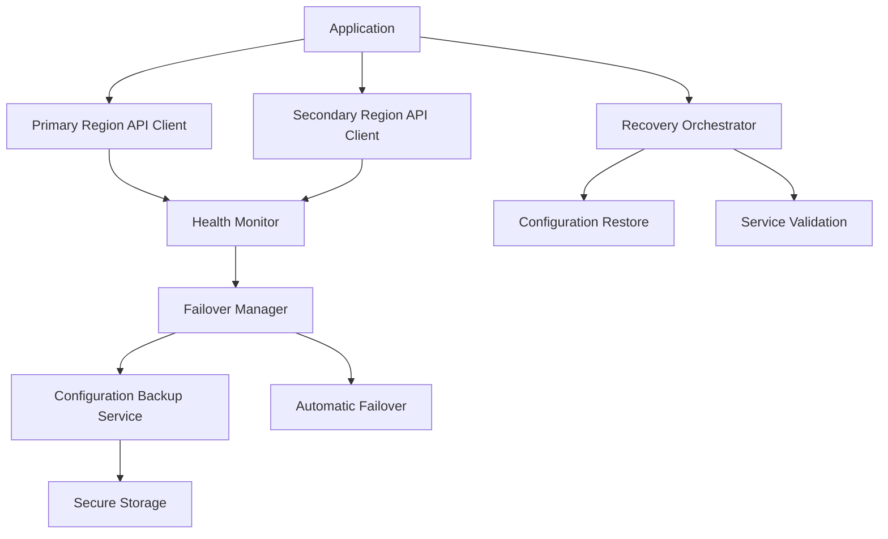

# Disaster Recovery and Business Continuity Planning

This example demonstrates how to implement disaster recovery and business continuity strategies for applications using the Cloud Connexa API client.

## Overview

Maintaining business operations during service disruptions is critical for enterprise applications. This guide covers:

1. Implementing robust failover mechanisms
2. Designing resilient application architectures
3. Developing backup and restore procedures for VPN configurations
4. Creating comprehensive disaster recovery plans
5. Testing and validating recovery processes

## Architecture



## Basic Implementation

### 1. Multi-Region Client Configuration

```python
import os
import json
import logging
import time
from typing import Dict, Any, List, Optional, Tuple
from enum import Enum
from datetime import datetime, timedelta
import threading

from cloudconnexa import (
    CloudConnexaClient,
    RetryPolicy,
    CircuitBreaker,
    CloudConnexaError
)

# Configure logging
logging.basicConfig(level=logging.INFO)
logger = logging.getLogger("cloudconnexa.dr")

class RegionStatus(Enum):
    """Status of a region."""
    HEALTHY = "healthy"
    DEGRADED = "degraded"
    UNAVAILABLE = "unavailable"
    UNKNOWN = "unknown"

class MultiRegionClient:
    """Client that supports failover between multiple regions."""
    
    def __init__(
        self,
        primary_config: Dict[str, Any],
        secondary_configs: List[Dict[str, Any]],
        health_check_interval: int = 60,
        failover_threshold: int = 3
    ):
        """
        Initialize a multi-region client with primary and secondary configurations.
        
        Args:
            primary_config: Configuration for the primary region
            secondary_configs: Configurations for backup regions in priority order
            health_check_interval: Seconds between health checks
            failover_threshold: Number of consecutive failures before failover
        """
        self.primary_config = primary_config
        self.secondary_configs = secondary_configs
        self.health_check_interval = health_check_interval
        self.failover_threshold = failover_threshold
        
        # Initialize clients
        self.primary_client = self._create_client(primary_config)
        self.secondary_clients = [
            self._create_client(config) for config in secondary_configs
        ]
        
        # Current active client
        self.active_client = self.primary_client
        self.active_config = primary_config
        
        # Region health tracking
        self.region_status = {
            self._get_region_id(primary_config): RegionStatus.UNKNOWN
        }
        for config in secondary_configs:
            self.region_status[self._get_region_id(config)] = RegionStatus.UNKNOWN
        
        self.failure_counts = {region_id: 0 for region_id in self.region_status}
        
        # Start health monitoring
        self._stop_monitoring = False
        self._monitor_thread = threading.Thread(
            target=self._health_monitor, 
            daemon=True
        )
        self._monitor_thread.start()
    
    def _get_region_id(self, config: Dict[str, Any]) -> str:
        """Get a unique identifier for a region configuration."""
        return config.get("region_id", config["api_url"])
    
    def _create_client(self, config: Dict[str, Any]) -> CloudConnexaClient:
        """Create a client with appropriate retry and circuit breaker settings."""
        retry_policy = RetryPolicy(
            max_retries=config.get("max_retries", 5),
            retry_delay=config.get("retry_delay", 1),
            max_retry_delay=config.get("max_retry_delay", 30),
            retry_on_status_codes=[429, 500, 502, 503, 504],
            backoff_factor=config.get("backoff_factor", 2.0)
        )
        
        circuit_breaker = CircuitBreaker(
            failure_threshold=config.get("circuit_threshold", 5),
            recovery_timeout=config.get("circuit_recovery", 30),
            failure_status_codes=[500, 502, 503, 504]
        )
        
        return CloudConnexaClient(
            api_url=config["api_url"],
            client_id=config["client_id"],
            client_secret=config["client_secret"],
            retry_policy=retry_policy,
            circuit_breaker=circuit_breaker,
            request_timeout=config.get("timeout", 30)
        )
    
    def _health_monitor(self):
        """Monitor the health of all regions and manage failover."""
        while not self._stop_monitoring:
            for config in [self.primary_config] + self.secondary_configs:
                region_id = self._get_region_id(config)
                client = (
                    self.primary_client 
                    if config == self.primary_config 
                    else self.secondary_clients[self.secondary_configs.index(config)]
                )
                
                try:
                    # Try a lightweight API call to check health
                    start_time = time.time()
                    # Use a non-destructive read operation
                    client.networks.list(limit=1)
                    latency = time.time() - start_time
                    
                    # Update status based on latency
                    if latency < 1.0:
                        self.region_status[region_id] = RegionStatus.HEALTHY
                    else:
                        self.region_status[region_id] = RegionStatus.DEGRADED
                    
                    # Reset failure count on success
                    self.failure_counts[region_id] = 0
                    
                except Exception as e:
                    logger.warning(f"Health check failed for {region_id}: {e}")
                    self.failure_counts[region_id] += 1
                    
                    if self.failure_counts[region_id] >= self.failover_threshold:
                        self.region_status[region_id] = RegionStatus.UNAVAILABLE
                        
                        # If this is the active region, trigger failover
                        if config == self.active_config:
                            self._perform_failover()
            
            # Sleep until next check
            time.sleep(self.health_check_interval)
    
    def _perform_failover(self):
        """Perform failover to the next available region."""
        # Find the first healthy or degraded secondary
        for i, config in enumerate(self.secondary_configs):
            region_id = self._get_region_id(config)
            status = self.region_status[region_id]
            
            if status in [RegionStatus.HEALTHY, RegionStatus.DEGRADED]:
                logger.warning(
                    f"Failing over from {self._get_region_id(self.active_config)} "
                    f"to {region_id}"
                )
                
                self.active_config = config
                self.active_client = self.secondary_clients[i]
                return
        
        logger.error("No healthy regions available for failover!")
```

### 2. Configuration Backup and Restore

```python
class ConfigurationBackup:
    """Backup and restore VPN configurations."""
    
    def __init__(
        self, 
        client: CloudConnexaClient,
        storage_path: str = "backups",
        encryption_key: Optional[str] = None
    ):
        """
        Initialize the backup service.
        
        Args:
            client: The Cloud Connexa client
            storage_path: Directory to store backups
            encryption_key: Optional key to encrypt backup data
        """
        self.client = client
        self.storage_path = storage_path
        self.encryption_key = encryption_key
        
        # Create backup directory if it doesn't exist
        os.makedirs(storage_path, exist_ok=True)
    
    def create_full_backup(self) -> str:
        """
        Create a full backup of all VPN configurations.
        
        Returns:
            Path to the backup file
        """
        # Start with an empty configuration object
        backup = {
            "version": "1.0",
            "timestamp": datetime.now().isoformat(),
            "networks": [],
            "users": [],
            "user_groups": [],
            "connectors": [],
            "routes": [],
            "dns_records": [],
            "ip_services": []
        }
        
        # Back up networks
        try:
            networks = self.client.networks.list()
            for network in networks:
                network_data = network.to_dict()
                
                # Get additional settings for each network
                try:
                    settings = self.client.networks.get_settings(network.id)
                    network_data["settings"] = settings.to_dict()
                except Exception as e:
                    logger.warning(f"Could not fetch settings for network {network.id}: {e}")
                
                backup["networks"].append(network_data)
        except Exception as e:
            logger.error(f"Error backing up networks: {e}")
        
        # Back up users
        try:
            users = self.client.users.list()
            backup["users"] = [user.to_dict() for user in users]
        except Exception as e:
            logger.error(f"Error backing up users: {e}")
        
        # Back up user groups
        try:
            user_groups = self.client.user_groups.list()
            backup["user_groups"] = [group.to_dict() for group in user_groups]
        except Exception as e:
            logger.error(f"Error backing up user groups: {e}")
        
        # Back up connectors
        try:
            connectors = self.client.connectors.list()
            backup["connectors"] = [connector.to_dict() for connector in connectors]
        except Exception as e:
            logger.error(f"Error backing up connectors: {e}")
        
        # Back up routes
        try:
            routes = self.client.routes.list()
            backup["routes"] = [route.to_dict() for route in routes]
        except Exception as e:
            logger.error(f"Error backing up routes: {e}")
        
        # Back up DNS records
        try:
            dns_records = self.client.dns.list_records()
            backup["dns_records"] = [record.to_dict() for record in dns_records]
        except Exception as e:
            logger.error(f"Error backing up DNS records: {e}")
        
        # Back up IP services
        try:
            ip_services = self.client.ip_services.list()
            backup["ip_services"] = [service.to_dict() for service in ip_services]
        except Exception as e:
            logger.error(f"Error backing up IP services: {e}")
        
        # Generate backup filename
        timestamp = datetime.now().strftime("%Y%m%d_%H%M%S")
        filename = f"connexa_backup_{timestamp}.json"
        filepath = os.path.join(self.storage_path, filename)
        
        # Encrypt if necessary
        if self.encryption_key:
            backup_data = self._encrypt_data(json.dumps(backup))
        else:
            backup_data = json.dumps(backup, indent=2)
        
        # Write backup file
        with open(filepath, "w" if not self.encryption_key else "wb") as f:
            f.write(backup_data)
        
        logger.info(f"Backup created at {filepath}")
        return filepath
```

## Disaster Recovery Plan Template

A comprehensive disaster recovery plan should include:

1. **Risk Assessment**
   - Identify key VPN infrastructure components
   - Document potential failure scenarios
   - Rate impact of each scenario

2. **Recovery Strategy**
   - Define Recovery Time Objectives (RTO)
   - Define Recovery Point Objectives (RPO)
   - Document failover procedures for each service

3. **Team Roles and Responsibilities**
   - Assign team members to specific recovery tasks
   - Define escalation procedures
   - Document contact information

4. **Testing and Validation**
   - Schedule regular DR tests
   - Define success criteria
   - Document validation procedures

5. **Recovery Runbooks**
   - Step-by-step instructions for recovery operations
   - API client configuration templates
   - Validation checklists

## Production Implementation Example

### Multi-Region Infrastructure with Automated Failover

```python
from cloudconnexa import CloudConnexaClient
import logging
import os
import json
from datetime import datetime, timedelta

# Initialize logger
logging.basicConfig(level=logging.INFO)
logger = logging.getLogger("dr_example")

# Initialize configuration
PRIMARY_REGION = {
    "region_id": "us-east",
    "api_url": "https://api.us-east.cloudconnexa.com/v1",
    "client_id": os.getenv("CONNEXA_PRIMARY_CLIENT_ID"),
    "client_secret": os.getenv("CONNEXA_PRIMARY_CLIENT_SECRET"),
    "max_retries": 5,
    "retry_delay": 1.0,
    "backoff_factor": 2.0,
    "timeout": 30
}

SECONDARY_REGIONS = [
    {
        "region_id": "us-west",
        "api_url": "https://api.us-west.cloudconnexa.com/v1",
        "client_id": os.getenv("CONNEXA_SECONDARY_CLIENT_ID"),
        "client_secret": os.getenv("CONNEXA_SECONDARY_CLIENT_SECRET"),
        "max_retries": 5,
        "retry_delay": 1.0,
        "backoff_factor": 2.0,
        "timeout": 30
    },
    {
        "region_id": "eu-central",
        "api_url": "https://api.eu-central.cloudconnexa.com/v1",
        "client_id": os.getenv("CONNEXA_TERTIARY_CLIENT_ID"),
        "client_secret": os.getenv("CONNEXA_TERTIARY_CLIENT_SECRET"),
        "max_retries": 5,
        "retry_delay": 1.0,
        "backoff_factor": 2.0,
        "timeout": 30
    }
]

# Initialize multi-region client
dr_client = MultiRegionClient(
    primary_config=PRIMARY_REGION,
    secondary_configs=SECONDARY_REGIONS,
    health_check_interval=60,
    failover_threshold=3
)

# Schedule regular backups
backup_service = ConfigurationBackup(
    client=dr_client.active_client,
    storage_path="/secure/backups/vpn",
    encryption_key=os.getenv("BACKUP_ENCRYPTION_KEY")
)

# Create a full backup
backup_path = backup_service.create_full_backup()
print(f"Backup created: {backup_path}")

# Example operation with the resilient client
try:
    networks = dr_client.active_client.networks.list()
    print(f"Successfully retrieved {len(networks)} networks from {dr_client.active_config['region_id']}")
except Exception as e:
    print(f"Error retrieving networks: {e}")
```

## Best Practices

1. **Documentation**
   - Maintain up-to-date architecture diagrams
   - Document all recovery procedures
   - Keep a log of all DR tests and results

2. **Regular Testing**
   - Conduct scheduled failover tests
   - Validate backup and restore procedures
   - Perform "chaos engineering" exercises

3. **Monitoring and Alerting**
   - Implement early warning systems for degraded performance
   - Set up alerts for failover events
   - Monitor recovery metrics

4. **Security Considerations**
   - Encrypt all backup data
   - Use separate authentication credentials for DR
   - Implement least-privilege access for recovery operations

5. **Compliance and Audit**
   - Document compliance with industry regulations
   - Maintain audit logs for all DR activities
   - Regular review and improvement of DR procedures

## Common Pitfalls

1. **Untested Recovery Plans**
   - Regularly test your disaster recovery procedures
   - Include all team members in DR drills

2. **Over-reliance on Single Region**
   - Implement true multi-region architecture
   - Test application resilience to regional failures

3. **Incomplete Backups**
   - Ensure ALL configuration data is backed up
   - Validate restored configurations

4. **Manual Processes**
   - Automate as much of the DR process as possible
   - Use infrastructure as code for recovery

5. **Poor Communication**
   - Define clear communication channels during outages
   - Document escalation procedures

## Conclusion

Implementing robust disaster recovery procedures for your Cloud Connexa VPN infrastructure is essential for maintaining business continuity. By following the practices outlined in this guide, you can ensure your critical VPN services remain available even during significant disruptions.

Remember that disaster recovery is an ongoing process that requires regular testing, refinement, and improvement. As your application evolves, so should your disaster recovery strategies. 