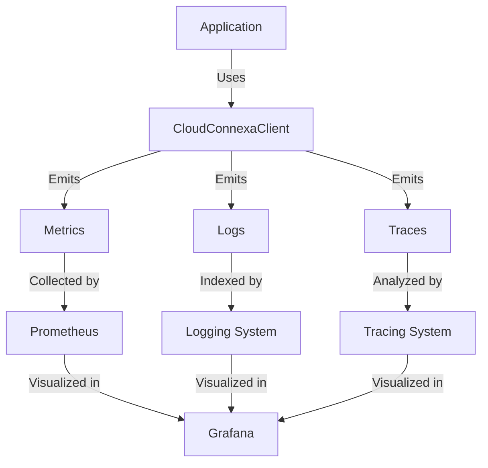
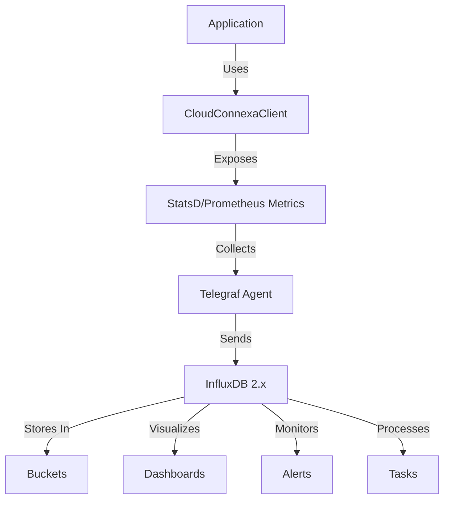

# Monitoring and Observability for Cloud Connexa API Client

This example demonstrates how to implement comprehensive monitoring and observability for the Cloud Connexa API client in production environments, enabling proactive issue detection, performance analysis, and operational visibility.

## Overview

Proper monitoring and observability are essential for operating production services that depend on the Cloud Connexa API. This guide covers:

1. Instrumenting the API client to collect metrics
2. Integrating with popular monitoring systems (Prometheus/Grafana or InfluxDB 2.x)
3. Setting up alerts for proactive issue detection
4. Creating dashboards for operational visibility
5. Implementing distributed tracing for request tracking

## Monitoring Architectures

Two popular monitoring architectures are presented in this guide:

### Prometheus/Grafana Architecture



### InfluxDB 2.x Architecture



## Instrumenting the Client

The first step is to add instrumentation to the Cloud Connexa client to collect metrics about API usage, performance, and errors.

### Option 1: Prometheus-Based Metrics Wrapper

```python
import time
import functools
import threading
from typing import Any, Callable, Dict, List, Optional
from cloudconnexa import CloudConnexaClient

class MonitoredCloudConnexaClient:
    """Wrapper for CloudConnexaClient that adds monitoring capabilities."""
    
    def __init__(
        self, 
        client: CloudConnexaClient, 
        metrics_registry=None,
        service_name: str = "cloudconnexa",
        enable_tracing: bool = True
    ):
        """
        Initialize the monitored client wrapper.
        
        Args:
            client: The CloudConnexaClient instance to wrap
            metrics_registry: The metrics registry (e.g., Prometheus registry)
            service_name: Name to use for service metrics
            enable_tracing: Whether to enable distributed tracing
        """
        self.client = client
        self.service_name = service_name
        self.enable_tracing = enable_tracing
        self._setup_metrics(metrics_registry)
        self._local = threading.local()
        
        # Wrap client services with monitoring
        self._wrap_client_services()
    
    def _setup_metrics(self, registry):
        """Set up the metrics collectors."""
        # Import here to avoid hard dependency
        try:
            import prometheus_client as prom
            
            # Use provided registry or default
            self.registry = registry or prom.REGISTRY
            
            # Counter for API calls
            self.api_calls_total = prom.Counter(
                f'{self.service_name}_api_calls_total',
                'Total number of API calls',
                ['method', 'endpoint', 'status'],
                registry=self.registry
            )
            
            # Histogram for API call latency
            self.api_call_latency = prom.Histogram(
                f'{self.service_name}_api_call_latency_seconds',
                'API call latency in seconds',
                ['method', 'endpoint'],
                buckets=(0.005, 0.01, 0.025, 0.05, 0.075, 0.1, 0.25, 0.5, 0.75, 1.0, 2.5, 5.0, 7.5, 10.0, float('inf')),
                registry=self.registry
            )
            
            # Gauge for connection pool usage
            self.connection_pool_usage = prom.Gauge(
                f'{self.service_name}_connection_pool_usage',
                'Current connection pool usage',
                registry=self.registry
            )
            
            # Counter for errors
            self.api_errors_total = prom.Counter(
                f'{self.service_name}_api_errors_total',
                'Total number of API errors',
                ['method', 'endpoint', 'error_type'],
                registry=self.registry
            )
            
            # Counter for authentication operations
            self.auth_operations_total = prom.Counter(
                f'{self.service_name}_auth_operations_total',
                'Total number of authentication operations',
                ['operation', 'status'],
                registry=self.registry
            )
            
            # Gauge for circuit breaker state
            self.circuit_breaker_state = prom.Enum(
                f'{self.service_name}_circuit_breaker_state',
                'Circuit breaker state',
                states=['closed', 'open', 'half_open'],
                registry=self.registry
            )
            self.circuit_breaker_state.state('closed')
            
            # Counter for rate limit hits
            self.rate_limit_hits_total = prom.Counter(
                f'{self.service_name}_rate_limit_hits_total',
                'Total number of rate limit hits',
                registry=self.registry
            )
            
            self.metrics_enabled = True
        except ImportError:
            self.metrics_enabled = False
            print("Warning: prometheus_client not installed. Metrics collection is disabled.")
    
    def _wrap_client_services(self):
        """Wrap all service methods with monitoring."""
        # For each service (networks, users, etc.)
        for service_name in [
            'networks', 'users', 'connectors', 'routes', 
            'vpn_regions', 'dns', 'user_groups', 'ip_services'
        ]:
            if hasattr(self.client, service_name):
                service = getattr(self.client, service_name)
                
                # Create a new wrapper object with the same methods
                wrapped_service = type(f'Monitored{service.__class__.__name__}', (), {})()
                
                # For each method in the service
                for method_name in ['list', 'get', 'create', 'update', 'delete']:
                    if hasattr(service, method_name):
                        original_method = getattr(service, method_name)
                        
                        # Wrap the method with monitoring
                        wrapped_method = self._wrap_method(
                            original_method, 
                            service_name, 
                            method_name
                        )
                        
                        # Set the wrapped method on our wrapper object
                        setattr(wrapped_service, method_name, wrapped_method)
                
                # Replace the original service with our wrapped version
                setattr(self, service_name, wrapped_service)
    
    def _wrap_method(self, method: Callable, service_name: str, method_name: str) -> Callable:
        """Wrap a service method with monitoring."""
        @functools.wraps(method)
        def wrapper(*args, **kwargs):
            endpoint = f"{service_name}.{method_name}"
            
            # Start distributed tracing span if enabled
            span = None
            if self.enable_tracing:
                try:
                    from opentelemetry import trace
                    tracer = trace.get_tracer(self.service_name)
                    span = tracer.start_span(f"{endpoint}")
                    span.set_attribute("service", service_name)
                    span.set_attribute("operation", method_name)
                    # Add args to span for more context (be careful with sensitive data)
                    if args and method_name in ['get', 'update', 'delete'] and len(args) > 0:
                        span.set_attribute("resource_id", str(args[0]))
                except ImportError:
                    pass
            
            start_time = time.time()
            success = False
            error_type = None
            
            try:
                # Execute the original method
                result = method(*args, **kwargs)
                success = True
                return result
            except Exception as e:
                error_type = type(e).__name__
                if self.metrics_enabled:
                    self.api_errors_total.labels(
                        method=method_name,
                        endpoint=service_name,
                        error_type=error_type
                    ).inc()
                
                # Record error in span
                if span:
                    span.record_exception(e)
                
                raise
            finally:
                # Calculate request duration
                duration = time.time() - start_time
                
                # Record metrics if enabled
                if self.metrics_enabled:
                    self.api_calls_total.labels(
                        method=method_name,
                        endpoint=service_name,
                        status="success" if success else "error"
                    ).inc()
                    
                    self.api_call_latency.labels(
                        method=method_name,
                        endpoint=service_name
                    ).observe(duration)
                
                # End span if tracing enabled
                if span:
                    span.end()
        
        return wrapper
    
    def execute_request(self, *args, **kwargs):
        """Pass through to the underlying client."""
        return self.client.execute_request(*args, **kwargs)
    
    # Add a hook for circuit breaker state changes
    def on_circuit_state_change(self, state: str):
        """Update circuit breaker state metric."""
        if self.metrics_enabled:
            self.circuit_breaker_state.state(state)
    
    # Add a hook for rate limit hits
    def on_rate_limit_hit(self):
        """Increment rate limit hits counter."""
        if self.metrics_enabled:
            self.rate_limit_hits_total.inc()
    
    # Monitor authentication operations
    def on_auth_operation(self, operation: str, status: str):
        """Increment authentication operations counter."""
        if self.metrics_enabled:
            self.auth_operations_total.labels(
                operation=operation,
                status=status
            ).inc()
    
    # Track connection pool usage
    def update_connection_pool_usage(self, usage: int):
        """Update connection pool usage gauge."""
        if self.metrics_enabled:
            self.connection_pool_usage.set(usage)
```

### Option 2: StatsD/Telegraf Metrics Wrapper

For organizations using InfluxDB 2.x, here's a client wrapper that sends metrics via StatsD:

```python
import time
import functools
import threading
import socket
from typing import Any, Callable, Dict, List, Optional
from datetime import datetime
from cloudconnexa import CloudConnexaClient

class StatsDClient:
    """Simple StatsD client implementation."""
    
    def __init__(self, host='localhost', port=8125, prefix='cloudconnexa'):
        """Initialize the StatsD client."""
        self.host = host
        self.port = port
        self.prefix = prefix
        self.socket = socket.socket(socket.AF_INET, socket.SOCK_DGRAM)
    
    def _format_metric_name(self, name):
        """Format a metric name with the prefix."""
        return f"{self.prefix}.{name}"
    
    def _send(self, data):
        """Send data to StatsD."""
        try:
            self.socket.sendto(data.encode('utf-8'), (self.host, self.port))
        except Exception as e:
            # Fail silently - metrics should not break the application
            pass
    
    def increment(self, metric, value=1, tags=None):
        """Increment a counter."""
        formatted_metric = self._format_metric_name(metric)
        if tags:
            formatted_tags = ',' + ','.join([f"{k}={v}" for k, v in tags.items()])
            formatted_metric = f"{formatted_metric}{formatted_tags}"
        
        self._send(f"{formatted_metric}:{value}|c")
    
    def timing(self, metric, value_ms, tags=None):
        """Record a timing in milliseconds."""
        formatted_metric = self._format_metric_name(metric)
        if tags:
            formatted_tags = ',' + ','.join([f"{k}={v}" for k, v in tags.items()])
            formatted_metric = f"{formatted_metric}{formatted_tags}"
        
        self._send(f"{formatted_metric}:{value_ms}|ms")
    
    def gauge(self, metric, value, tags=None):
        """Set a gauge value."""
        formatted_metric = self._format_metric_name(metric)
        if tags:
            formatted_tags = ',' + ','.join([f"{k}={v}" for k, v in tags.items()])
            formatted_metric = f"{formatted_metric}{formatted_tags}"
        
        self._send(f"{formatted_metric}:{value}|g")

class TelegrafMonitoredClient:
    """Cloud Connexa client wrapper that sends metrics to Telegraf via StatsD."""
    
    def __init__(
        self, 
        client: CloudConnexaClient, 
        statsd_host='localhost', 
        statsd_port=8125, 
        service_name='cloudconnexa',
        enable_tracing=True
    ):
        """
        Initialize the monitored client.
        
        Args:
            client: The CloudConnexaClient to monitor
            statsd_host: Host where Telegraf's StatsD input is listening
            statsd_port: Port for Telegraf's StatsD input
            service_name: Service name prefix for metrics
            enable_tracing: Whether to enable distributed tracing
        """
        self.client = client
        self.service_name = service_name
        self.enable_tracing = enable_tracing
        self.statsd = StatsDClient(host=statsd_host, port=statsd_port, prefix=service_name)
        self._local = threading.local()
        
        # Wrap client services with monitoring
        self._wrap_client_services()
    
    def _wrap_client_services(self):
        """Wrap all service methods with monitoring."""
        # For each service (networks, users, etc.)
        for service_name in [
            'networks', 'users', 'connectors', 'routes', 
            'vpn_regions', 'dns', 'user_groups', 'ip_services'
        ]:
            if hasattr(self.client, service_name):
                service = getattr(self.client, service_name)
                
                # Create a new wrapper object with the same methods
                wrapped_service = type(f'Monitored{service.__class__.__name__}', (), {})()
                
                # For each method in the service
                for method_name in ['list', 'get', 'create', 'update', 'delete']:
                    if hasattr(service, method_name):
                        original_method = getattr(service, method_name)
                        
                        # Wrap the method with monitoring
                        wrapped_method = self._wrap_method(
                            original_method, 
                            service_name, 
                            method_name
                        )
                        
                        # Set the wrapped method on our wrapper object
                        setattr(wrapped_service, method_name, wrapped_method)
                
                # Replace the original service with our wrapped version
                setattr(self, service_name, wrapped_service)
    
    def _wrap_method(self, method: Callable, service_name: str, method_name: str) -> Callable:
        """Wrap a service method with monitoring."""
        @functools.wraps(method)
        def wrapper(*args, **kwargs):
            endpoint = f"{service_name}.{method_name}"
            
            # Set up distributed tracing if enabled
            # (Implementation would depend on your tracing solution)
            
            start_time = time.time()
            success = False
            error_type = None
            
            try:
                # Execute the original method
                result = method(*args, **kwargs)
                success = True
                return result
            except Exception as e:
                error_type = type(e).__name__
                # Increment error counter
                self.statsd.increment(
                    "api.errors",
                    tags={
                        "method": method_name,
                        "service": service_name,
                        "error_type": error_type
                    }
                )
                raise
            finally:
                # Record metrics regardless of success/failure
                
                # Call duration
                duration_ms = (time.time() - start_time) * 1000
                self.statsd.timing(
                    "api.latency",
                    duration_ms,
                    tags={
                        "method": method_name,
                        "service": service_name
                    }
                )
                
                # Call count
                status = "success" if success else "error"
                self.statsd.increment(
                    "api.calls",
                    tags={
                        "method": method_name,
                        "service": service_name,
                        "status": status
                    }
                )
                
                # If this was an authentication call, track that specifically
                if service_name == "auth":
                    self.statsd.increment(
                        "auth.operations",
                        tags={
                            "operation": method_name,
                            "status": status
                        }
                    )
        
        return wrapper
    
    # Proxy all other attributes to the underlying client
    def __getattr__(self, name):
        return getattr(self.client, name)
```

## Monitoring Solutions

Choose the monitoring solution that best fits your organization's stack:

### Option 1: Prometheus and Grafana

#### Prometheus Configuration

Add this to your `prometheus.yml` configuration:

```yaml
scrape_configs:
  - job_name: 'cloudconnexa_api'
    scrape_interval: 15s
    static_configs:
      - targets: ['your-app-host:8000']
```

#### Grafana Dashboard

Here's a sample Grafana dashboard configuration in JSON format:

```json
{
  "annotations": {
    "list": [
      {
        "builtIn": 1,
        "datasource": "-- Grafana --",
        "enable": true,
        "hide": true,
        "iconColor": "rgba(0, 211, 255, 1)",
        "name": "Annotations & Alerts",
        "type": "dashboard"
      }
    ]
  },
  "editable": true,
  "gnetId": null,
  "graphTooltip": 0,
  "id": 1,
  "links": [],
  "panels": [
    {
      "aliasColors": {},
      "bars": false,
      "dashLength": 10,
      "dashes": false,
      "datasource": null,
      "fieldConfig": {
        "defaults": {},
        "overrides": []
      },
      "fill": 1,
      "fillGradient": 0,
      "gridPos": {
        "h": 8,
        "w": 12,
        "x": 0,
        "y": 0
      },
      "hiddenSeries": false,
      "id": 2,
      "legend": {
        "avg": false,
        "current": false,
        "max": false,
        "min": false,
        "show": true,
        "total": false,
        "values": false
      },
      "lines": true,
      "linewidth": 1,
      "nullPointMode": "null",
      "options": {
        "alertThreshold": true
      },
      "percentage": false,
      "pluginVersion": "7.5.7",
      "pointradius": 2,
      "points": false,
      "renderer": "flot",
      "seriesOverrides": [],
      "spaceLength": 10,
      "stack": false,
      "steppedLine": false,
      "targets": [
        {
          "expr": "rate(cloudconnexa_api_calls_total[5m])",
          "interval": "",
          "legendFormat": "{{method}} {{endpoint}} ({{status}})",
          "refId": "A"
        }
      ],
      "thresholds": [],
      "timeFrom": null,
      "timeRegions": [],
      "timeShift": null,
      "title": "API Calls Rate",
      "tooltip": {
        "shared": true,
        "sort": 0,
        "value_type": "individual"
      },
      "type": "graph",
      "xaxis": {
        "buckets": null,
        "mode": "time",
        "name": null,
        "show": true,
        "values": []
      },
      "yaxes": [
        {
          "format": "short",
          "label": null,
          "logBase": 1,
          "max": null,
          "min": null,
          "show": true
        },
        {
          "format": "short",
          "label": null,
          "logBase": 1,
          "max": null,
          "min": null,
          "show": true
        }
      ],
      "yaxis": {
        "align": false,
        "alignLevel": null
      }
    }
  ]
}
```

#### Prometheus Alert Rules

Here are example alert rules for Prometheus:

```yaml
groups:
- name: CloudConnexaAPIAlerts
  rules:
  - alert: HighErrorRate
    expr: sum(rate(cloudconnexa_api_errors_total[5m])) / sum(rate(cloudconnexa_api_calls_total[5m])) > 0.05
    for: 5m
    labels:
      severity: warning
    annotations:
      summary: "High API error rate (> 5%)"
      description: "Cloud Connexa API has a high error rate: {{ $value | humanizePercentage }}"

  - alert: CircuitBreakerOpen
    expr: cloudconnexa_circuit_breaker_state == 1
    for: 1m
    labels:
      severity: critical
    annotations:
      summary: "Circuit breaker is OPEN"
      description: "The Cloud Connexa API circuit breaker has been triggered and is in OPEN state"
```

### Option 2: Telegraf and InfluxDB 2.x

#### Telegraf Configuration

Configure Telegraf to collect StatsD metrics and write them to InfluxDB 2.x:

```toml
# /etc/telegraf/telegraf.conf

# Global settings
[agent]
  interval = "10s"
  round_interval = true
  metric_batch_size = 1000
  metric_buffer_limit = 10000
  collection_jitter = "0s"
  flush_interval = "10s"
  flush_jitter = "0s"
  precision = ""
  debug = false
  quiet = false
  hostname = ""
  omit_hostname = false

# StatsD input plugin - collect metrics from your application
[[inputs.statsd]]
  protocol = "udp"
  max_tcp_connections = 250
  tcp_keep_alive = false
  service_address = ":8125"
  delete_gauges = true
  delete_counters = true
  delete_sets = true
  delete_timings = true
  percentiles = [90, 95, 99]
  metric_separator = "."
  parse_data_dog_tags = true
  allowed_pending_messages = 10000
  percentile_limit = 1000

# InfluxDB v2 output - using the new HTTP API with tokens
[[outputs.influxdb_v2]]
  urls = ["http://influxdb:8086"]
  token = "${INFLUX_TOKEN}"
  organization = "${INFLUX_ORG}"
  bucket = "${INFLUX_BUCKET}"
  timeout = "5s"
```

#### InfluxDB 2.x Dashboards

Create a dashboard in InfluxDB 2.x UI:

1. **Create a new dashboard**:
   - In the InfluxDB UI, navigate to "Dashboards" and click "Create Dashboard" 
   - Name it "Cloud Connexa API Monitoring"

2. **Add an overview panel with API call rates**:
   - Add a graph visualization
   - Use this Flux query:
   ```flux
   from(bucket: "cloudconnexa")
     |> range(start: v.timeRangeStart, stop: v.timeRangeStop)
     |> filter(fn: (r) => r._measurement == "cloudconnexa.api.calls")
     |> filter(fn: (r) => r._field == "value")
     |> aggregateWindow(every: v.windowPeriod, fn: sum, createEmpty: false)
     |> yield(name: "API Call Volume")
   ```

3. **Add an error rate panel**:
   - Add a gauge visualization
   - Use this Flux query:
   ```flux
   import "math"

   calls = from(bucket: "cloudconnexa")
     |> range(start: v.timeRangeStart, stop: v.timeRangeStop)
     |> filter(fn: (r) => r._measurement == "cloudconnexa.api.calls")
     |> filter(fn: (r) => r._field == "value")
     |> sum()
     
   errors = from(bucket: "cloudconnexa")
     |> range(start: v.timeRangeStart, stop: v.timeRangeStop) 
     |> filter(fn: (r) => r._measurement == "cloudconnexa.api.errors")
     |> filter(fn: (r) => r._field == "value") 
     |> sum()
     
   join(tables: {calls: calls, errors: errors}, on: ["_start", "_stop"])
     |> map(fn: (r) => ({
       _time: r._time,
       _value: if r._value_errors > 0.0 and r._value_calls > 0.0 then (r._value_errors / r._value_calls) * 100.0 else 0.0
     }))
     |> yield(name: "Error Rate")
   ```

#### InfluxDB 2.x Alerts

Set up alerts in InfluxDB 2.x:

1. **Create a high error rate check**:
   - In the InfluxDB UI, navigate to "Alerts" → "Checks" → "Create Check"
   - Select "Threshold Check"
   - Query:
   ```flux
   import "math"

   from(bucket: "cloudconnexa")
     |> range(start: -5m)
     |> filter(fn: (r) => r._measurement == "cloudconnexa.api.calls" or r._measurement == "cloudconnexa.api.errors")
     |> filter(fn: (r) => r._field == "value")
     |> aggregateWindow(every: 1m, fn: sum, createEmpty: false)
     |> pivot(rowKey:["_time", "service"], columnKey: ["_measurement"], valueColumn: "_value")
     |> map(fn: (r) => ({
         _time: r._time,
         _value: if exists r["cloudconnexa.api.errors"] and exists r["cloudconnexa.api.calls"] and r["cloudconnexa.api.calls"] > 0.0 then (r["cloudconnexa.api.errors"] / r["cloudconnexa.api.calls"]) * 100.0 else 0.0,
         service: r.service
     }))
   ```
   - Set thresholds: WARN > 2%, CRIT > 5%

2. **Create a notification endpoint**:
   - Go to "Alerts" → "Notification Endpoints" → "Create"
   - Select your preferred notification method (Slack, Email, PagerDuty, etc.)

## Implementing Distributed Tracing

For a complete observability solution, implement distributed tracing using OpenTelemetry:

```python
from opentelemetry import trace
from opentelemetry.sdk.trace import TracerProvider
from opentelemetry.sdk.trace.export import BatchSpanProcessor
from opentelemetry.exporter.jaeger.thrift import JaegerExporter
from opentelemetry.sdk.resources import SERVICE_NAME, Resource

# Resource describes this application
resource = Resource(attributes={
    SERVICE_NAME: "cloud-connexa-client"
})

# Create a tracer provider
provider = TracerProvider(resource=resource)

# Configure Jaeger exporter
jaeger_exporter = JaegerExporter(
    agent_host_name="jaeger",
    agent_port=6831,
)

# Add span processor to the tracer provider
provider.add_span_processor(BatchSpanProcessor(jaeger_exporter))

# Set global tracer provider
trace.set_tracer_provider(provider)

# Create a tracer
tracer = trace.get_tracer("cloudconnexa.client")

# Enhance the MonitoredCloudConnexaClient with explicit tracing
def api_call_with_tracing(func):
    """Decorator to add OpenTelemetry tracing to API calls."""
    @functools.wraps(func)
    def wrapper(*args, **kwargs):
        with tracer.start_as_current_span(func.__name__) as span:
            # Add attributes to span
            span.set_attribute("service", "cloudconnexa")
            span.set_attribute("operation", func.__name__)
            
            # Add args to span (be careful with sensitive data)
            if args and len(args) > 1:
                span.set_attribute("resource_id", str(args[1]))
            
            # Execute the function
            try:
                result = func(*args, **kwargs)
                span.set_status(trace.StatusCode.OK)
                return result
            except Exception as e:
                span.set_status(trace.StatusCode.ERROR, str(e))
                span.record_exception(e)
                raise
    return wrapper

# Apply this decorator to your API methods
```

## Containerized Deployment

### Docker Compose with InfluxDB 2.x

```yaml
version: '3'
services:
  app:
    image: your-cloud-connexa-app
    environment:
      - CLOUDCONNEXA_API_URL=https://api.cloudconnexa.com
      - CLOUDCONNEXA_CLIENT_ID=your_client_id
      - CLOUDCONNEXA_CLIENT_SECRET=your_client_secret
      - TELEGRAF_HOST=telegraf
      - TELEGRAF_PORT=8125
    ports:
      - "8000:8000"
    depends_on:
      - telegraf
      
  telegraf:
    image: telegraf:1.22
    volumes:
      - ./telegraf.conf:/etc/telegraf/telegraf.conf:ro
    ports:
      - "8125:8125/udp"
    depends_on:
      - influxdb
    environment:
      - INFLUX_TOKEN=${INFLUX_TOKEN}
      - INFLUX_ORG=${INFLUX_ORG}
      - INFLUX_BUCKET=${INFLUX_BUCKET}
    
  influxdb:
    image: influxdb:2.6
    volumes:
      - influxdb_data:/var/lib/influxdb2
    ports:
      - "8086:8086"
    environment:
      - DOCKER_INFLUXDB_INIT_MODE=setup
      - DOCKER_INFLUXDB_INIT_USERNAME=${INFLUX_USERNAME}
      - DOCKER_INFLUXDB_INIT_PASSWORD=${INFLUX_PASSWORD}
      - DOCKER_INFLUXDB_INIT_ORG=${INFLUX_ORG}
      - DOCKER_INFLUXDB_INIT_BUCKET=${INFLUX_BUCKET}
      - DOCKER_INFLUXDB_INIT_ADMIN_TOKEN=${INFLUX_TOKEN}
      - DOCKER_INFLUXDB_INIT_RETENTION=${INFLUX_RETENTION}

volumes:
  influxdb_data:
```

## Best Practices

### 1. What to Monitor

Monitor these key metrics for the Cloud Connexa API client:

1. **Request rates**: Track how many API calls are made, by endpoint and method
2. **Error rates**: Monitor failed API calls by type and endpoint
3. **Latency**: Measure how long API calls take to complete
4. **Circuit breaker status**: Track when circuit breakers are triggered
5. **Rate limiting**: Monitor when rate limits are hit
6. **Authentication operations**: Track token refreshes and authentication failures
7. **Connection pool usage**: Monitor connection pool saturation
8. **Resource usage**: Track the count of resources being managed

### 2. Alerting Strategy

Set up alerts for these critical conditions:

1. **High error rates**: Alert when error rate exceeds normal thresholds (e.g., > 5%)
2. **Circuit breaker open**: Alert when the circuit breaker trips
3. **Authentication failures**: Alert on persistent authentication problems
4. **High latency**: Alert when API response times degrade significantly
5. **Rate limit hits**: Alert when rate limits are being reached frequently

### 3. Logging Best Practices

1. **Structured logging**: Use structured log formats (JSON) with consistent fields
2. **Include trace context**: Add trace and span IDs to logs for correlation
3. **Log levels**: Use appropriate log levels (DEBUG, INFO, WARNING, ERROR)
4. **Sensitive data**: Never log sensitive information like API credentials
5. **Context**: Include relevant context with each log entry
6. **Sampling**: Consider sampling verbose logs in high-throughput environments

### 4. Dashboard Organization

Organize your dashboards into these sections:

1. **Overview**: High-level metrics and status
2. **Performance**: Detailed latency and throughput metrics
3. **Errors**: Error rates and patterns
4. **Resources**: Status of Cloud Connexa resources being managed
5. **Authentication**: Token management and authentication metrics

## Choosing Between Monitoring Solutions

| Feature | Prometheus/Grafana | InfluxDB 2.x |
|---------|-------------------|--------------|
| **Architecture** | Pull-based metrics collection | Push-based metrics collection |
| **Query Language** | PromQL | Flux |
| **Dashboard** | Grafana | InfluxDB UI |
| **Alerting** | Alertmanager | InfluxDB Checks & Notifications |
| **Data Model** | Time series with labels | Time series with tags |
| **Retention** | Basic retention policies | Bucket-based retention |
| **Integration** | Native scraping | Telegraf collectors |
| **Self-hosting** | Separate components | All-in-one solution |

Choose the solution that best aligns with your organization's existing monitoring infrastructure and expertise.

## Conclusion

Implementing robust monitoring and observability for the Cloud Connexa API client is essential for production environments. By collecting metrics, tracking performance, and setting up appropriate alerts, you can proactively detect issues, optimize performance, and ensure the reliability of your Cloud Connexa integration.

Both Prometheus/Grafana and InfluxDB 2.x provide powerful monitoring capabilities. The approach outlined in this document can be adapted to fit various monitoring stacks and operational requirements. 