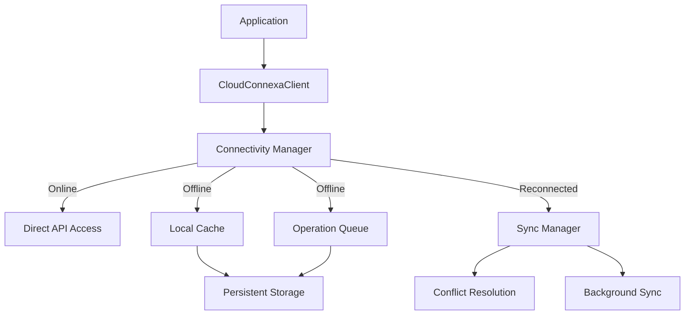

# Local Caching and Offline Operations

This example demonstrates how to implement local caching and offline operation capabilities for the Cloud Connexa API client, enabling applications to function with limited connectivity.

## Overview

Applications for field teams or remote locations often need to operate in environments with intermittent or limited connectivity. This guide covers:

1. Implementing persistent local caching
2. Enabling read operations while offline
3. Queuing write operations for later synchronization
4. Managing conflict resolution when connectivity is restored
5. Providing users with appropriate feedback about offline status

## Architecture



## Basic Implementation

### 1. Offline-Aware Client Wrapper

```python
import os
import json
import logging
import time
import sqlite3
import threading
from typing import Dict, Any, Optional, List, Tuple, Callable
from enum import Enum
from datetime import datetime, timedelta
from functools import wraps
import uuid

from cloudconnexa import (
    CloudConnexaClient, 
    RetryPolicy, 
    CircuitBreaker,
    CloudConnexaError,
    NetworkError
)

# Configure logging
logging.basicConfig(level=logging.INFO)
logger = logging.getLogger('cloudconnexa.offline')

class ConnectivityState(Enum):
    """Possible connectivity states."""
    ONLINE = "online"
    OFFLINE = "offline"
    UNKNOWN = "unknown"

class PersistentCache:
    """SQLite-based persistent cache for offline operation."""
    
    def __init__(self, db_path: str = "cloudconnexa_cache.db"):
        """Initialize the cache with a SQLite database file."""
        self.db_path = db_path
        self._setup_database()
        self.lock = threading.RLock()
    
    def _setup_database(self):
        """Set up the database schema."""
        with sqlite3.connect(self.db_path) as conn:
            cursor = conn.cursor()
            
            # Create cache table
            cursor.execute('''
            CREATE TABLE IF NOT EXISTS cache (
                key TEXT PRIMARY KEY,
                value TEXT NOT NULL,
                expiry TIMESTAMP NOT NULL
            )
            ''')
            
            # Create queue for pending operations
            cursor.execute('''
            CREATE TABLE IF NOT EXISTS operation_queue (
                id TEXT PRIMARY KEY,
                operation TEXT NOT NULL,
                service TEXT NOT NULL,
                method TEXT NOT NULL,
                args TEXT NOT NULL,
                kwargs TEXT NOT NULL,
                created_at TIMESTAMP NOT NULL,
                status TEXT NOT NULL,
                retry_count INTEGER DEFAULT 0,
                last_error TEXT
            )
            ''')
            
            conn.commit()
    
    def get(self, key: str, default: Any = None) -> Any:
        """Get an item from cache."""
        with self.lock:
            try:
                with sqlite3.connect(self.db_path) as conn:
                    cursor = conn.cursor()
                    cursor.execute(
                        "SELECT value, expiry FROM cache WHERE key = ?", 
                        (key,)
                    )
                    row = cursor.fetchone()
                    
                    if row:
                        value, expiry = row
                        expiry_dt = datetime.fromisoformat(expiry)
                        
                        # Check if expired
                        if expiry_dt > datetime.now():
                            return json.loads(value)
                        else:
                            # Delete expired item
                            cursor.execute("DELETE FROM cache WHERE key = ?", (key,))
                            conn.commit()
            
            except Exception as e:
                logger.error(f"Error retrieving from cache: {e}")
            
            return default
    
    def set(self, key: str, value: Any, ttl: int = 86400) -> None:
        """Set an item in cache with TTL in seconds (default 24 hours)."""
        with self.lock:
            try:
                with sqlite3.connect(self.db_path) as conn:
                    cursor = conn.cursor()
                    
                    # Calculate expiry
                    expiry = (datetime.now() + timedelta(seconds=ttl)).isoformat()
                    
                    # Serialize value
                    serialized = json.dumps(value)
                    
                    # Insert or replace
                    cursor.execute(
                        "INSERT OR REPLACE INTO cache (key, value, expiry) VALUES (?, ?, ?)",
                        (key, serialized, expiry)
                    )
                    
                    conn.commit()
            except Exception as e:
                logger.error(f"Error writing to cache: {e}")
    
    def delete(self, key: str) -> None:
        """Delete an item from cache."""
        with self.lock:
            try:
                with sqlite3.connect(self.db_path) as conn:
                    cursor = conn.cursor()
                    cursor.execute("DELETE FROM cache WHERE key = ?", (key,))
                    conn.commit()
            except Exception as e:
                logger.error(f"Error deleting from cache: {e}")
    
    def enqueue_operation(
        self, 
        service: str, 
        method: str, 
        args: List, 
        kwargs: Dict[str, Any]
    ) -> str:
        """Add an operation to the queue for later execution."""
        with self.lock:
            try:
                operation_id = str(uuid.uuid4())
                
                with sqlite3.connect(self.db_path) as conn:
                    cursor = conn.cursor()
                    
                    cursor.execute(
                        """
                        INSERT INTO operation_queue 
                        (id, operation, service, method, args, kwargs, created_at, status) 
                        VALUES (?, ?, ?, ?, ?, ?, ?, ?)
                        """,
                        (
                            operation_id,
                            f"{service}.{method}",
                            service,
                            method,
                            json.dumps(args),
                            json.dumps(kwargs),
                            datetime.now().isoformat(),
                            "pending"
                        )
                    )
                    
                    conn.commit()
                
                return operation_id
            except Exception as e:
                logger.error(f"Error enqueuing operation: {e}")
                return None
    
    def get_pending_operations(self) -> List[Dict[str, Any]]:
        """Get all pending operations from the queue."""
        with self.lock:
            try:
                with sqlite3.connect(self.db_path) as conn:
                    conn.row_factory = sqlite3.Row
                    cursor = conn.cursor()
                    
                    cursor.execute(
                        "SELECT * FROM operation_queue WHERE status = 'pending' ORDER BY created_at ASC"
                    )
                    
                    operations = []
                    for row in cursor.fetchall():
                        op = dict(row)
                        op['args'] = json.loads(op['args'])
                        op['kwargs'] = json.loads(op['kwargs'])
                        operations.append(op)
                    
                    return operations
            except Exception as e:
                logger.error(f"Error retrieving pending operations: {e}")
                return []
    
    def update_operation_status(
        self, 
        operation_id: str, 
        status: str, 
        error: Optional[str] = None
    ) -> None:
        """Update the status of an operation in the queue."""
        with self.lock:
            try:
                with sqlite3.connect(self.db_path) as conn:
                    cursor = conn.cursor()
                    
                    if error:
                        cursor.execute(
                            """
                            UPDATE operation_queue 
                            SET status = ?, last_error = ?, retry_count = retry_count + 1
                            WHERE id = ?
                            """,
                            (status, error, operation_id)
                        )
                    else:
                        cursor.execute(
                            "UPDATE operation_queue SET status = ? WHERE id = ?",
                            (status, operation_id)
                        )
                    
                    conn.commit()
            except Exception as e:
                logger.error(f"Error updating operation status: {e}")

class OfflineAwareClient:
    """Wrapper for CloudConnexaClient that supports offline operations."""
    
    def __init__(
        self,
        client: CloudConnexaClient,
        cache_db_path: str = "cloudconnexa_cache.db",
        connectivity_check_interval: int = 60,  # seconds
        auto_sync: bool = True
    ):
        """
        Initialize the offline-aware client.
        
        Args:
            client: The base CloudConnexaClient
            cache_db_path: Path to SQLite cache database
            connectivity_check_interval: How often to check connectivity (seconds)
            auto_sync: Whether to automatically sync when online
        """
        self.client = client
        self.cache = PersistentCache(db_path=cache_db_path)
        self.connectivity_state = ConnectivityState.UNKNOWN
        self.connectivity_check_interval = connectivity_check_interval
        self.auto_sync = auto_sync
        self.last_connectivity_check = 0
        
        # Set up services with offline support
        self._setup_services()
        
        # Start background connectivity checker if auto_sync is enabled
        if self.auto_sync:
            self._start_connectivity_checker()
    
    def _setup_services(self):
        """Set up service proxies with offline support."""
        # For each service in the client
        for service_name in [
            'networks', 'users', 'connectors', 'routes', 
            'vpn_regions', 'dns', 'user_groups', 'ip_services'
        ]:
            if hasattr(self.client, service_name):
                # Get the original service
                original_service = getattr(self.client, service_name)
                
                # Create offline-aware proxy
                offline_service = OfflineServiceProxy(
                    service=original_service,
                    service_name=service_name,
                    cache=self.cache,
                    connectivity_checker=self._check_connectivity
                )
                
                # Replace the service with our proxy
                setattr(self, service_name, offline_service)
    
    def _check_connectivity(self) -> bool:
        """
        Check if we can connect to the API.
        
        Returns:
            True if online, False if offline
        """
        # Only check every X seconds to avoid unnecessary API calls
        current_time = time.time()
        if current_time - self.last_connectivity_check < self.connectivity_check_interval:
            return self.connectivity_state == ConnectivityState.ONLINE
        
        self.last_connectivity_check = current_time
        
        try:
            # Try a lightweight API call
            response = self.client.execute_request("GET", "health", timeout=(2, 5))
            
            if response.status_code < 500:  # Consider 4xx as "online but error"
                if self.connectivity_state != ConnectivityState.ONLINE:
                    logger.info("Connectivity restored to Cloud Connexa API")
                    self.connectivity_state = ConnectivityState.ONLINE
                    
                    # Auto-sync pending operations if enabled
                    if self.auto_sync:
                        self.sync_pending_operations()
                
                return True
        except Exception as e:
            if self.connectivity_state != ConnectivityState.OFFLINE:
                logger.warning(f"API appears to be offline: {e}")
                self.connectivity_state = ConnectivityState.OFFLINE
        
        return False
    
    def _start_connectivity_checker(self):
        """Start a background thread to periodically check connectivity."""
        def checker_thread():
            while True:
                try:
                    self._check_connectivity()
                except Exception as e:
                    logger.error(f"Error in connectivity checker: {e}")
                
                time.sleep(self.connectivity_check_interval)
        
        thread = threading.Thread(target=checker_thread, daemon=True)
        thread.start()
    
    def is_online(self) -> bool:
        """Check if currently online."""
        return self._check_connectivity()
    
    def sync_pending_operations(self) -> Tuple[List[str], List[Dict[str, Any]]]:
        """
        Sync pending operations from the queue.
        
        Returns:
            Tuple of (successful_operation_ids, failed_operations)
        """
        if not self.is_online():
            logger.warning("Cannot sync while offline")
            return [], []
        
        successful = []
        failed = []
        
        # Get pending operations
        operations = self.cache.get_pending_operations()
        
        for op in operations:
            try:
                logger.info(f"Executing queued operation {op['operation']}")
                
                # Get the service
                if not hasattr(self.client, op['service']):
                    raise ValueError(f"Service {op['service']} not found")
                
                service = getattr(self.client, op['service'])
                
                # Get the method
                if not hasattr(service, op['method']):
                    raise ValueError(f"Method {op['method']} not found on {op['service']}")
                
                method = getattr(service, op['method'])
                
                # Execute the operation
                result = method(*op['args'], **op['kwargs'])
                
                # Mark as successful
                self.cache.update_operation_status(op['id'], 'completed')
                successful.append(op['id'])
                
                # Invalidate related caches
                self._invalidate_cache_for_operation(op)
                
                logger.info(f"Successfully executed queued operation {op['operation']}")
            except Exception as e:
                logger.error(f"Error executing queued operation {op['operation']}: {e}")
                
                # Mark as failed
                self.cache.update_operation_status(
                    op['id'],
                    'failed',
                    str(e)
                )
                
                failed.append({
                    "operation": op,
                    "error": str(e),
                    "error_type": type(e).__name__
                })
        
        return successful, failed
    
    def _invalidate_cache_for_operation(self, operation: Dict[str, Any]) -> None:
        """Invalidate relevant cache entries for an operation."""
        service = operation['service']
        method = operation['method']
        
        # For list methods, invalidate the list cache
        if method == 'list':
            self.cache.delete(f"{service}")
        
        # For get, update, delete methods with resource IDs
        elif method in ['get', 'update', 'delete'] and operation['args']:
            resource_id = operation['args'][0]
            self.cache.delete(f"{service}_{resource_id}")
            self.cache.delete(f"{service}")  # Also invalidate list cache
        
        # For create methods
        elif method == 'create':
            self.cache.delete(f"{service}")  # Invalidate list cache

class OfflineServiceProxy:
    """Proxy for service objects with offline capabilities."""
    
    def __init__(
        self, 
        service, 
        service_name: str,
        cache: PersistentCache,
        connectivity_checker: Callable[[], bool]
    ):
        """
        Initialize the service proxy.
        
        Args:
            service: The original service object
            service_name: Name of the service (e.g., 'networks')
            cache: The persistent cache
            connectivity_checker: Function to check connectivity
        """
        self.service = service
        self.service_name = service_name
        self.cache = cache
        self.connectivity_checker = connectivity_checker
        
        # Set up method proxies
        self._setup_method_proxies()
    
    def _setup_method_proxies(self):
        """Set up proxies for standard CRUD methods."""
        # For each common method
        for method_name in ['list', 'get', 'create', 'update', 'delete']:
            if hasattr(self.service, method_name):
                original_method = getattr(self.service, method_name)
                
                # Create an appropriate proxy based on method type
                if method_name in ['list', 'get']:
                    # Read methods - support from cache when offline
                    proxy_method = self._create_read_proxy(original_method, method_name)
                else:
                    # Write methods - queue when offline
                    proxy_method = self._create_write_proxy(original_method, method_name)
                
                # Set the proxy method on this object
                setattr(self, method_name, proxy_method)
    
    def _create_read_proxy(self, method: Callable, method_name: str) -> Callable:
        """Create a proxy for read methods with offline support."""
        @wraps(method)
        def proxy(*args, **kwargs):
            # Determine cache key
            if method_name == 'list':
                # For list, use service name and any filter params
                cache_key = self.service_name
                if kwargs:
                    cache_key += "_" + "_".join(f"{k}={v}" for k, v in sorted(kwargs.items()))
            else:  # get
                # For get, use service name and resource ID
                resource_id = args[0] if args else kwargs.get('id')
                if not resource_id:
                    raise ValueError(f"No resource ID provided for {self.service_name}.{method_name}")
                cache_key = f"{self.service_name}_{resource_id}"
            
            # Check if online
            is_online = self.connectivity_checker()
            
            if is_online:
                try:
                    # Online - try API first
                    result = method(*args, **kwargs)
                    
                    # Cache the result
                    self.cache.set(cache_key, result)
                    
                    return result
                except NetworkError as e:
                    logger.warning(
                        f"Network error while online, falling back to cache: {e}"
                    )
                    # Fall through to cache
                    pass
            
            # Offline or API error - try cache
            cached_result = self.cache.get(cache_key)
            
            if cached_result is not None:
                logger.info(
                    f"Using cached data for {self.service_name}.{method_name}"
                    f"{' (offline mode)' if not is_online else ''}"
                )
                return cached_result
            
            # No cache - raise appropriate error
            if not is_online:
                logger.error(f"Offline and no cached data available for {cache_key}")
                raise ValueError(
                    f"Cannot {method_name} {self.service_name} while offline with no cached data"
                )
            else:
                # We were online but got an error and have no cache
                logger.error(f"API error and no cache available for {cache_key}")
                raise
        
        return proxy
    
    def _create_write_proxy(self, method: Callable, method_name: str) -> Callable:
        """Create a proxy for write methods with offline queuing."""
        @wraps(method)
        def proxy(*args, **kwargs):
            # Check if online
            is_online = self.connectivity_checker()
            
            if is_online:
                try:
                    # Online - try API directly
                    result = method(*args, **kwargs)
                    
                    # Invalidate cache based on operation
                    if method_name == 'create':
                        # Invalidate list cache for this service
                        self.cache.delete(self.service_name)
                    elif method_name in ['update', 'delete'] and args:
                        # Invalidate specific resource cache
                        resource_id = args[0]
                        self.cache.delete(f"{self.service_name}_{resource_id}")
                        # Also invalidate list cache
                        self.cache.delete(self.service_name)
                    
                    return result
                except NetworkError as e:
                    logger.warning(
                        f"Network error during {method_name}, will queue operation: {e}"
                    )
                    # Fall through to queuing
                    is_online = False
            
            if not is_online:
                # Offline - queue the operation
                logger.info(
                    f"Queuing {self.service_name}.{method_name} for later execution (offline mode)"
                )
                
                # Queue the operation
                operation_id = self.cache.enqueue_operation(
                    self.service_name, 
                    method_name,
                    list(args),
                    kwargs
                )
                
                if operation_id:
                    # Return a placeholder result
                    return {
                        "_offline_queued": True,
                        "_operation_id": operation_id,
                        "_service": self.service_name,
                        "_method": method_name,
                        "_args": args,
                        "_kwargs": kwargs,
                        "_queued_at": datetime.now().isoformat()
                    }
                else:
                    # Queue failed
                    raise ValueError(
                        f"Failed to queue {method_name} operation while offline"
                    )
            
            # Should never reach here
            raise RuntimeError("Unexpected execution path in write proxy")
        
        return proxy
```

## Usage Example

```python
from cloudconnexa import CloudConnexaClient, RetryPolicy
import os
import time

# Initialize the base client
client = CloudConnexaClient(
    api_url=os.getenv("CLOUDCONNEXA_API_URL"),
    client_id=os.getenv("CLOUDCONNEXA_CLIENT_ID"),
    client_secret=os.getenv("CLOUDCONNEXA_CLIENT_SECRET"),
    retry_policy=RetryPolicy(
        max_retries=3,
        retry_codes=[408, 429, 500, 502, 503, 504],
        backoff_factor=0.5
    )
)

# Wrap with offline capabilities
offline_client = OfflineAwareClient(
    client=client,
    cache_db_path="my_app_cache.db",
    connectivity_check_interval=30,  # Check connectivity every 30 seconds
    auto_sync=True  # Automatically sync when back online
)

# Use the client normally
try:
    # This will work online and use cache when offline
    networks = offline_client.networks.list()
    print(f"Found {len(networks)} networks")
    
    for network in networks:
        print(f"Network: {network['name']}")
        
    # Even offline, cached networks are available
    if not offline_client.is_online():
        print("Working in offline mode with cached data")
    
    # Create works online, and queues when offline
    new_network = offline_client.networks.create(
        name=f"Test Network {int(time.time())}",
        description="Created with offline-aware client",
        egress=False
    )
    
    if new_network.get("_offline_queued"):
        print(
            f"Network creation queued with operation ID: {new_network['_operation_id']}" 
            f"Will execute when back online."
        )
    else:
        print(f"Network created with ID: {new_network['id']}")
    
except Exception as e:
    print(f"Error: {e}")

# Force sync pending operations
if offline_client.is_online():
    successful, failed = offline_client.sync_pending_operations()
    print(f"Synced {len(successful)} operations, {len(failed)} failed")
```

## Advanced Configuration

### Database Configuration

For production environments, consider using a more robust database configuration:

```python
import sqlite3

# Configure connection timeout and busy timeout
def get_connection(db_path):
    conn = sqlite3.connect(
        db_path,
        timeout=10.0,  # Connection timeout
        isolation_level='EXCLUSIVE'  # Transaction isolation level
    )
    conn.execute('PRAGMA busy_timeout = 5000')  # Wait up to 5 seconds when DB is locked
    conn.execute('PRAGMA journal_mode = WAL')  # Write-Ahead Logging for better concurrency
    conn.row_factory = sqlite3.Row  # Return rows as dictionaries
    return conn

# Use in cache implementation
class EnhancedPersistentCache(PersistentCache):
    def _get_connection(self):
        return get_connection(self.db_path)
```

### Conflict Resolution

For more sophisticated conflict resolution when syncing:

```python
class ConflictResolutionStrategy(Enum):
    """Strategies for resolving conflicts during sync."""
    SERVER_WINS = "server_wins"  # Server data takes precedence
    CLIENT_WINS = "client_wins"  # Client changes take precedence
    MERGE = "merge"  # Attempt to merge changes
    MANUAL = "manual"  # Require manual resolution

class AdvancedSyncManager:
    """Advanced sync manager with conflict resolution."""
    
    def __init__(
        self, 
        client: CloudConnexaClient, 
        cache: PersistentCache,
        conflict_strategy: ConflictResolutionStrategy = ConflictResolutionStrategy.SERVER_WINS
    ):
        self.client = client
        self.cache = cache
        self.conflict_strategy = conflict_strategy
        self.conflicts = []
    
    def sync_resource(self, service_name, resource_id, local_data):
        """Sync a specific resource with conflict detection."""
        try:
            # Get current server data
            service = getattr(self.client, service_name)
            server_data = service.get(resource_id)
            
            # Check for conflicts (simplified check - timestamp based)
            if self._has_conflict(local_data, server_data):
                # Handle according to strategy
                if self.conflict_strategy == ConflictResolutionStrategy.SERVER_WINS:
                    # Just use server data
                    self.cache.set(f"{service_name}_{resource_id}", server_data)
                    return server_data, False
                
                elif self.conflict_strategy == ConflictResolutionStrategy.CLIENT_WINS:
                    # Update server with our data
                    updated = service.update(
                        resource_id, 
                        {k: v for k, v in local_data.items() if k != 'id'}
                    )
                    self.cache.set(f"{service_name}_{resource_id}", updated)
                    return updated, False
                
                elif self.conflict_strategy == ConflictResolutionStrategy.MERGE:
                    # Attempt to smartly merge the data
                    merged = self._merge_resources(local_data, server_data)
                    updated = service.update(
                        resource_id,
                        {k: v for k, v in merged.items() if k != 'id'}
                    )
                    self.cache.set(f"{service_name}_{resource_id}", updated)
                    return updated, False
                
                elif self.conflict_strategy == ConflictResolutionStrategy.MANUAL:
                    # Store conflict for manual resolution
                    conflict = {
                        "service": service_name,
                        "resource_id": resource_id,
                        "local_data": local_data,
                        "server_data": server_data
                    }
                    self.conflicts.append(conflict)
                    return None, True
            
            else:
                # No conflict - just return server data
                self.cache.set(f"{service_name}_{resource_id}", server_data)
                return server_data, False
                
        except Exception as e:
            logger.error(f"Error syncing {service_name}/{resource_id}: {e}")
            return None, True
    
    def _has_conflict(self, local_data, server_data):
        """
        Detect if there's a conflict between local and server data.
        This is a simplified example - real implementation would depend 
        on resource type and available metadata.
        """
        # Check if both have updated_at and it's different
        if ('updated_at' in local_data and 'updated_at' in server_data and
                local_data['updated_at'] != server_data['updated_at']):
            return True
        
        # Simple field-by-field comparison (excluding metadata)
        metadata_fields = ['id', 'created_at', 'updated_at']
        for key, local_value in local_data.items():
            if key in metadata_fields:
                continue
                
            if key in server_data and server_data[key] != local_value:
                return True
        
        return False
    
    def _merge_resources(self, local_data, server_data):
        """
        Merge local and server data intelligently.
        This is a simplified example that prefers newer values.
        """
        result = dict(server_data)  # Start with server data
        
        # For fields updated locally, use local value if it seems newer
        local_updated_at = datetime.fromisoformat(local_data.get('updated_at', '2000-01-01'))
        server_updated_at = datetime.fromisoformat(server_data.get('updated_at', '2000-01-01'))
        
        if local_updated_at > server_updated_at:
            # Local data is newer, use its values except for metadata
            metadata_fields = ['id', 'created_at']
            for key, value in local_data.items():
                if key not in metadata_fields:
                    result[key] = value
        
        return result
    
    def get_pending_conflicts(self):
        """Get list of conflicts requiring manual resolution."""
        return self.conflicts
    
    def resolve_conflict(self, conflict_index, resolution_data):
        """Manually resolve a conflict."""
        if 0 <= conflict_index < len(self.conflicts):
            conflict = self.conflicts[conflict_index]
            
            try:
                # Update on server with resolution data
                service = getattr(self.client, conflict['service'])
                updated = service.update(
                    conflict['resource_id'],
                    {k: v for k, v in resolution_data.items() if k != 'id'}
                )
                
                # Update cache
                self.cache.set(
                    f"{conflict['service']}_{conflict['resource_id']}", 
                    updated
                )
                
                # Remove from conflicts list
                self.conflicts.pop(conflict_index)
                
                return updated
            except Exception as e:
                logger.error(f"Error resolving conflict: {e}")
                return None
        else:
            raise IndexError(f"Conflict index {conflict_index} out of range")
```

## User Interface Considerations

When implementing offline capabilities, it's important to provide clear feedback to users:

```python
class OfflineStatusProvider:
    """Provide offline status information for user interfaces."""
    
    def __init__(self, offline_client: OfflineAwareClient):
        self.client = offline_client
    
    def get_status_summary(self) -> Dict[str, Any]:
        """Get a summary of offline status for display in UI."""
        is_online = self.client.is_online()
        
        # Get pending operations count
        operations = self.client.cache.get_pending_operations()
        
        return {
            "is_online": is_online,
            "status": "Online" if is_online else "Offline",
            "pending_operations": len(operations),
            "last_sync": getattr(self.client, 'last_sync_time', None),
            "can_sync": is_online and len(operations) > 0
        }
    
    def get_pending_operations_summary(self) -> List[Dict[str, Any]]:
        """Get a summary of pending operations for display in UI."""
        operations = self.client.cache.get_pending_operations()
        
        # Create user-friendly summaries
        summaries = []
        for op in operations:
            # Get human-readable description
            description = self._get_operation_description(op)
            
            summaries.append({
                "id": op["id"],
                "description": description,
                "created_at": op["created_at"],
                "service": op["service"],
                "method": op["method"]
            })
        
        return summaries
    
    def _get_operation_description(self, operation: Dict[str, Any]) -> str:
        """Create a human-readable description of an operation."""
        method = operation["method"]
        service = operation["service"]
        
        if method == "create":
            if service == "networks":
                return f"Create network: {operation['kwargs'].get('name', 'Unnamed')}"
            elif service == "users":
                return f"Create user: {operation['kwargs'].get('email', 'No email')}"
            else:
                return f"Create {service} resource"
                
        elif method == "update":
            resource_id = operation["args"][0] if operation["args"] else "unknown"
            return f"Update {service} with ID: {resource_id}"
            
        elif method == "delete":
            resource_id = operation["args"][0] if operation["args"] else "unknown"
            return f"Delete {service} with ID: {resource_id}"
        
        return f"{method} operation on {service}"
```

## Best Practices

1. **Be selective with offline caching**: Not all resources need to be cached. Focus on those most critical for offline operation.

2. **Implement clear UI indicators**: Users should always know when they're working offline and what operations are queued.

3. **Set appropriate cache TTL**: Consider how frequently resources change when setting cache expiration times.

4. **Encrypt sensitive data**: If caching sensitive information, implement appropriate encryption.

5. **Use appropriate conflict resolution**: Choose conflict resolution strategies appropriate for your application needs.

6. **Test thoroughly**: Simulate various connectivity scenarios to ensure your application behaves correctly.

7. **Validate offline changes**: Before queuing offline operations, validate them to catch errors immediately.

8. **Monitor sync failures**: Implement proper monitoring for sync operations that fail repeatedly.

9. **Implement retry strategies**: Use exponential backoff for failed synchronization attempts.

10. **Consider cache size limits**: Implement cache eviction policies to prevent excessive storage usage.

## Conclusion

Implementing local caching and offline operation capabilities allows applications to function effectively in environments with limited connectivity. By carefully designing your caching strategy, operation queue, and synchronization mechanisms, you can provide a seamless experience for users regardless of network conditions. 