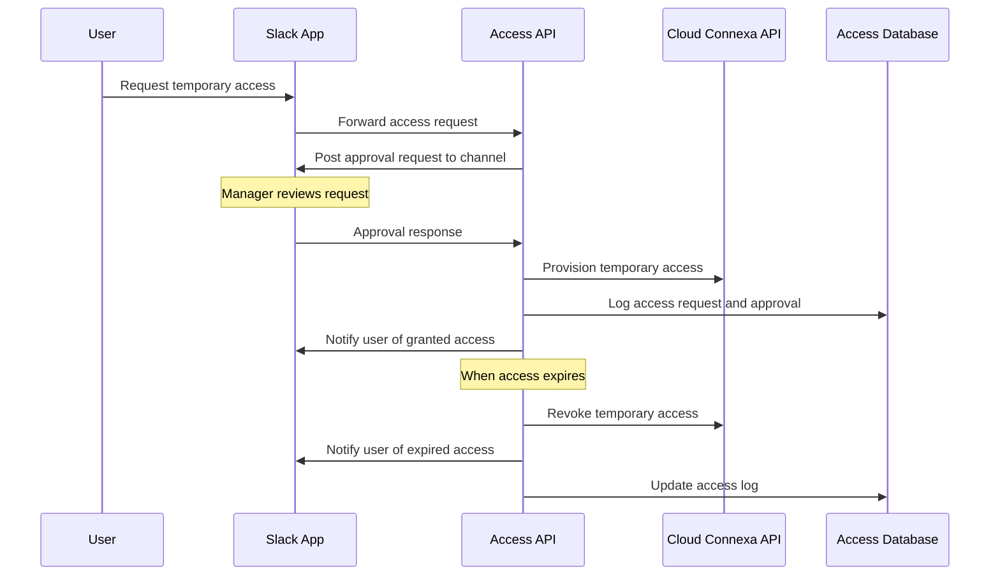

# Slack Integration for Dynamic Access Management

This example demonstrates how to integrate the Cloud Connexa API client with Slack to create a dynamic access management solution with approval workflows and temporary access provisioning.

## Architecture Overview



## Setup Requirements

1. Slack App with appropriate permissions
2. Web server for handling Slack events and commands
3. Database for tracking access requests and approvals
4. Cloud Connexa API client with appropriate permissions
5. Scheduled job system for access expiration and cleanup

## Implementation

### 1. Slack App Configuration

Create a Slack app with the following features:

- Slash command: `/vpn-access` to request access
- Interactive components: For approval buttons
- Bot token with appropriate scopes:
  - `commands` - For the slash command
  - `chat:write` - To post messages
  - `im:write` - To send direct messages
  - `users:read` - To identify users
  - `groups:read` - To get channel information

### 2. Backend API Setup

```python
import os
import json
import logging
from datetime import datetime, timedelta
from typing import Dict, Any, Optional, List, Tuple
from flask import Flask, request, jsonify
from slack_sdk import WebClient
from slack_sdk.signature import SignatureVerifier
from apscheduler.schedulers.background import BackgroundScheduler

from cloudconnexa import CloudConnexaClient

# Configure logging
logging.basicConfig(level=logging.INFO)
logger = logging.getLogger('vpn_access_manager')

# Initialize Flask app
app = Flask(__name__)

# Initialize Slack client
slack_client = WebClient(token=os.environ["SLACK_BOT_TOKEN"])
signature_verifier = SignatureVerifier(os.environ["SLACK_SIGNING_SECRET"])

# Initialize Cloud Connexa client
cloudconnexa_client = CloudConnexaClient(
    api_url=os.environ["CLOUDCONNEXA_API_URL"],
    client_id=os.environ["CLOUDCONNEXA_CLIENT_ID"],
    client_secret=os.environ["CLOUDCONNEXA_CLIENT_SECRET"]
)

# Initialize scheduler for access expiration
scheduler = BackgroundScheduler()
scheduler.start()

# Simple in-memory database for demonstration
# In production, use a proper database
access_requests = {}
active_access_grants = {}
access_history = []

# Configuration
APPROVAL_CHANNEL = os.environ.get("APPROVAL_CHANNEL", "vpn-access-approvals")
DEFAULT_ACCESS_DURATION = int(os.environ.get("DEFAULT_ACCESS_DURATION", "4"))  # hours
MAX_ACCESS_DURATION = int(os.environ.get("MAX_ACCESS_DURATION", "24"))  # hours
NETWORK_GROUP_MAPPING = json.loads(os.environ.get("NETWORK_GROUP_MAPPING", "{}"))
```

### 3. Slack Command Handler

```python
@app.route('/slack/vpn-access', methods=['POST'])
def handle_vpn_access_command():
    """Handle the /vpn-access slash command."""
    # Verify request is from Slack
    if not signature_verifier.is_valid(
        request.headers.get('X-Slack-Signature', ''),
        request.headers.get('X-Slack-Request-Timestamp', ''),
        request.get_data().decode('utf-8')
    ):
        return jsonify({"error": "Invalid request signature"}), 401
    
    # Parse the command
    command_text = request.form.get('text', '')
    user_id = request.form.get('user_id')
    user_name = request.form.get('user_name')
    channel_id = request.form.get('channel_id')
    
    # Process the command
    parts = command_text.split()
    
    if not parts or parts[0] == 'help':
        return jsonify({
            "response_type": "ephemeral",
            "text": "VPN Access Management",
            "attachments": [{
                "text": (
                    "Available commands:\n"
                    "• `/vpn-access request [network] [duration in hours] [reason]` - Request temporary access\n"
                    "• `/vpn-access status` - Check your current access status\n"
                    "• `/vpn-access list` - List available networks\n"
                    "• `/vpn-access help` - Show this help message"
                )
            }]
        })
    
    if parts[0] == 'request':
        if len(parts) < 4:
            return jsonify({
                "response_type": "ephemeral",
                "text": "Please specify a network, duration, and reason. Example: `/vpn-access request dev-network 4 Running database migration`"
            })
        
        network = parts[1]
        
        try:
            duration = int(parts[2])
            if duration <= 0 or duration > MAX_ACCESS_DURATION:
                return jsonify({
                    "response_type": "ephemeral",
                    "text": f"Duration must be between 1 and {MAX_ACCESS_DURATION} hours."
                })
        except ValueError:
            return jsonify({
                "response_type": "ephemeral",
                "text": "Duration must be a number in hours."
            })
        
        reason = ' '.join(parts[3:])
        
        # Check if network exists
        try:
            networks = cloudconnexa_client.networks.list()
            network_exists = any(n['name'] == network for n in networks)
            if not network_exists:
                return jsonify({
                    "response_type": "ephemeral",
                    "text": f"Network '{network}' does not exist. Use `/vpn-access list` to see available networks."
                })
        except Exception as e:
            logger.error(f"Error checking network: {e}")
            return jsonify({
                "response_type": "ephemeral",
                "text": "Error checking network. Please try again later."
            })
        
        # Create access request
        request_id = f"req_{int(datetime.now().timestamp())}_{user_id}"
        request_data = {
            "id": request_id,
            "user_id": user_id,
            "user_name": user_name,
            "network": network,
            "duration": duration,
            "reason": reason,
            "status": "pending",
            "requested_at": datetime.now().isoformat(),
            "expires_at": (datetime.now() + timedelta(hours=duration)).isoformat()
        }
        
        access_requests[request_id] = request_data
        
        # Send approval request to the designated channel
        try:
            result = slack_client.chat_postMessage(
                channel=APPROVAL_CHANNEL,
                text=f"VPN Access Request from <@{user_id}>",
                blocks=[
                    {
                        "type": "section",
                        "text": {
                            "type": "mrkdwn",
                            "text": f"*VPN Access Request*\n*User:* <@{user_id}>\n*Network:* {network}\n*Duration:* {duration} hours\n*Reason:* {reason}"
                        }
                    },
                    {
                        "type": "actions",
                        "elements": [
                            {
                                "type": "button",
                                "text": {
                                    "type": "plain_text",
                                    "text": "Approve"
                                },
                                "style": "primary",
                                "value": request_id,
                                "action_id": "approve_vpn_access"
                            },
                            {
                                "type": "button",
                                "text": {
                                    "type": "plain_text",
                                    "text": "Deny"
                                },
                                "style": "danger",
                                "value": request_id,
                                "action_id": "deny_vpn_access"
                            }
                        ]
                    }
                ]
            )
            
            # Store message information for updates
            access_requests[request_id]["message_ts"] = result["ts"]
            access_requests[request_id]["message_channel"] = result["channel"]
            
            return jsonify({
                "response_type": "ephemeral",
                "text": f"Access request submitted for {network}. You will be notified once approved or denied."
            })
            
        except Exception as e:
            logger.error(f"Error sending approval request: {e}")
            return jsonify({
                "response_type": "ephemeral",
                "text": "Error submitting access request. Please try again later."
            })
    
    elif parts[0] == 'status':
        # Get current user's active grants
        user_grants = [g for g in active_access_grants.values() if g["user_id"] == user_id]
        
        if not user_grants:
            return jsonify({
                "response_type": "ephemeral",
                "text": "You don't have any active VPN access grants."
            })
        
        grant_texts = []
        for grant in user_grants:
            expires = datetime.fromisoformat(grant["expires_at"])
            remaining = expires - datetime.now()
            hours, remainder = divmod(remaining.seconds, 3600)
            minutes, _ = divmod(remainder, 60)
            
            grant_texts.append(
                f"• *Network:* {grant['network']} - *Expires in:* {hours}h {minutes}m"
            )
        
        return jsonify({
            "response_type": "ephemeral",
            "text": "Your active VPN access grants:",
            "attachments": [{
                "text": "\n".join(grant_texts)
            }]
        })
    
    elif parts[0] == 'list':
        # List available networks
        try:
            networks = cloudconnexa_client.networks.list()
            if not networks:
                return jsonify({
                    "response_type": "ephemeral",
                    "text": "No networks available."
                })
            
            network_text = "\n".join([f"• {n['name']}" for n in networks])
            
            return jsonify({
                "response_type": "ephemeral",
                "text": "Available networks:",
                "attachments": [{
                    "text": network_text
                }]
            })
        except Exception as e:
            logger.error(f"Error listing networks: {e}")
            return jsonify({
                "response_type": "ephemeral",
                "text": "Error retrieving networks. Please try again later."
            })
    
    return jsonify({
        "response_type": "ephemeral",
        "text": "Unknown command. Use `/vpn-access help` for available commands."
    })
```

### 4. Approval/Denial Handler

```python
@app.route('/slack/interactions', methods=['POST'])
def handle_interactions():
    """Handle Slack interactive components."""
    # Verify request is from Slack
    if not signature_verifier.is_valid(
        request.headers.get('X-Slack-Signature', ''),
        request.headers.get('X-Slack-Request-Timestamp', ''),
        request.get_data().decode('utf-8')
    ):
        return jsonify({"error": "Invalid request signature"}), 401
    
    # Parse the payload
    payload = json.loads(request.form.get('payload', '{}'))
    
    if payload.get('type') != 'block_actions':
        return jsonify({"error": "Unsupported interaction type"}), 400
    
    # Get action and request ID
    action_id = payload['actions'][0]['action_id']
    request_id = payload['actions'][0]['value']
    approver_id = payload['user']['id']
    approver_name = payload['user']['name']
    
    # Check if request exists
    if request_id not in access_requests:
        # Update message indicating request not found
        slack_client.chat_update(
            channel=payload['channel']['id'],
            ts=payload['message']['ts'],
            text="VPN Access Request - Not Found",
            blocks=[
                {
                    "type": "section",
                    "text": {
                        "type": "mrkdwn",
                        "text": "⚠️ This access request no longer exists."
                    }
                }
            ]
        )
        return jsonify({}), 200
    
    # Get request data
    request_data = access_requests[request_id]
    
    # Check if already processed
    if request_data['status'] != 'pending':
        # Update message indicating already processed
        slack_client.chat_update(
            channel=payload['channel']['id'],
            ts=payload['message']['ts'],
            text=f"VPN Access Request - {request_data['status']}",
            blocks=[
                {
                    "type": "section",
                    "text": {
                        "type": "mrkdwn",
                        "text": f"This request has already been {request_data['status']}."
                    }
                }
            ]
        )
        return jsonify({}), 200
    
    if action_id == 'approve_vpn_access':
        # Process approval
        try:
            # Update request status
            request_data['status'] = 'approved'
            request_data['approved_by'] = approver_id
            request_data['approved_at'] = datetime.now().isoformat()
            
            # Grant access in Cloud Connexa
            grant_id = grant_vpn_access(request_data)
            
            if grant_id:
                # Update message indicating approval
                slack_client.chat_update(
                    channel=payload['channel']['id'],
                    ts=payload['message']['ts'],
                    text=f"VPN Access Request - Approved by <@{approver_id}>",
                    blocks=[
                        {
                            "type": "section",
                            "text": {
                                "type": "mrkdwn",
                                "text": (
                                    f"*VPN Access Request - APPROVED*\n"
                                    f"*User:* <@{request_data['user_id']}>\n"
                                    f"*Network:* {request_data['network']}\n"
                                    f"*Duration:* {request_data['duration']} hours\n"
                                    f"*Reason:* {request_data['reason']}\n"
                                    f"*Approved by:* <@{approver_id}>"
                                )
                            }
                        }
                    ]
                )
                
                # Notify user of approval
                slack_client.chat_postMessage(
                    channel=request_data['user_id'],
                    text=f"Your VPN access request for {request_data['network']} has been approved!",
                    blocks=[
                        {
                            "type": "section",
                            "text": {
                                "type": "mrkdwn",
                                "text": (
                                    f"✅ *VPN Access Approved*\n"
                                    f"Your request for access to *{request_data['network']}* has been approved.\n"
                                    f"Access will expire in *{request_data['duration']} hours*.\n\n"
                                    f"Connect using your standard VPN client."
                                )
                            }
                        }
                    ]
                )
                
                # Log approval
                access_history.append({
                    "action": "approved",
                    "request_id": request_id,
                    "approver_id": approver_id,
                    "timestamp": datetime.now().isoformat(),
                    "grant_id": grant_id
                })
                
            else:
                # Update message indicating approval failed
                slack_client.chat_update(
                    channel=payload['channel']['id'],
                    ts=payload['message']['ts'],
                    text=f"VPN Access Request - Approval Failed",
                    blocks=[
                        {
                            "type": "section",
                            "text": {
                                "type": "mrkdwn",
                                "text": (
                                    f"*VPN Access Request - APPROVAL FAILED*\n"
                                    f"*User:* <@{request_data['user_id']}>\n"
                                    f"*Network:* {request_data['network']}\n"
                                    f"*Duration:* {request_data['duration']} hours\n"
                                    f"*Reason:* {request_data['reason']}\n"
                                    f"*Error:* Unable to provision access. Check logs for details."
                                )
                            }
                        }
                    ]
                )
                
                # Notify user of failure
                slack_client.chat_postMessage(
                    channel=request_data['user_id'],
                    text=f"Your VPN access request for {request_data['network']} could not be provisioned due to a system error.",
                    blocks=[
                        {
                            "type": "section",
                            "text": {
                                "type": "mrkdwn",
                                "text": (
                                    f"❌ *VPN Access Approval Failed*\n"
                                    f"Your request for access to *{request_data['network']}* was approved, but we couldn't provision access due to a system error.\n"
                                    f"Please contact IT support for assistance."
                                )
                            }
                        }
                    ]
                )
                
                # Log failure
                access_history.append({
                    "action": "approval_failed",
                    "request_id": request_id,
                    "approver_id": approver_id,
                    "timestamp": datetime.now().isoformat(),
                    "error": "Failed to provision access"
                })
        
        except Exception as e:
            logger.error(f"Error approving request {request_id}: {e}")
            
            # Update message indicating error
            slack_client.chat_update(
                channel=payload['channel']['id'],
                ts=payload['message']['ts'],
                text=f"VPN Access Request - Error",
                blocks=[
                    {
                        "type": "section",
                        "text": {
                            "type": "mrkdwn",
                            "text": f"Error processing approval: {str(e)}"
                        }
                    }
                ]
            )
    
    elif action_id == 'deny_vpn_access':
        # Process denial
        try:
            # Update request status
            request_data['status'] = 'denied'
            request_data['denied_by'] = approver_id
            request_data['denied_at'] = datetime.now().isoformat()
            
            # Update message indicating denial
            slack_client.chat_update(
                channel=payload['channel']['id'],
                ts=payload['message']['ts'],
                text=f"VPN Access Request - Denied by <@{approver_id}>",
                blocks=[
                    {
                        "type": "section",
                        "text": {
                            "type": "mrkdwn",
                            "text": (
                                f"*VPN Access Request - DENIED*\n"
                                f"*User:* <@{request_data['user_id']}>\n"
                                f"*Network:* {request_data['network']}\n"
                                f"*Duration:* {request_data['duration']} hours\n"
                                f"*Reason:* {request_data['reason']}\n"
                                f"*Denied by:* <@{approver_id}>"
                            )
                        }
                    }
                ]
            )
            
            # Notify user of denial
            slack_client.chat_postMessage(
                channel=request_data['user_id'],
                text=f"Your VPN access request for {request_data['network']} has been denied.",
                blocks=[
                    {
                        "type": "section",
                        "text": {
                            "type": "mrkdwn",
                            "text": (
                                f"❌ *VPN Access Denied*\n"
                                f"Your request for access to *{request_data['network']}* has been denied.\n"
                                f"Please contact <@{approver_id}> for more information."
                            )
                        }
                    }
                ]
            )
            
            # Log denial
            access_history.append({
                "action": "denied",
                "request_id": request_id,
                "denier_id": approver_id,
                "timestamp": datetime.now().isoformat()
            })
            
        except Exception as e:
            logger.error(f"Error denying request {request_id}: {e}")
            
            # Update message indicating error
            slack_client.chat_update(
                channel=payload['channel']['id'],
                ts=payload['message']['ts'],
                text=f"VPN Access Request - Error",
                blocks=[
                    {
                        "type": "section",
                        "text": {
                            "type": "mrkdwn",
                            "text": f"Error processing denial: {str(e)}"
                        }
                    }
                ]
            )
    
    return jsonify({}), 200
```

### 5. Access Provisioning and Revocation

```python
def grant_vpn_access(request_data: Dict[str, Any]) -> Optional[str]:
    """
    Grant VPN access by adding the user to the appropriate group.
    
    Args:
        request_data: The access request data
        
    Returns:
        grant_id if successful, None if failed
    """
    try:
        network_name = request_data['network']
        user_id = request_data['user_id']
        user_email = get_user_email(user_id)
        duration_hours = request_data['duration']
        
        if not user_email:
            logger.error(f"Could not find email for user {user_id}")
            return None
        
        # Find or create user in Cloud Connexa
        cc_user = find_or_create_user(user_email)
        if not cc_user:
            logger.error(f"Could not find or create user {user_email}")
            return None
        
        # Find the user group for this network
        group_name = NETWORK_GROUP_MAPPING.get(network_name, f"{network_name}-users")
        
        # Find or create the user group
        user_group = find_or_create_group(group_name)
        if not user_group:
            logger.error(f"Could not find or create group {group_name}")
            return None
        
        # Add user to group
        success = add_user_to_group(cc_user['id'], user_group['id'])
        if not success:
            logger.error(f"Failed to add user {cc_user['id']} to group {user_group['id']}")
            return None
        
        # Create grant record
        grant_id = f"grant_{int(datetime.now().timestamp())}_{user_id}"
        grant_data = {
            "id": grant_id,
            "user_id": user_id,
            "user_email": user_email,
            "cc_user_id": cc_user['id'],
            "network": network_name,
            "group_id": user_group['id'],
            "request_id": request_data['id'],
            "granted_at": datetime.now().isoformat(),
            "expires_at": (datetime.now() + timedelta(hours=duration_hours)).isoformat()
        }
        
        # Store grant
        active_access_grants[grant_id] = grant_data
        
        # Schedule access revocation
        scheduler.add_job(
            revoke_vpn_access,
            'date',
            run_date=datetime.now() + timedelta(hours=duration_hours),
            args=[grant_id],
            id=f"revoke_{grant_id}"
        )
        
        return grant_id
        
    except Exception as e:
        logger.error(f"Error granting access: {e}")
        return None

def revoke_vpn_access(grant_id: str) -> bool:
    """
    Revoke previously granted VPN access.
    
    Args:
        grant_id: The grant ID to revoke
        
    Returns:
        True if successful, False if failed
    """
    if grant_id not in active_access_grants:
        logger.warning(f"Grant {grant_id} not found for revocation")
        return False
    
    grant_data = active_access_grants[grant_id]
    
    try:
        # Remove user from group
        success = remove_user_from_group(grant_data['cc_user_id'], grant_data['group_id'])
        if not success:
            logger.error(f"Failed to remove user {grant_data['cc_user_id']} from group {grant_data['group_id']}")
            return False
        
        # Mark grant as expired
        grant_data['revoked_at'] = datetime.now().isoformat()
        grant_data['status'] = 'revoked'
        
        # Move from active to history
        del active_access_grants[grant_id]
        access_history.append({
            "action": "revoked",
            "grant_id": grant_id,
            "user_id": grant_data['user_id'],
            "network": grant_data['network'],
            "timestamp": datetime.now().isoformat()
        })
        
        # Notify user of revocation
        try:
            slack_client.chat_postMessage(
                channel=grant_data['user_id'],
                text=f"Your VPN access to {grant_data['network']} has expired.",
                blocks=[
                    {
                        "type": "section",
                        "text": {
                            "type": "mrkdwn",
                            "text": (
                                f"🕒 *VPN Access Expired*\n"
                                f"Your temporary access to *{grant_data['network']}* has expired.\n"
                                f"If you need continued access, please submit a new request."
                            )
                        }
                    }
                ]
            )
        except Exception as e:
            logger.error(f"Error notifying user of access revocation: {e}")
        
        return True
        
    except Exception as e:
        logger.error(f"Error revoking access for grant {grant_id}: {e}")
        return False
```

### 6. Cloud Connexa API Helpers

```python
def get_user_email(slack_user_id: str) -> Optional[str]:
    """Get email address for a Slack user."""
    try:
        user_info = slack_client.users_info(user=slack_user_id)
        if user_info["ok"]:
            return user_info["user"].get("profile", {}).get("email")
    except Exception as e:
        logger.error(f"Error getting user email for {slack_user_id}: {e}")
    return None

def find_or_create_user(email: str) -> Optional[Dict[str, Any]]:
    """Find or create a user in Cloud Connexa."""
    try:
        # First, try to find the user
        users = cloudconnexa_client.users.list(email=email)
        if users:
            return users[0]
        
        # If not found, create the user
        user = cloudconnexa_client.users.create({
            "email": email,
            "name": email.split('@')[0]  # Basic name from email
        })
        return user
    except Exception as e:
        logger.error(f"Error finding or creating user {email}: {e}")
        return None

def find_or_create_group(group_name: str) -> Optional[Dict[str, Any]]:
    """Find or create a user group in Cloud Connexa."""
    try:
        # First, try to find the group
        groups = cloudconnexa_client.user_groups.list(name=group_name)
        if groups:
            return groups[0]
        
        # If not found, create the group
        group = cloudconnexa_client.user_groups.create({
            "name": group_name,
            "description": f"Temporary access group for {group_name}"
        })
        return group
    except Exception as e:
        logger.error(f"Error finding or creating group {group_name}: {e}")
        return None

def add_user_to_group(user_id: str, group_id: str) -> bool:
    """Add a user to a group in Cloud Connexa."""
    try:
        # Add user to group
        cloudconnexa_client.user_groups.add_member(group_id, user_id)
        return True
    except Exception as e:
        logger.error(f"Error adding user {user_id} to group {group_id}: {e}")
        return False

def remove_user_from_group(user_id: str, group_id: str) -> bool:
    """Remove a user from a group in Cloud Connexa."""
    try:
        # Remove user from group
        cloudconnexa_client.user_groups.remove_member(group_id, user_id)
        return True
    except Exception as e:
        logger.error(f"Error removing user {user_id} from group {group_id}: {e}")
        return False
```

### 7. Running the Application

```python
if __name__ == "__main__":
    # Register cleanup job to run every hour
    def cleanup_expired_requests():
        current_time = datetime.now()
        expired_requests = []
        
        for req_id, req_data in list(access_requests.items()):
            if req_data['status'] == 'pending':
                requested_at = datetime.fromisoformat(req_data['requested_at'])
                if (current_time - requested_at).total_seconds() > 24 * 3600:  # 24 hours
                    expired_requests.append(req_id)
                    req_data['status'] = 'expired'
                    
                    # Update Slack message
                    try:
                        slack_client.chat_update(
                            channel=req_data['message_channel'],
                            ts=req_data['message_ts'],
                            text=f"VPN Access Request - Expired",
                            blocks=[
                                {
                                    "type": "section",
                                    "text": {
                                        "type": "mrkdwn",
                                        "text": (
                                            f"*VPN Access Request - EXPIRED*\n"
                                            f"*User:* <@{req_data['user_id']}>\n"
                                            f"*Network:* {req_data['network']}\n"
                                            f"*Duration:* {req_data['duration']} hours\n"
                                            f"*Reason:* {req_data['reason']}\n"
                                            f"*Status:* This request has expired without action."
                                        )
                                    }
                                }
                            ]
                        )
                    except Exception as e:
                        logger.error(f"Error updating expired request message: {e}")
        
        if expired_requests:
            logger.info(f"Cleaned up {len(expired_requests)} expired access requests")
    
    scheduler.add_job(cleanup_expired_requests, 'interval', hours=1)
    
    # Start the Flask app
    app.run(host='0.0.0.0', port=int(os.environ.get("PORT", 3000)))
```

## Security Considerations

1. **Authentication and Authorization**
   - Verify all Slack requests using signing secret
   - Use proper permissions for the Slack app
   - Implement authorization checks for approvers
   - Use secure storage for API credentials

2. **Sensitive Data Handling**
   - Don't log sensitive information
   - Encrypt data at rest in your database
   - Use HTTPS for all API communications
   - Follow the principle of least privilege

3. **Access Controls**
   - Define network-to-group mappings with proper access controls
   - Implement audit logging for all access changes
   - Ensure proper setup of user groups in Cloud Connexa
   - Don't grant more privileges than needed

4. **Secure Deployment**
   - Use secrets management for credentials
   - Deploy in an isolated environment
   - Implement proper network security
   - Keep all dependencies updated

## Audit Logging

Maintaining a comprehensive audit log is essential for security compliance:

```python
def log_audit_event(event_type: str, data: Dict[str, Any]) -> None:
    """Log an audit event to a secure storage system."""
    event = {
        "event_type": event_type,
        "timestamp": datetime.now().isoformat(),
        "data": data
    }
    
    # In a production system, you would:
    # 1. Store this in a secure, append-only database
    # 2. Include cryptographic verification
    # 3. Consider using a SIEM system
    
    # For this example, we'll just log it
    logger.info(f"AUDIT: {event_type} - {json.dumps(data)}")
    
    # Example events to log:
    # - access_requested
    # - access_approved
    # - access_denied
    # - access_granted
    # - access_revoked
    # - group_created
    # - user_created
    # - user_added_to_group
    # - user_removed_from_group
```

## Production Deployment Enhancements

For a production deployment, consider these enhancements:

1. **Database Integration**
   - Replace in-memory storage with a proper database
   - Implement transaction support for atomic operations
   - Add data backup and recovery mechanisms

2. **High Availability**
   - Deploy multiple instances behind a load balancer
   - Use a distributed scheduler for reliable job execution
   - Implement proper exception handling and retries

3. **Monitoring and Alerting**
   - Add performance monitoring
   - Set up alerts for failures
   - Implement health checks
   - Add detailed logging for troubleshooting

4. **Enhanced Security**
   - Add IP-based access controls
   - Implement request rate limiting
   - Add Multi-Factor Authentication for approvals
   - Use a Web Application Firewall (WAF)

5. **User Experience**
   - Add customizable approval workflows
   - Implement approval delegation
   - Add emergency access provisions
   - Create a web dashboard for administrators

## Integration with Other Systems

This pattern can be extended to integrate with:

1. **Identity Providers**
   - Sync user details from Active Directory/LDAP
   - Integrate with SAML or OAuth providers
   - Implement role-based access control

2. **ITSM Systems**
   - Create tickets in ServiceNow/Jira for approvals
   - Sync approval status with ticket workflows
   - Maintain audit records in central ITSM

3. **SIEM Systems**
   - Forward access events to security monitoring
   - Generate alerts for suspicious patterns
   - Maintain compliance-ready audit trails

4. **Compliance Reporting**
   - Generate automated access reports
   - Track approval metrics and patterns
   - Document emergency access procedures

## Conclusion

This example demonstrates how to create a robust integration between the Cloud Connexa API and Slack for dynamic access management. By implementing temporary access workflows with manager approvals, organizations can maintain security while providing flexible access when needed. 