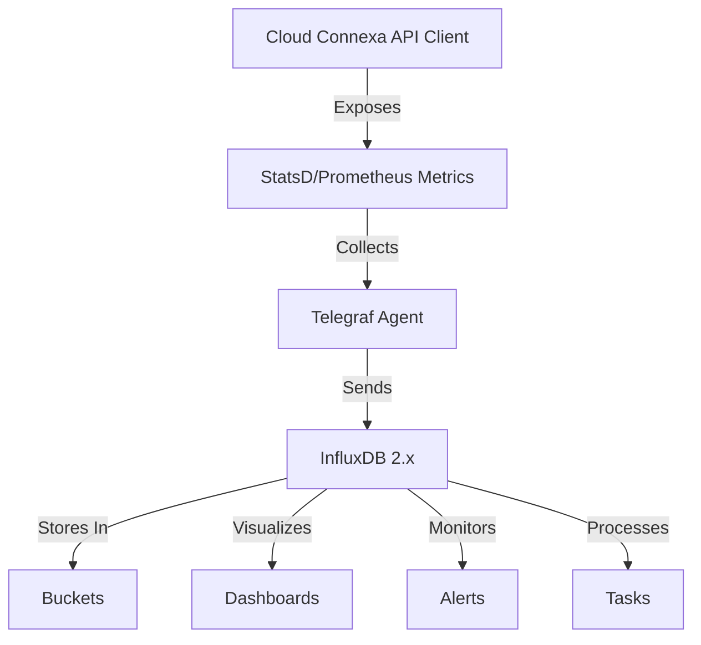

# Telegraf and InfluxDB 2.x Monitoring for Cloud Connexa API Client

This example demonstrates how to implement comprehensive monitoring for the Cloud Connexa API client using Telegraf and InfluxDB 2.x, enabling effective performance tracking and alerting in distributed environments.

## Overview

For organizations using the modern InfluxDB 2.x stack for monitoring, this guide provides a complete implementation of Cloud Connexa API client monitoring using:

1. Telegraf for metrics collection
2. InfluxDB 2.x for time-series data storage, visualization, and alerting
3. Flux language for powerful data analysis and transformations
4. InfluxDB UI for dashboards and alert management
5. InfluxDB Tasks for automated monitoring workflows

## Architecture



## Client Instrumentation

First, we need to instrument the client to expose metrics that Telegraf can collect. We'll build on the MonitoredCloudConnexaClient from our monitoring examples, but adapt it to work with StatsD, which Telegraf can collect.

```python
import time
import functools
import threading
import socket
from typing import Any, Callable, Dict, List, Optional
from datetime import datetime
from cloudconnexa import CloudConnexaClient

class StatsDClient:
    """Simple StatsD client implementation."""
    
    def __init__(self, host='localhost', port=8125, prefix='cloudconnexa'):
        """Initialize the StatsD client."""
        self.host = host
        self.port = port
        self.prefix = prefix
        self.socket = socket.socket(socket.AF_INET, socket.SOCK_DGRAM)
    
    def _format_metric_name(self, name):
        """Format a metric name with the prefix."""
        return f"{self.prefix}.{name}"
    
    def _send(self, data):
        """Send data to StatsD."""
        try:
            self.socket.sendto(data.encode('utf-8'), (self.host, self.port))
        except Exception as e:
            # Fail silently - metrics should not break the application
            pass
    
    def increment(self, metric, value=1, tags=None):
        """Increment a counter."""
        formatted_metric = self._format_metric_name(metric)
        if tags:
            formatted_tags = ',' + ','.join([f"{k}={v}" for k, v in tags.items()])
            formatted_metric = f"{formatted_metric}{formatted_tags}"
        
        self._send(f"{formatted_metric}:{value}|c")
    
    def timing(self, metric, value_ms, tags=None):
        """Record a timing in milliseconds."""
        formatted_metric = self._format_metric_name(metric)
        if tags:
            formatted_tags = ',' + ','.join([f"{k}={v}" for k, v in tags.items()])
            formatted_metric = f"{formatted_metric}{formatted_tags}"
        
        self._send(f"{formatted_metric}:{value_ms}|ms")
    
    def gauge(self, metric, value, tags=None):
        """Set a gauge value."""
        formatted_metric = self._format_metric_name(metric)
        if tags:
            formatted_tags = ',' + ','.join([f"{k}={v}" for k, v in tags.items()])
            formatted_metric = f"{formatted_metric}{formatted_tags}"
        
        self._send(f"{formatted_metric}:{value}|g")

class TelegrafMonitoredClient:
    """Cloud Connexa client wrapper that sends metrics to Telegraf via StatsD."""
    
    def __init__(
        self, 
        client: CloudConnexaClient, 
        statsd_host='localhost', 
        statsd_port=8125, 
        service_name='cloudconnexa',
        enable_tracing=True
    ):
        """
        Initialize the monitored client.
        
        Args:
            client: The CloudConnexaClient to monitor
            statsd_host: Host where Telegraf's StatsD input is listening
            statsd_port: Port for Telegraf's StatsD input
            service_name: Service name prefix for metrics
            enable_tracing: Whether to enable distributed tracing
        """
        self.client = client
        self.service_name = service_name
        self.enable_tracing = enable_tracing
        self.statsd = StatsDClient(host=statsd_host, port=statsd_port, prefix=service_name)
        self._local = threading.local()
        
        # Wrap client services with monitoring
        self._wrap_client_services()
    
    def _wrap_client_services(self):
        """Wrap all service methods with monitoring."""
        # For each service (networks, users, etc.)
        for service_name in [
            'networks', 'users', 'connectors', 'routes', 
            'vpn_regions', 'dns', 'user_groups', 'ip_services'
        ]:
            if hasattr(self.client, service_name):
                service = getattr(self.client, service_name)
                
                # Create a new wrapper object with the same methods
                wrapped_service = type(f'Monitored{service.__class__.__name__}', (), {})()
                
                # For each method in the service
                for method_name in ['list', 'get', 'create', 'update', 'delete']:
                    if hasattr(service, method_name):
                        original_method = getattr(service, method_name)
                        
                        # Wrap the method with monitoring
                        wrapped_method = self._wrap_method(
                            original_method, 
                            service_name, 
                            method_name
                        )
                        
                        # Set the wrapped method on our wrapper object
                        setattr(wrapped_service, method_name, wrapped_method)
                
                # Replace the original service with our wrapped version
                setattr(self, service_name, wrapped_service)
    
    def _wrap_method(self, method: Callable, service_name: str, method_name: str) -> Callable:
        """Wrap a service method with monitoring."""
        @functools.wraps(method)
        def wrapper(*args, **kwargs):
            endpoint = f"{service_name}.{method_name}"
            
            # Set up distributed tracing if enabled
            # (Implementation would depend on your tracing solution)
            
            start_time = time.time()
            success = False
            error_type = None
            
            try:
                # Execute the original method
                result = method(*args, **kwargs)
                success = True
                return result
            except Exception as e:
                error_type = type(e).__name__
                # Increment error counter
                self.statsd.increment(
                    "api.errors",
                    tags={
                        "method": method_name,
                        "service": service_name,
                        "error_type": error_type
                    }
                )
                raise
            finally:
                # Record metrics regardless of success/failure
                
                # Call duration
                duration_ms = (time.time() - start_time) * 1000
                self.statsd.timing(
                    "api.latency",
                    duration_ms,
                    tags={
                        "method": method_name,
                        "service": service_name
                    }
                )
                
                # Call count
                status = "success" if success else "error"
                self.statsd.increment(
                    "api.calls",
                    tags={
                        "method": method_name,
                        "service": service_name,
                        "status": status
                    }
                )
                
                # If this was an authentication call, track that specifically
                if service_name == "auth":
                    self.statsd.increment(
                        "auth.operations",
                        tags={
                            "operation": method_name,
                            "status": status
                        }
                    )
        
        return wrapper
    
    # Proxy all other attributes to the underlying client
    def __getattr__(self, name):
        return getattr(self.client, name)
```

## Telegraf Configuration for InfluxDB 2.x

Configure Telegraf to collect StatsD metrics and write them to InfluxDB 2.x using the new v2 API:

```toml
# /etc/telegraf/telegraf.conf

# Global settings
[agent]
  interval = "10s"
  round_interval = true
  metric_batch_size = 1000
  metric_buffer_limit = 10000
  collection_jitter = "0s"
  flush_interval = "10s"
  flush_jitter = "0s"
  precision = ""
  debug = false
  quiet = false
  hostname = ""
  omit_hostname = false

# StatsD input plugin - collect metrics from your application
[[inputs.statsd]]
  protocol = "udp"
  max_tcp_connections = 250
  tcp_keep_alive = false
  service_address = ":8125"
  delete_gauges = true
  delete_counters = true
  delete_sets = true
  delete_timings = true
  percentiles = [90, 95, 99]
  metric_separator = "."
  parse_data_dog_tags = true
  allowed_pending_messages = 10000
  percentile_limit = 1000

# InfluxDB v2 output - using the new HTTP API with tokens
[[outputs.influxdb_v2]]
  urls = ["http://influxdb:8086"]
  token = "${INFLUX_TOKEN}"
  organization = "${INFLUX_ORG}"
  bucket = "${INFLUX_BUCKET}"
  timeout = "5s"
  
# Additional useful inputs for system monitoring

# Collect system metrics
[[inputs.cpu]]
  percpu = true
  totalcpu = true
  collect_cpu_time = false
  report_active = false

[[inputs.disk]]
  ignore_fs = ["tmpfs", "devtmpfs", "devfs", "iso9660", "overlay", "aufs", "squashfs"]

[[inputs.diskio]]

[[inputs.mem]]

[[inputs.net]]

[[inputs.processes]]

[[inputs.swap]]

[[inputs.system]]

# HTTP metrics for your application
[[inputs.http_response]]
  urls = ["http://localhost:8000/health"]  # Your app's health endpoint
  response_timeout = "5s"
  method = "GET"
  follow_redirects = true
  insecure_skip_verify = false
```

## Using the Client with Telegraf

```python
from cloudconnexa import CloudConnexaClient, RetryPolicy
import os

# Initialize the base client
client = CloudConnexaClient(
    api_url=os.getenv("CLOUDCONNEXA_API_URL"),
    client_id=os.getenv("CLOUDCONNEXA_CLIENT_ID"),
    client_secret=os.getenv("CLOUDCONNEXA_CLIENT_SECRET"),
    retry_policy=RetryPolicy(
        max_retries=3,
        retry_codes=[408, 429, 500, 502, 503, 504],
        backoff_factor=0.5
    )
)

# Wrap with Telegraf monitoring
monitored_client = TelegrafMonitoredClient(
    client=client,
    statsd_host=os.getenv("TELEGRAF_HOST", "localhost"),
    statsd_port=int(os.getenv("TELEGRAF_PORT", 8125)),
    service_name="cloudconnexa"
)

# Use the client normally
networks = monitored_client.networks.list()
print(f"Found {len(networks)} networks")
```

## InfluxDB 2.x Flux Queries

Below are examples of useful Flux queries for analyzing Cloud Connexa API client metrics in InfluxDB 2.x:

```flux
// API call rate by service and method
from(bucket: "cloudconnexa")
  |> range(start: -1h)
  |> filter(fn: (r) => r._measurement == "cloudconnexa.api.calls")
  |> filter(fn: (r) => r._field == "value")
  |> group(columns: ["service", "method"])
  |> aggregateWindow(every: 1m, fn: sum, createEmpty: false)
  |> yield(name: "api_call_rate")

// Error percentage by service
import "math"

from(bucket: "cloudconnexa")
  |> range(start: -1h)
  |> filter(fn: (r) => r._measurement == "cloudconnexa.api.calls" or r._measurement == "cloudconnexa.api.errors")
  |> filter(fn: (r) => r._field == "value")
  |> aggregateWindow(every: 1m, fn: sum, createEmpty: false)
  |> pivot(rowKey:["_time", "service"], columnKey: ["_measurement"], valueColumn: "_value")
  |> map(fn: (r) => ({
      _time: r._time,
      service: r.service,
      error_percentage: if exists r["cloudconnexa.api.errors"] and exists r["cloudconnexa.api.calls"] and r["cloudconnexa.api.calls"] > 0.0 then (r["cloudconnexa.api.errors"] / r["cloudconnexa.api.calls"]) * 100.0 else 0.0
  }))
  |> filter(fn: (r) => r.error_percentage > 0.0)
  |> yield(name: "error_percentage")

// 95th percentile API latency by service and method
from(bucket: "cloudconnexa")
  |> range(start: -1h)
  |> filter(fn: (r) => r._measurement == "cloudconnexa.api.latency")
  |> filter(fn: (r) => r._field == "p95" or r._field == "value")
  |> group(columns: ["service", "method"])
  |> aggregateWindow(every: 5m, fn: mean, createEmpty: false)
  |> sort(columns: ["_value"], desc: true)
  |> yield(name: "p95_latency")
```

## Creating Dashboards in InfluxDB 2.x UI

InfluxDB 2.x includes a built-in dashboard solution. Here's how to structure your Cloud Connexa API monitoring dashboard:

1. **Create a new dashboard**:
   - In the InfluxDB UI, navigate to "Dashboards" and click "Create Dashboard" 
   - Name it "Cloud Connexa API Monitoring"

2. **Add an overview panel with API call rates**:
   - Add a graph visualization
   - Use this Flux query:
   ```flux
   from(bucket: "cloudconnexa")
     |> range(start: v.timeRangeStart, stop: v.timeRangeStop)
     |> filter(fn: (r) => r._measurement == "cloudconnexa.api.calls")
     |> filter(fn: (r) => r._field == "value")
     |> aggregateWindow(every: v.windowPeriod, fn: sum, createEmpty: false)
     |> yield(name: "API Call Volume")
   ```

3. **Add an error rate panel**:
   - Add a gauge visualization
   - Use this Flux query:
   ```flux
   import "math"

   calls = from(bucket: "cloudconnexa")
     |> range(start: v.timeRangeStart, stop: v.timeRangeStop)
     |> filter(fn: (r) => r._measurement == "cloudconnexa.api.calls")
     |> filter(fn: (r) => r._field == "value")
     |> sum()
     
   errors = from(bucket: "cloudconnexa")
     |> range(start: v.timeRangeStart, stop: v.timeRangeStop) 
     |> filter(fn: (r) => r._measurement == "cloudconnexa.api.errors")
     |> filter(fn: (r) => r._field == "value") 
     |> sum()
     
   join(tables: {calls: calls, errors: errors}, on: ["_start", "_stop"])
     |> map(fn: (r) => ({
       _time: r._time,
       _value: if r._value_errors > 0.0 and r._value_calls > 0.0 then (r._value_errors / r._value_calls) * 100.0 else 0.0
     }))
     |> yield(name: "Error Rate")
   ```
   - Set thresholds: 0-1% (green), 1-5% (yellow), >5% (red)

4. **Add a latency panel**:
   - Add a heatmap visualization 
   - Use this Flux query:
   ```flux
   from(bucket: "cloudconnexa") 
     |> range(start: v.timeRangeStart, stop: v.timeRangeStop)
     |> filter(fn: (r) => r._measurement == "cloudconnexa.api.latency")
     |> filter(fn: (r) => r._field == "p95" or r._field == "value")
     |> aggregateWindow(every: v.windowPeriod, fn: mean, createEmpty: false)
     |> group(columns: ["service", "method"])
   ```

## Setting Up Alerts in InfluxDB 2.x

InfluxDB 2.x has built-in alerting capabilities through Checks and Notification Rules:

1. **Create a high error rate check**:
   - In the InfluxDB UI, navigate to "Alerts" → "Checks" → "Create Check"
   - Select "Threshold Check"
   - Query:
   ```flux
   import "math"

   from(bucket: "cloudconnexa")
     |> range(start: -5m)
     |> filter(fn: (r) => r._measurement == "cloudconnexa.api.calls" or r._measurement == "cloudconnexa.api.errors")
     |> filter(fn: (r) => r._field == "value")
     |> aggregateWindow(every: 1m, fn: sum, createEmpty: false)
     |> pivot(rowKey:["_time", "service"], columnKey: ["_measurement"], valueColumn: "_value")
     |> map(fn: (r) => ({
         _time: r._time,
         _value: if exists r["cloudconnexa.api.errors"] and exists r["cloudconnexa.api.calls"] and r["cloudconnexa.api.calls"] > 0.0 then (r["cloudconnexa.api.errors"] / r["cloudconnexa.api.calls"]) * 100.0 else 0.0,
         service: r.service
     }))
   ```
   - Set thresholds: WARN > 2%, CRIT > 5%

2. **Create a high latency check**:
   - Create another check for high API latency
   - Query:
   ```flux
   from(bucket: "cloudconnexa")
     |> range(start: -5m)
     |> filter(fn: (r) => r._measurement == "cloudconnexa.api.latency")
     |> filter(fn: (r) => r._field == "p95" or r._field == "value")
     |> aggregateWindow(every: 1m, fn: mean, createEmpty: false)
     |> group(columns: ["service", "method"])
   ```
   - Set thresholds: WARN > 500ms, CRIT > 1000ms

3. **Create a notification endpoint**:
   - Go to "Alerts" → "Notification Endpoints" → "Create"
   - Select your preferred notification method (Slack, Email, PagerDuty, etc.)
   - Configure the endpoint details

4. **Create a notification rule**:
   - Go to "Alerts" → "Notification Rules" → "Create"
   - Select the checks you want to trigger the notification
   - Select the notification endpoint
   - Define the message template, e.g.:
   ```
   {{ if eq .Level "critical" }}🚨{{ else if eq .Level "warning" }}⚠️{{ end }} 
   {{ .Check.Name }} is {{ .Level }}: {{ index .Values "_value" }} 
   Service: {{ index .Tags "service" }}
   {{ if index .Tags "method" }}Method: {{ index .Tags "method" }}{{ end }}
   ```

## Monitoring Tasks with InfluxDB 2.x

Create automated monitoring tasks that run on a schedule:

```flux
// Create a daily summary report of API usage and performance
option task = {name: "Daily API Summary", every: 1d, offset: 0m}

data =
    from(bucket: "cloudconnexa")
        |> range(start: -24h)
        |> filter(fn: (r) => r._measurement == "cloudconnexa.api.calls" or r._measurement == "cloudconnexa.api.errors" or r._measurement == "cloudconnexa.api.latency")
        |> filter(fn: (r) => r._field == "value" or r._field == "p95")

// Aggregate API calls by service
total_calls = 
    data
        |> filter(fn: (r) => r._measurement == "cloudconnexa.api.calls")
        |> group(columns: ["service"])
        |> sum()
        |> set(key: "metric", value: "total_calls")
        |> keep(columns: ["_time", "_value", "service", "metric"])

// Calculate average latency by service
avg_latency =
    data
        |> filter(fn: (r) => r._measurement == "cloudconnexa.api.latency")
        |> group(columns: ["service"])
        |> mean()
        |> set(key: "metric", value: "avg_latency")
        |> keep(columns: ["_time", "_value", "service", "metric"])

// Count errors by service
error_count =
    data
        |> filter(fn: (r) => r._measurement == "cloudconnexa.api.errors")
        |> group(columns: ["service"])
        |> sum()
        |> set(key: "metric", value: "error_count")
        |> keep(columns: ["_time", "_value", "service", "metric"])

// Combine all metrics
union(tables: [total_calls, avg_latency, error_count])
    |> to(
        bucket: "cloudconnexa_reports",
        org: "your-org",
        measurementColumn: "metric",
        tagColumns: ["service"]
    )
```

## Containerized Deployment with InfluxDB 2.x

For containerized environments, here's a Docker Compose example:

```yaml
version: '3'
services:
  app:
    image: your-cloud-connexa-app
    environment:
      - CLOUDCONNEXA_API_URL=https://api.cloudconnexa.com
      - CLOUDCONNEXA_CLIENT_ID=your_client_id
      - CLOUDCONNEXA_CLIENT_SECRET=your_client_secret
      - TELEGRAF_HOST=telegraf
      - TELEGRAF_PORT=8125
    ports:
      - "8000:8000"
    depends_on:
      - telegraf
      
  telegraf:
    image: telegraf:1.22
    volumes:
      - ./telegraf.conf:/etc/telegraf/telegraf.conf:ro
    ports:
      - "8125:8125/udp"
    depends_on:
      - influxdb
    environment:
      - INFLUX_TOKEN=${INFLUX_TOKEN}
      - INFLUX_ORG=${INFLUX_ORG}
      - INFLUX_BUCKET=${INFLUX_BUCKET}
    
  influxdb:
    image: influxdb:2.6
    volumes:
      - influxdb_data:/var/lib/influxdb2
    ports:
      - "8086:8086"
    environment:
      - DOCKER_INFLUXDB_INIT_MODE=setup
      - DOCKER_INFLUXDB_INIT_USERNAME=${INFLUX_USERNAME}
      - DOCKER_INFLUXDB_INIT_PASSWORD=${INFLUX_PASSWORD}
      - DOCKER_INFLUXDB_INIT_ORG=${INFLUX_ORG}
      - DOCKER_INFLUXDB_INIT_BUCKET=${INFLUX_BUCKET}
      - DOCKER_INFLUXDB_INIT_ADMIN_TOKEN=${INFLUX_TOKEN}
      - DOCKER_INFLUXDB_INIT_RETENTION=${INFLUX_RETENTION}

volumes:
  influxdb_data:
```

## Best Practices for InfluxDB 2.x

1. **Data Organization**:
   - Use buckets to organize data by retention requirements
   - Structure measurements with consistent field names
   - Take advantage of tags for efficient filtering

2. **Tagging Strategy**: 
   - Use tags for dimensions you commonly filter or group by
   - Keep tag values short and concise
   - Avoid using timestamps or unique IDs as tag values

3. **Retention Management**: 
   - Set appropriate bucket retention policies based on metric importance
   - Use downsampling tasks to aggregate historical data
   - Monitor storage usage through the InfluxDB UI

4. **Performance Optimization**:
   - Use batch writes for greater efficiency
   - Filter data as early as possible in Flux queries
   - Leverage task system for regular data transformations

5. **Security Best Practices**:
   - Use token-based authentication
   - Create tokens with appropriate permissions using InfluxDB 2.x's fine-grained authorization
   - Rotate tokens periodically
   - Use HTTPS for all communication

## Conclusion

Implementing Cloud Connexa API client monitoring with Telegraf and InfluxDB 2.x provides a modern, powerful solution for tracking performance, detecting issues, and maintaining high availability. With InfluxDB 2.x's integrated dashboarding, alerting, and task capabilities, you have a complete observability solution that can scale with your application.

By collecting detailed metrics about API calls, latency, errors, and system performance, you can ensure your applications using the Cloud Connexa API client remain reliable and performant in production environments. 