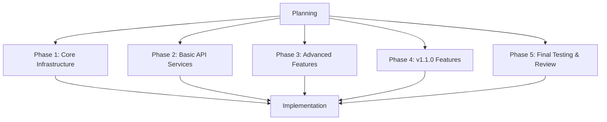
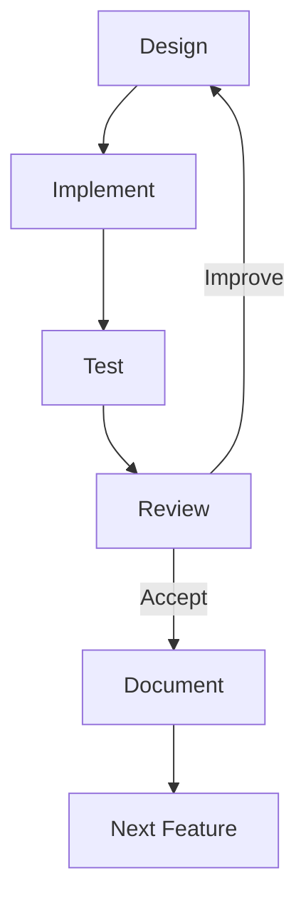
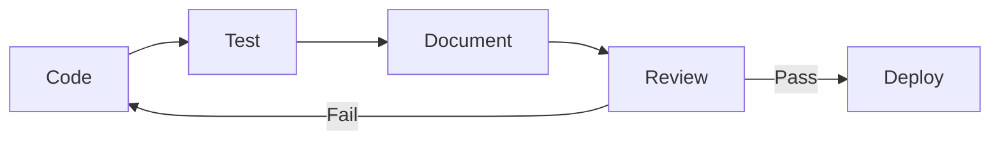
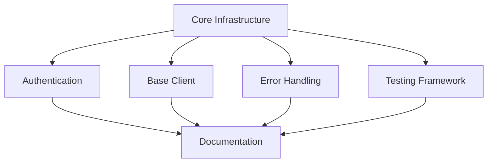
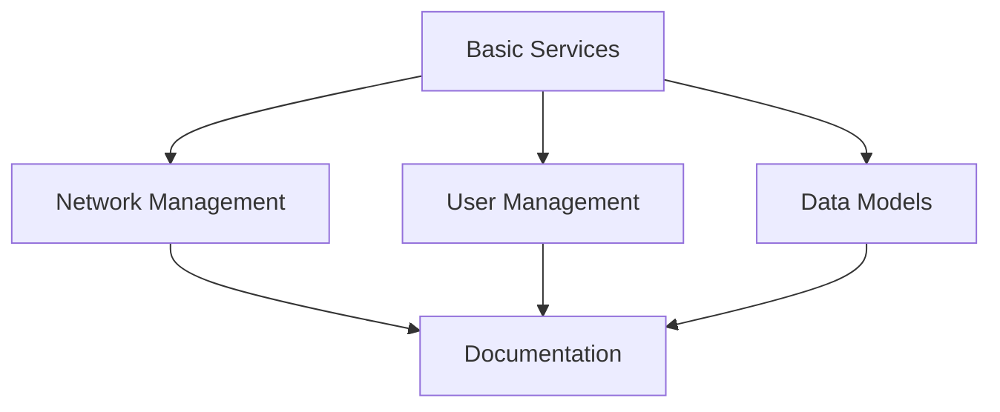
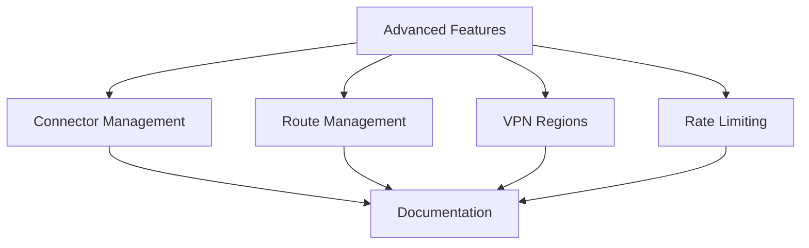
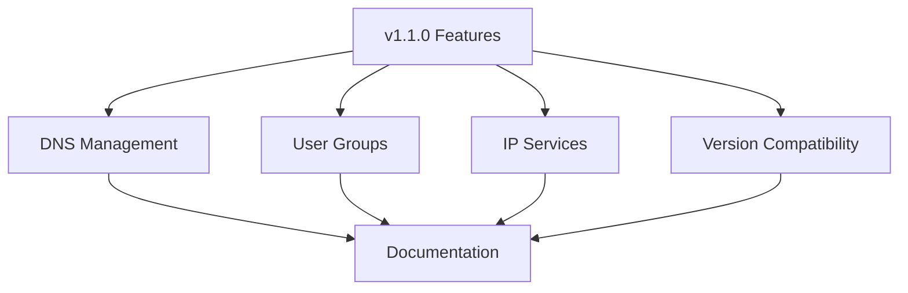
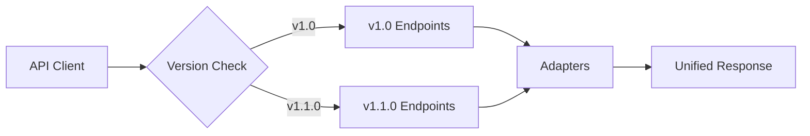
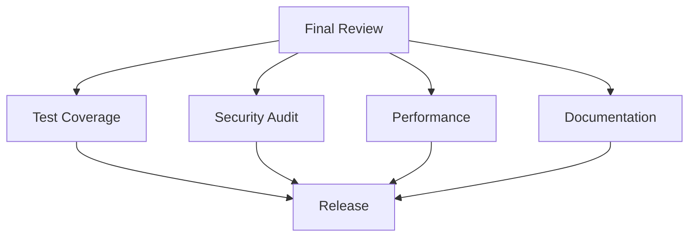

# Cloud Connexa Python Client - Project Plan

## Summary


This directory contains the project's implementation plans for the Cloud Connexa Python client. The project is broken down into five sequential phases, with each phase building upon the previous one and having clear objectives, tasks, and success criteria to guide development.

## Development Approach

### Iterative Development Cycle


### Continuous Integration


## Documentation Strategy

### Continuous Documentation
- Documentation is an ongoing process, not a phase
- Each feature is documented as it's implemented
- API documentation is updated with each endpoint
- Examples are created alongside features
- Tests serve as living documentation

### Documentation Components
- Code documentation (docstrings, type hints)
- API documentation (endpoints, models, examples)
- Architecture documentation (design decisions, patterns)
- Testing documentation (test cases, scenarios)
- Security documentation (authentication, authorization)

### Documentation Tools
- Sphinx for API documentation
- Type hints for code documentation
- Test cases as usage examples
- Architecture Decision Records (ADRs)
- Security documentation

## Phase Overview

### Phase 1: Core Infrastructure


- Basic project setup
- Authentication system
- Core client implementation
- Basic error handling
- Initial test framework

[Detailed Plan](plan_ph1.md)

### Phase 2: Basic API Services


- Network management
- User management
- Basic model implementations
- Unit tests for core functionality

[Detailed Plan](plan_ph2.md)

### Phase 3: Advanced Features


- Connector management
- Route management
- VPN Region support
- Rate limiting
- Advanced error handling
- Integration tests

[Detailed Plan](plan_ph3.md)

### Phase 4: v1.1.0 Features




- DNS record management with single record endpoint (v1.1.0) and list/filter fallback (v1.0)
- User group management with single group endpoint (v1.1.0) and list/filter fallback (v1.0)
- IP Service management with DTO structure differences (routing removed in v1.1.0)
- Version compatibility layer for seamless API version handling
- Comprehensive tests for both API versions
- Version-specific documentation and examples
- Migration guide for transitioning from v1.0 to v1.1.0

[Detailed Plan](plan_ph4.md)
[Migration Guide](migration_v1_to_v110.md)

### Phase 5: Final Testing & Review


- Comprehensive test coverage
- Security audit
- Performance testing
- Final documentation review
- Release preparation

[Detailed Plan](plan_ph5.md)

## Implementation Sequence
- Phase 1 must be completed before Phase 2
- Phase 2 must be completed before Phase 3
- Phase 3 must be completed before Phase 4
- Phase 4 must be completed before Phase 5
- Documentation and testing are continuous throughout all phases

## Success Criteria
- Complete API coverage
- 90%+ test coverage
- All tests passing
- Documentation complete and up-to-date
- Security audit passed
- Performance requirements met

## Dependencies
- Python 3.7+
- Cloud Connexa API v1.1.0
- Required Python packages (see requirements.txt)

## Risk Management
- API changes during development
- Security vulnerabilities
- Performance bottlenecks
- Integration challenges

## Review Points
- End of each phase
- Security review
- Performance review
- Documentation review
- Code quality review

## Notes for AI
- Plans should be followed in sequential order
- Each phase has specific objectives and tasks
- Success criteria must be met before moving to next phase
- Documentation is continuous throughout all phases
- Technical details should be referenced when implementing features
- Dependencies between phases should be respected

## Documentation Structure
```
docs/
├── api/                    # API documentation
│   ├── authentication.md   # Auth documentation
│   ├── networks.md        # Network API docs
│   ├── users.md           # User API docs
│   └── ...
├── architecture/          # Architecture docs
│   ├── decisions/         # ADRs
│   ├── patterns.md       # Design patterns
│   └── security.md       # Security architecture
├── examples/             # Usage examples
│   ├── basic/           # Basic usage
│   ├── advanced/        # Advanced usage
│   └── security/        # Security examples
├── development/         # Development guides
│   ├── setup.md        # Setup guide
│   ├── testing.md      # Testing guide
│   └── contributing.md # Contributing guide
└── planning/           # Project planning
    ├── README.md       # Main plan (this file)
    ├── plan_ph1.md     # Phase 1
    ├── plan_ph2.md     # Phase 2
    ├── plan_ph3.md     # Phase 3
    ├── plan_ph4.md     # Phase 4
    ├── plan_ph5.md     # Phase 5
    └── migration_v1_to_v110.md # Migration guide
``` 