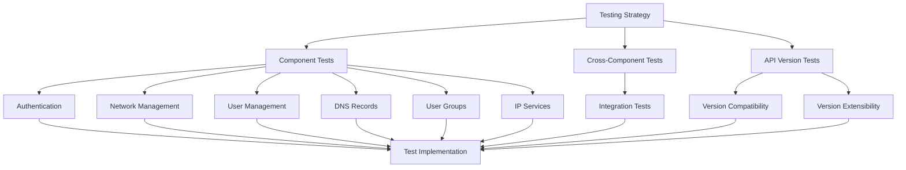
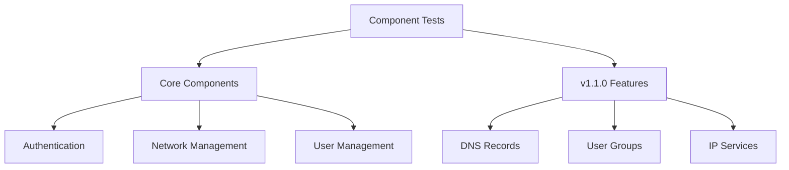
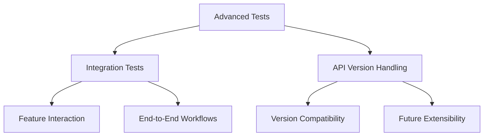

# Testing Documentation

## Summary

This directory contains the test strategy and specifications for the Cloud Connexa Python client. It follows a Test-Driven Development (TDD) approach, where tests are defined before implementation to ensure quality and maintainability.

## Test Organization

### Component Tests

### Cross-Component and API Version Tests

## Notes for AI
- All tests should be written before implementation
- Tests should cover both success and failure cases
- Security tests are critical and must be comprehensive
- Performance tests should include benchmarks
- Mock external dependencies appropriately
- Follow pytest best practices
- Maintain test isolation
- Use appropriate fixtures
- Document test scenarios clearly

## Contents

### Core Component Tests
- [Authentication Tests](auth_tests.md) - Testing authentication flows, token management, and error handling
- [Network Tests](network_tests.md) - Testing network resource creation, retrieval, updates, and deletion
- [User Tests](user_tests.md) - Testing user management operations and access control

### v1.1.0 Feature Tests
- [DNS Tests](dns_tests.md) - Testing DNS record management with v1.1.0 single record retrieval
- [User Group Tests](user_group_tests.md) - Testing user group management with v1.1.0 single group retrieval
- [IP Service Tests](ip_service_tests.md) - Testing IP services with v1.1.0 updated DTO structure

### Cross-Component Tests
- [Integration Tests](integration_tests.md) - Testing v1.1.0 features working together in complete workflows

### API Version Tests
- [Version Compatibility Tests](version_compatibility_tests.md) - Testing compatibility across API versions
- [API Version Extensibility Tests](api_version_extensibility_tests.md) - Testing extensibility for future API versions

## Test Specification Format
Each test specification includes:
- Test scenarios
- Input/output expectations
- Edge cases
- Error conditions
- Mocking requirements
- Test data
- Example code snippets 