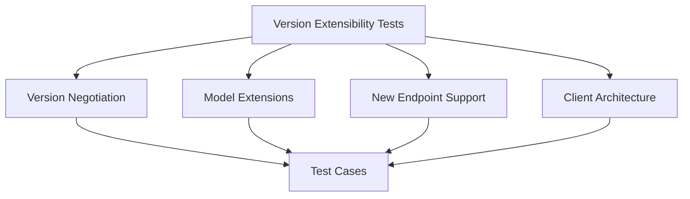

# API Version Extensibility Tests

## Summary


This document specifies test cases for ensuring the Cloud Connexa Python client can be easily extended to support future API versions (beyond v1.1.0). Rather than focusing on backward compatibility, these tests verify the client's architecture is flexible enough to incorporate new features, endpoints, and data structures as the API evolves.

## Notes for AI
- Test the client's architecture for extensibility
- Verify the process for adding support for new API versions
- Test patterns for handling new endpoints
- Test patterns for extending data models
- Validate version negotiation mechanisms
- Test client's ability to adapt to API schema changes
- Verify documentation for extending the client
- Ensure test framework can be extended for new features

## Test Cases

### 1. Version Negotiation Framework
```python
def test_version_negotiation_framework():
    """Test the client's ability to negotiate and select API versions."""
    # Test cases:
    # - Client detects available API versions
    # - Client selects appropriate version
    # - Client handles new version announcement
    # - Version selection can be overridden
    # - Client handles unknown versions gracefully
```

### 2. Model Extension Patterns
```python
def test_model_extension_patterns():
    """Test patterns for extending data models for new API versions."""
    # Test cases:
    # - Extending existing models with new fields
    # - Handling removed fields
    # - Adding new model types
    # - Versioned model serialization/deserialization
    # - Model validation for different versions
```

### 3. Service Layer Extensibility
```python
def test_service_layer_extensibility():
    """Test the extensibility of the service layer for new endpoints."""
    # Test cases:
    # - Adding new API endpoints
    # - Extending existing endpoints with new parameters
    # - Versioned service registration
    # - Service discovery and documentation
    # - Service method overriding
```

### 4. Client Architecture Flexibility
```python
def test_client_architecture_flexibility():
    """Test the overall architecture's flexibility for extension."""
    # Test cases:
    # - Adding version-specific client features
    # - Plugin architecture for extensions
    # - Configuration framework for version features
    # - Feature detection and graceful degradation
    # - Consistent client interface across versions
```

### 5. Version Migration Workflow
```python
def test_version_migration_workflow():
    """Test the workflow for migrating to a new API version."""
    # Test cases:
    # - Process for adding new version support
    # - Testing strategy for new versions
    # - Documentation update workflow
    # - Gradual feature adoption
    # - Feature toggles for new functionality
```

## Test Data

### Version Extension Framework
```python
VERSION_EXTENSION_SCENARIOS = {
    "new_endpoint": {
        "name": "new_feature_endpoint",
        "version_introduced": "v1.2.0",
        "method": "GET",
        "path": "/new-feature",
        "response_schema": {
            "type": "object",
            "properties": {
                "id": {"type": "string"},
                "name": {"type": "string"},
                "new_property": {"type": "boolean"}
            }
        }
    },
    "extended_model": {
        "name": "network",
        "version_introduced": "v1.1.0",
        "version_extended": "v1.2.0",
        "new_properties": [
            {"name": "advanced_options", "type": "object"},
            {"name": "tags", "type": "array"}
        ]
    },
    "changed_behavior": {
        "name": "listing_pagination",
        "version_introduced": "v1.1.0",
        "version_changed": "v1.2.0",
        "change_description": "Pagination tokens instead of page numbers"
    }
}
```

### Model Extension Example
```python
MODEL_EXTENSIONS = {
    "v1.1.0": {
        "Network": [
            "id", "name", "cidr", "description", "created_at", "updated_at"
        ],
        "User": [
            "id", "name", "email", "role", "created_at", "updated_at"
        ]
    },
    "v1.2.0": {
        "Network": [
            "id", "name", "cidr", "description", "created_at", "updated_at",
            "tags", "advanced_options", "metrics"
        ],
        "User": [
            "id", "name", "email", "role", "created_at", "updated_at",
            "last_login", "two_factor_enabled", "preferences"
        ],
        "NewResource": [
            "id", "name", "type", "configuration"
        ]
    }
}
```

## Mocking Requirements

### Version Extension Mock
```python
@pytest.fixture
def mock_version_extension():
    """Mock framework for testing version extensions."""
    class VersionExtensionTester:
        def __init__(self):
            self.client = CloudConnexaClient(api_version="1.1.0")
            self.available_versions = ["1.0", "1.1.0", "1.2.0"]
            
        def extend_to_version(self, version):
            """Simulate extending the client to a new version."""
            # Extension logic here
            pass
            
        def add_new_endpoint(self, endpoint_spec):
            """Simulate adding a new endpoint."""
            # Endpoint addition logic
            pass
            
        def extend_model(self, model_name, new_properties):
            """Simulate extending a model with new properties."""
            # Model extension logic
            pass
    
    return VersionExtensionTester()
```

### Future API Mock
```python
@pytest.fixture
def mock_future_api():
    """Mock a future version of the API."""
    with requests_mock.Mocker() as m:
        # Mock current version endpoints
        m.register_uri("GET", "https://api.cloudconnexa.com/v1.1.0/networks", json={"networks": []})
        
        # Mock future version endpoints
        m.register_uri("GET", "https://api.cloudconnexa.com/v1.2.0/networks", json={"networks": [], "pagination_token": "token123"})
        m.register_uri("GET", "https://api.cloudconnexa.com/v1.2.0/new-feature", json={"features": []})
        
        yield m
```

## Extending Tests for New Versions

When the API is updated to a new version:

1. Create a new test file `test_vX_X_X_features.py` for version-specific features
2. Update the model extension tests with new model schemas
3. Add tests for new endpoints
4. Update version negotiation tests with the new version
5. Add migration tests from the previous version

Example for adding tests for a hypothetical v1.2.0:

```python
def test_v1_2_0_network_tags():
    """Test the new network tags feature in v1.2.0."""
    client = CloudConnexaClient(api_version="1.2.0")
    network = client.networks.create(
        name="test-network",
        cidr="10.0.0.0/24",
        tags=["prod", "web"]  # New in v1.2.0
    )
    assert "tags" in network
    assert network["tags"] == ["prod", "web"]
```

## Test Developer Workflow

When extending the client for a new API version:

1. Create a version-specific implementation class
2. Extend base models with new properties
3. Add new service methods for new endpoints
4. Update version negotiation logic
5. Add tests for new functionality
6. Update documentation with version-specific notes

Example workflow:

```python
# 1. Create version implementation
class V120Implementation(BaseVersionImplementation):
    """Implementation for v1.2.0 API."""
    
    # 2. Extend models
    def get_network_model(self):
        """Get the network model for v1.2.0."""
        model = super().get_network_model()
        model.add_property("tags", list)
        model.add_property("advanced_options", dict)
        return model
    
    # 3. Add new endpoints
    def register_services(self, client):
        """Register services for v1.2.0."""
        super().register_services(client)
        client.register_service("new_feature", NewFeatureService)
```

## Success Criteria
- Client architecture supports easy extension for new API versions
- Adding new endpoints requires minimal code changes
- Model extensions are straightforward to implement
- Version negotiation works for future versions
- Documentation clearly explains version extension process
- Test framework can be easily extended for new versions
- Developer workflow for adding new versions is well-defined and tested 