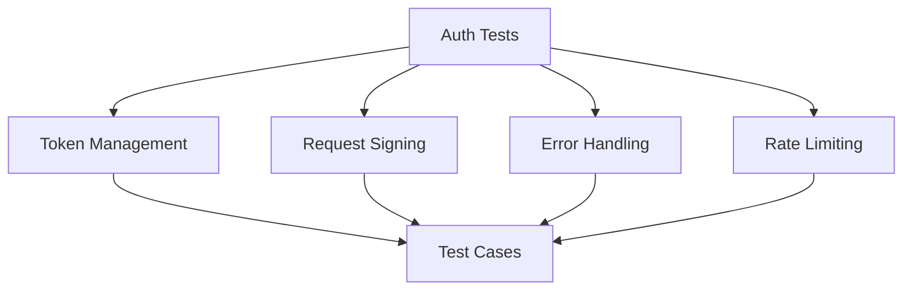

# Authentication Tests

## Summary


This document specifies the test cases for the authentication system of the Cloud Connexa Python client. Authentication is a critical component that requires thorough testing of token management, request signing, and error handling.

## Notes for AI
- Mock all external API calls
- Test token refresh scenarios
- Verify request signing
- Test rate limiting behavior
- Validate error handling
- Check credential management
- Test concurrent requests
- Verify token expiration
- Test invalid credentials
- Check secure storage

## Test Cases

### 1. Client Initialization
```python
def test_client_init():
    """Test client initialization with various credential combinations."""
    # Test cases:
    # - Valid credentials
    # - Missing credentials
    # - Invalid credentials
    # - Environment variables
    # - Secure storage
```

### 2. Token Management
```python
def test_token_management():
    """Test token acquisition, refresh, and validation."""
    # Test cases:
    # - Initial token acquisition
    # - Token refresh before expiration
    # - Token refresh after expiration
    # - Invalid token handling
    # - Concurrent token requests
```

### 3. Request Signing
```python
def test_request_signing():
    """Test request signing and validation."""
    # Test cases:
    # - Valid request signing
    # - Invalid signatures
    # - Missing signatures
    # - Signature expiration
    # - Different request types
```

### 4. Error Handling
```python
def test_auth_errors():
    """Test authentication error handling."""
    # Test cases:
    # - Invalid credentials
    # - Expired tokens
    # - Rate limiting
    # - Network errors
    # - Server errors
```

### 5. Rate Limiting
```python
def test_rate_limiting():
    """Test rate limiting behavior."""
    # Test cases:
    # - Basic rate limiting
    # - Burst handling
    # - Recovery after limit
    # - Different endpoints
    # - Concurrent requests
```

## Test Data

### Valid Credentials
```python
VALID_CREDENTIALS = {
    "client_id": "test_client_id",
    "client_secret": "test_client_secret",
    "api_url": "https://api.openvpn.com"
}
```

### Invalid Credentials
```python
INVALID_CREDENTIALS = [
    {"client_id": "", "client_secret": "valid_secret"},
    {"client_id": "valid_id", "client_secret": ""},
    {"client_id": None, "client_secret": "valid_secret"},
    {"client_id": "valid_id", "client_secret": None}
]
```

### Token Responses
```python
TOKEN_RESPONSES = {
    "valid": {
        "access_token": "valid_token",
        "token_type": "Bearer",
        "expires_in": 3600
    },
    "expired": {
        "access_token": "expired_token",
        "token_type": "Bearer",
        "expires_in": 0
    },
    "invalid": {
        "error": "invalid_client",
        "error_description": "Invalid client credentials"
    }
}
```

## Mocking Requirements

### API Client Mock
```python
@pytest.fixture
def mock_api_client():
    """Mock API client for authentication tests."""
    with requests_mock.Mocker() as m:
        yield m
```

### Token Storage Mock
```python
@pytest.fixture
def mock_token_storage():
    """Mock token storage for authentication tests."""
    storage = {}
    return storage
```

## Success Criteria
- All test cases pass
- 100% code coverage for auth module
- No security vulnerabilities
- Proper error handling
- Correct rate limiting
- Secure credential management
- Proper token refresh
- Valid request signing 