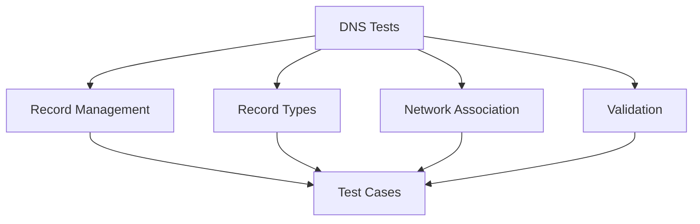

# DNS Tests

## Summary


This document specifies the test cases for the DNS record management functionality of the Cloud Connexa Python client. DNS management is a key feature in v1.1.0, with specific endpoints for managing DNS records within networks.

## Notes for AI
- Test all DNS record operations thoroughly
- Validate different record types (A, AAAA, CNAME, MX, TXT)
- Test network association
- Verify record validation
- Check error conditions
- Test concurrent operations
- Validate data models
- Test pagination
- Verify filtering
- Check sorting options

## Test Cases

### 1. DNS Record Creation
```python
def test_dns_record_creation():
    """Test DNS record creation with various configurations."""
    # Test cases:
    # - Basic A record creation
    # - AAAA record creation
    # - CNAME record creation
    # - MX record creation
    # - TXT record creation
    # - Invalid record types
    # - Duplicate records
    # - Missing required fields
```

### 2. DNS Record Retrieval
```python
def test_dns_record_retrieval():
    """Test DNS record retrieval operations."""
    # Test cases:
    # - Get single DNS record
    # - List all DNS records
    # - Filter by record type
    # - Filter by network
    # - Sort records
    # - Pagination
    # - Non-existent record
    # - Invalid record ID
```

### 3. DNS Record Update
```python
def test_dns_record_update():
    """Test DNS record update operations."""
    # Test cases:
    # - Update record value
    # - Update TTL
    # - Update record type
    # - Partial updates
    # - Invalid updates
    # - Concurrent updates
```

### 4. DNS Record Deletion
```python
def test_dns_record_deletion():
    """Test DNS record deletion operations."""
    # Test cases:
    # - Delete existing record
    # - Delete non-existent record
    # - Delete record with dependencies
    # - Concurrent deletions
```

### 5. Record Validation
```python
def test_dns_record_validation():
    """Test DNS record validation."""
    # Test cases:
    # - Valid A record format
    # - Valid AAAA record format
    # - Valid CNAME record format
    # - Valid MX record format
    # - Valid TXT record format
    # - Invalid record formats
```

## Test Data

### DNS Record Configurations
```python
DNS_RECORD_CONFIGS = {
    "a_record": {
        "type": "A",
        "name": "test.example.com",
        "value": "192.168.1.1",
        "ttl": 3600
    },
    "aaaa_record": {
        "type": "AAAA",
        "name": "test.example.com",
        "value": "2001:db8::1",
        "ttl": 3600
    },
    "cname_record": {
        "type": "CNAME",
        "name": "www.example.com",
        "value": "example.com",
        "ttl": 3600
    },
    "mx_record": {
        "type": "MX",
        "name": "example.com",
        "value": "mail.example.com",
        "priority": 10,
        "ttl": 3600
    },
    "txt_record": {
        "type": "TXT",
        "name": "example.com",
        "value": "v=spf1 include:_spf.example.com ~all",
        "ttl": 3600
    },
    "invalid": {
        "type": "INVALID",
        "name": "test.example.com",
        "value": "invalid",
        "ttl": 3600
    }
}
```

### DNS Record Responses
```python
DNS_RECORD_RESPONSES = {
    "created": {
        "id": "dns_123",
        "type": "A",
        "name": "test.example.com",
        "value": "192.168.1.1",
        "ttl": 3600,
        "created_at": "2024-01-01T00:00:00Z"
    },
    "updated": {
        "id": "dns_123",
        "type": "A",
        "name": "test.example.com",
        "value": "192.168.1.2",
        "ttl": 7200,
        "updated_at": "2024-01-02T00:00:00Z"
    },
    "error": {
        "error": "invalid_dns_record",
        "error_description": "Invalid DNS record configuration"
    }
}
```

## Mocking Requirements

### DNS API Mock
```python
@pytest.fixture
def mock_dns_api():
    """Mock DNS API for tests."""
    with requests_mock.Mocker() as m:
        yield m
```

### DNS Storage Mock
```python
@pytest.fixture
def mock_dns_storage():
    """Mock DNS storage for tests."""
    storage = {}
    return storage
```

## Success Criteria
- All DNS record operations work correctly
- Record type validation is thorough
- Network association is handled properly
- Record formats are validated correctly
- Error conditions are handled appropriately
- Data validation is thorough
- Concurrent operations work correctly
- Pagination and filtering work as expected 