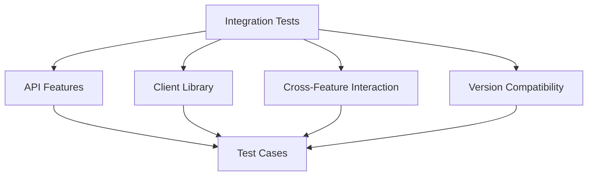

# Integration Tests (v1.1.0)

## Summary


This document specifies the integration test cases for verifying all v1.1.0 API features working together in the Cloud Connexa Python client. These tests focus on ensuring that the three main differences from v1.0 (single DNS record endpoint, single User Group endpoint, and updated IP Service DTO) all work correctly when used together in real-world scenarios.

## Notes for AI
- Test complete workflows that use multiple API features together
- Verify all v1.1.0 features work in combination
- Test interactions between DNS, User Groups, and IP Services
- Validate end-to-end scenarios
- Test with realistic data scenarios
- Verify data consistency across API calls
- Test performance under realistic load
- Verify error propagation across component boundaries

## Test Cases

### 1. Complete Network Setup Workflow
```python
def test_complete_network_setup():
    """Test a complete network setup workflow using v1.1.0 features."""
    # Test workflow:
    # 1. Create network
    # 2. Create user group with access to network
    # 3. Add users to group
    # 4. Add DNS records for network
    # 5. Configure IP services
    # 6. Verify single record/group retrieval (v1.1.0 feature)
    # 7. Verify IP services have correct DTO format (v1.1.0 feature)
```

### 2. DNS Management Integration
```python
def test_dns_management_integration():
    """Test DNS management integration with other features."""
    # Test workflow:
    # 1. Create DNS records of different types
    # 2. Verify single record retrieval (v1.1.0 feature)
    # 3. Associate records with networks
    # 4. Grant user groups access to manage DNS
    # 5. Verify record updates propagate correctly
    # 6. Test DNS operations in combination with IP service changes
```

### 3. User Group Access Control
```python
def test_user_group_access_control():
    """Test user group access control integration."""
    # Test workflow:
    # 1. Create multiple user groups
    # 2. Verify single group retrieval (v1.1.0 feature)
    # 3. Assign different permissions to groups
    # 4. Test access to networks and DNS records
    # 5. Verify permission enforcement
    # 6. Test interaction with IP services
```

### 4. IP Service Network Integration
```python
def test_ip_service_network_integration():
    """Test IP service integration with network features."""
    # Test workflow:
    # 1. Create networks and hosts
    # 2. Configure IP services for hosts
    # 3. Verify IP service DTO format (v1.1.0 feature)
    # 4. Associate DNS records with services
    # 5. Test user group access to services
    # 6. Verify configuration changes apply correctly
```

### 5. Multi-Feature Transaction Tests
```python
def test_multi_feature_transactions():
    """Test operations that span multiple features."""
    # Test workflow:
    # 1. Create a complete environment (networks, groups, users, DNS, services)
    # 2. Perform complex changes that affect multiple components
    # 3. Verify all v1.1.0 features (single DNS, single group, IP DTO)
    # 4. Test rollback scenarios
    # 5. Verify data consistency across all components
```

## Test Data

### Integration Test Environment
```python
INTEGRATION_ENV = {
    "networks": [
        {"id": "net_1", "name": "test-network-1", "cidr": "10.0.0.0/24"},
        {"id": "net_2", "name": "test-network-2", "cidr": "10.0.1.0/24"}
    ],
    "user_groups": [
        {
            "id": "group_1", 
            "name": "admins",
            "permissions": ["admin"]
        },
        {
            "id": "group_2", 
            "name": "users",
            "permissions": ["read", "write"]
        }
    ],
    "users": [
        {"id": "user_1", "name": "admin1", "groups": ["group_1"]},
        {"id": "user_2", "name": "user1", "groups": ["group_2"]}
    ],
    "dns_records": [
        {
            "id": "dns_1",
            "type": "A",
            "name": "test1.example.com",
            "value": "10.0.0.5"
        },
        {
            "id": "dns_2",
            "type": "CNAME",
            "name": "www.example.com",
            "value": "test1.example.com"
        }
    ],
    "hosts": [
        {"id": "host_1", "name": "host1", "network_id": "net_1"},
        {"id": "host_2", "name": "host2", "network_id": "net_2"}
    ],
    "ip_services": [
        {
            "id": "service_1",
            "name": "service1",
            "host_id": "host_1",
            "enabled": True
            # No routing information as per v1.1.0
        }
    ]
}
```

### Expected Test Results
```python
EXPECTED_RESULTS = {
    "single_dns_retrieval": {
        "success": True,
        "record_matches": True,
        "response_time_ms": "<= 200"
    },
    "single_group_retrieval": {
        "success": True,
        "group_matches": True,
        "response_time_ms": "<= 200"
    },
    "ip_service_format": {
        "has_expected_fields": True,
        "missing_routing_info": True,
        "backward_compatible": True
    },
    "multi_feature_transaction": {
        "success": True,
        "data_consistent": True,
        "all_features_working": True
    }
}
```

## Mocking Requirements

### Integration Environment Mock
```python
@pytest.fixture
def mock_integration_environment():
    """Set up a complete mock environment for integration tests."""
    with requests_mock.Mocker() as m:
        # Configure all required endpoints
        setup_network_endpoints(m)
        setup_user_group_endpoints(m)
        setup_dns_endpoints(m)
        setup_ip_service_endpoints(m)
        yield m
```

### Multi-Feature Mock
```python
def setup_network_endpoints(mock):
    """Set up network-related endpoints."""
    # Network endpoints
    for network in INTEGRATION_ENV["networks"]:
        mock.register_uri(
            "GET", 
            f"https://api.cloudconnexa.com/v1.1.0/networks/{network['id']}", 
            json=network
        )
    mock.register_uri(
        "GET", 
        "https://api.cloudconnexa.com/v1.1.0/networks", 
        json={"networks": INTEGRATION_ENV["networks"]}
    )
    
    # Similar setup for other endpoints
```

## Success Criteria
- All v1.1.0 features work correctly in combination
- Single DNS record retrieval works in real-world scenarios
- Single User Group retrieval works in real-world scenarios
- IP Service DTO format is correct in all contexts
- Features interact correctly with each other
- Error conditions are handled appropriately
- Performance is acceptable under realistic load
- Data consistency is maintained across API calls
- Client provides a coherent interface for all v1.1.0 features 