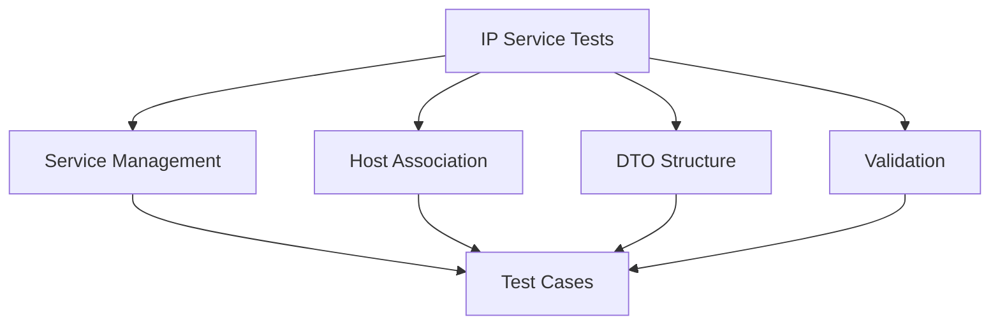

# IP Service Tests

## Summary


This document specifies the test cases for the IP Service management functionality of the Cloud Connexa Python client. In v1.1.0, the Data Transfer Object (DTO) for IP Services associated with a Host was updated to remove unnecessary routing information, which is a key change to verify.

## Notes for AI
- Test all IP Service operations thoroughly
- Verify the updated DTO structure (v1.1.0) that removes unnecessary routing information
- Test host association
- Validate IP Service configurations
- Check error conditions
- Test concurrent operations
- Validate data models
- Test pagination
- Verify filtering
- Check sorting options

## Test Cases

### 1. IP Service Creation
```python
def test_ip_service_creation():
    """Test IP Service creation with various configurations."""
    # Test cases:
    # - Basic IP Service creation
    # - IP Service with host association
    # - IP Service with specific configurations
    # - Verify DTO has no unnecessary routing information (v1.1.0)
    # - Invalid configurations
    # - Duplicate services
    # - Missing required fields
```

### 2. IP Service Retrieval
```python
def test_ip_service_retrieval():
    """Test IP Service retrieval operations."""
    # Test cases:
    # - Get single IP Service
    # - List all IP Services
    # - Filter by host
    # - Filter by status
    # - Sort services
    # - Pagination
    # - Non-existent service
    # - Invalid service ID
    # - Verify returned DTO has no routing information (v1.1.0)
```

### 3. IP Service Update
```python
def test_ip_service_update():
    """Test IP Service update operations."""
    # Test cases:
    # - Update service configuration
    # - Update host association
    # - Partial updates
    # - Invalid updates
    # - Concurrent updates
    # - Verify updated DTO has no routing information (v1.1.0)
```

### 4. IP Service Deletion
```python
def test_ip_service_deletion():
    """Test IP Service deletion operations."""
    # Test cases:
    # - Delete existing service
    # - Delete non-existent service
    # - Delete service with dependencies
    # - Concurrent deletions
```

### 5. DTO Structure Validation
```python
def test_ip_service_dto_structure():
    """Test IP Service DTO structure specifically for v1.1.0 changes."""
    # Test cases:
    # - Verify DTO has expected fields
    # - Verify DTO DOES NOT have routing information (v1.1.0 change)
    # - Test serialization/deserialization
    # - Test backward compatibility with older code
```

## Test Data

### IP Service Configurations
```python
IP_SERVICE_CONFIGS = {
    "basic": {
        "name": "test-service",
        "host_id": "host_123",
        "enabled": True
    },
    "full": {
        "name": "test-service-full",
        "host_id": "host_123",
        "enabled": True,
        "description": "Test IP Service with full config",
        "ip_range": "192.168.1.0/24"
    },
    "invalid": {
        "name": "",  # Invalid empty name
        "host_id": None  # Invalid null host_id
    }
}
```

### IP Service Responses (v1.1.0 format)
```python
IP_SERVICE_RESPONSES = {
    "created": {
        "id": "service_123",
        "name": "test-service",
        "host_id": "host_123",
        "enabled": True,
        "created_at": "2024-01-01T00:00:00Z"
        # Note: No routing information as per v1.1.0
    },
    "updated": {
        "id": "service_123",
        "name": "updated-service",
        "host_id": "host_123",
        "enabled": False,
        "updated_at": "2024-01-02T00:00:00Z"
        # Note: No routing information as per v1.1.0
    },
    "error": {
        "error": "invalid_ip_service",
        "error_description": "Invalid IP Service configuration"
    },
    "old_format": {
        "id": "service_123",
        "name": "test-service",
        "host_id": "host_123",
        "enabled": True,
        "created_at": "2024-01-01T00:00:00Z",
        "routing": {  # This field should no longer exist in v1.1.0
            "network": "192.168.1.0/24",
            "gateway": "192.168.1.1"
        }
    }
}
```

## Mocking Requirements

### IP Service API Mock
```python
@pytest.fixture
def mock_ip_service_api():
    """Mock IP Service API for tests."""
    with requests_mock.Mocker() as m:
        yield m
```

### IP Service Storage Mock
```python
@pytest.fixture
def mock_ip_service_storage():
    """Mock IP Service storage for tests."""
    storage = {}
    return storage
```

## Success Criteria
- All IP Service operations work correctly
- DTO structure correctly excludes unnecessary routing information (v1.1.0)
- Host association is handled properly
- Service configurations are validated correctly
- Error conditions are handled appropriately
- Data validation is thorough
- Concurrent operations work correctly
- Pagination and filtering work as expected
- Backward compatibility is maintained where necessary 