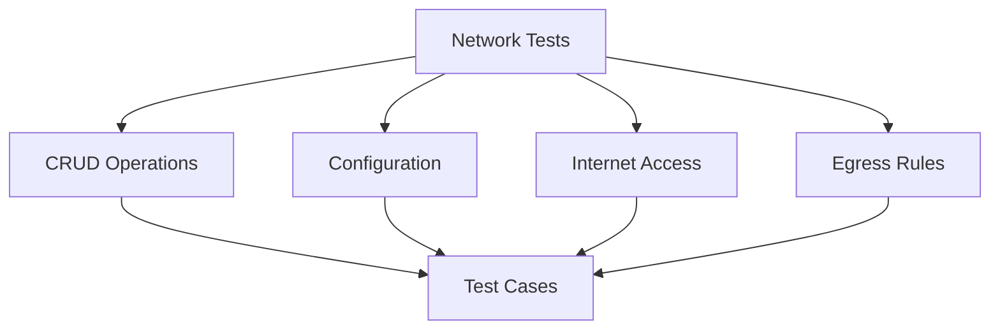

# Network Tests

## Summary


This document specifies the test cases for the Network management functionality of the Cloud Connexa Python client. Networks are a core component that requires comprehensive testing of all operations and configurations.

## Notes for AI
- Test all CRUD operations thoroughly
- Validate network configurations
- Test internet access settings
- Verify egress rule handling
- Check error conditions
- Test concurrent operations
- Validate data models
- Test pagination
- Verify filtering
- Check sorting options

## Test Cases

### 1. Network Creation
```python
def test_network_creation():
    """Test network creation with various configurations."""
    # Test cases:
    # - Basic network creation
    # - Network with custom config
    # - Network with internet access rules
    # - Network with egress rules
    # - Invalid configurations
    # - Duplicate names
    # - Missing required fields
```

### 2. Network Retrieval
```python
def test_network_retrieval():
    """Test network retrieval operations."""
    # Test cases:
    # - Get single network
    # - List all networks
    # - Filter networks
    # - Sort networks
    # - Pagination
    # - Non-existent network
    # - Invalid network ID
```

### 3. Network Update
```python
def test_network_update():
    """Test network update operations."""
    # Test cases:
    # - Update name
    # - Update description
    # - Update internet access
    # - Update egress rules
    # - Partial updates
    # - Invalid updates
    # - Concurrent updates
```

### 4. Network Deletion
```python
def test_network_deletion():
    """Test network deletion operations."""
    # Test cases:
    # - Delete existing network
    # - Delete non-existent network
    # - Delete network with active connectors
    # - Delete network with active users
    # - Concurrent deletions
```

### 5. Network Configuration
```python
def test_network_configuration():
    """Test network configuration operations."""
    # Test cases:
    # - Set internet access rules
    # - Configure egress rules
    # - Update DNS settings
    # - Set routing rules
    # - Invalid configurations
```

## Test Data

### Network Configurations
```python
NETWORK_CONFIGS = {
    "basic": {
        "name": "test-network",
        "description": "Test network"
    },
    "full": {
        "name": "test-network-full",
        "description": "Test network with full config",
        "internet_access": "split_tunnel_on",
        "egress": False,
        "dns_servers": ["8.8.8.8", "8.8.4.4"]
    },
    "invalid": {
        "name": "",  # Invalid empty name
        "description": None  # Invalid null description
    }
}
```

### Network Responses
```python
NETWORK_RESPONSES = {
    "created": {
        "id": "net_123",
        "name": "test-network",
        "description": "Test network",
        "created_at": "2024-01-01T00:00:00Z"
    },
    "updated": {
        "id": "net_123",
        "name": "updated-network",
        "description": "Updated network",
        "updated_at": "2024-01-02T00:00:00Z"
    },
    "error": {
        "error": "invalid_network",
        "error_description": "Invalid network configuration"
    }
}
```

## Mocking Requirements

### Network API Mock
```python
@pytest.fixture
def mock_network_api():
    """Mock network API for tests."""
    with requests_mock.Mocker() as m:
        yield m
```

### Network Storage Mock
```python
@pytest.fixture
def mock_network_storage():
    """Mock network storage for tests."""
    storage = {}
    return storage
```

## Success Criteria
- All CRUD operations work correctly
- Configuration changes are applied properly
- Internet access rules are enforced
- Egress rules are handled correctly
- Error conditions are handled appropriately
- Data validation is thorough
- Concurrent operations work correctly
- Pagination and filtering work as expected 