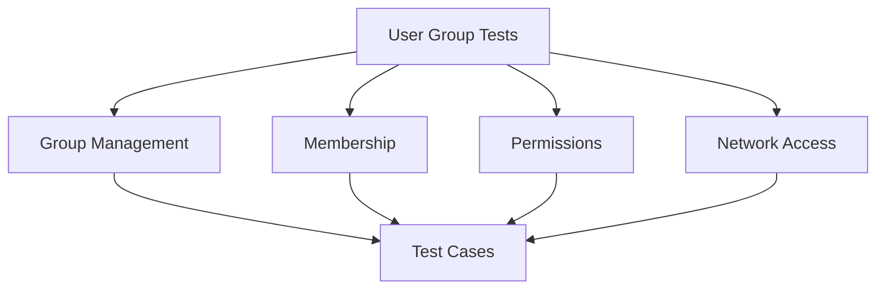

# User Group Tests

## Summary


This document specifies the test cases for the User Group management functionality of the Cloud Connexa Python client. User Groups are a key feature in v1.1.0, with specific endpoints for managing groups and their members.

## Notes for AI
- Test all group operations thoroughly
- Validate group membership handling
- Test permission management
- Verify network access rules
- Check error conditions
- Test concurrent operations
- Validate data models
- Test pagination
- Verify filtering
- Check sorting options

## Test Cases

### 1. Group Creation
```python
def test_group_creation():
    """Test group creation with various configurations."""
    # Test cases:
    # - Basic group creation
    # - Group with custom permissions
    # - Group with network access
    # - Group with member limits
    # - Invalid configurations
    # - Duplicate names
    # - Missing required fields
```

### 2. Group Retrieval
```python
def test_group_retrieval():
    """Test group retrieval operations."""
    # Test cases:
    # - Get single group
    # - List all groups
    # - Filter groups
    # - Sort groups
    # - Pagination
    # - Non-existent group
    # - Invalid group ID
```

### 3. Group Update
```python
def test_group_update():
    """Test group update operations."""
    # Test cases:
    # - Update group name
    # - Update permissions
    # - Update network access
    # - Update member limits
    # - Partial updates
    # - Invalid updates
    # - Concurrent updates
```

### 4. Group Deletion
```python
def test_group_deletion():
    """Test group deletion operations."""
    # Test cases:
    # - Delete existing group
    # - Delete non-existent group
    # - Delete group with active members
    # - Delete group with network access
    # - Concurrent deletions
```

### 5. Membership Management
```python
def test_membership_management():
    """Test group membership operations."""
    # Test cases:
    # - Add user to group
    # - Remove user from group
    # - List group members
    # - Update member permissions
    # - Member limit enforcement
    # - Invalid membership operations
```

## Test Data

### Group Configurations
```python
GROUP_CONFIGS = {
    "basic": {
        "name": "test-group",
        "description": "Test group"
    },
    "full": {
        "name": "test-group-full",
        "description": "Test group with full config",
        "permissions": ["read", "write", "admin"],
        "network_access": ["network_1", "network_2"],
        "member_limit": 100
    },
    "invalid": {
        "name": "",  # Invalid empty name
        "description": None  # Invalid null description
    }
}
```

### Group Responses
```python
GROUP_RESPONSES = {
    "created": {
        "id": "group_123",
        "name": "test-group",
        "description": "Test group",
        "created_at": "2024-01-01T00:00:00Z"
    },
    "updated": {
        "id": "group_123",
        "name": "updated-group",
        "description": "Updated group",
        "updated_at": "2024-01-02T00:00:00Z"
    },
    "error": {
        "error": "invalid_group",
        "error_description": "Invalid group configuration"
    }
}
```

## Mocking Requirements

### Group API Mock
```python
@pytest.fixture
def mock_group_api():
    """Mock group API for tests."""
    with requests_mock.Mocker() as m:
        yield m
```

### Group Storage Mock
```python
@pytest.fixture
def mock_group_storage():
    """Mock group storage for tests."""
    storage = {}
    return storage
```

## Success Criteria
- All group operations work correctly
- Membership management is handled properly
- Permissions are enforced correctly
- Network access rules are applied properly
- Error conditions are handled appropriately
- Data validation is thorough
- Concurrent operations work correctly
- Pagination and filtering work as expected 