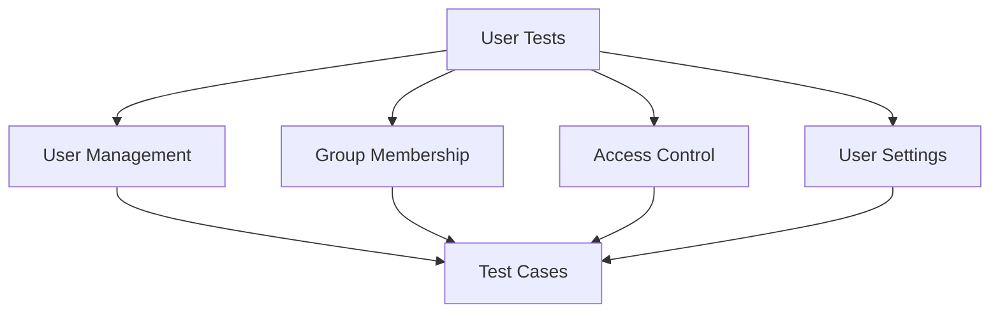

# User Tests

## Summary


This document specifies the test cases for the User management functionality of the Cloud Connexa Python client. User management is critical for controlling access and permissions within networks.

## Notes for AI
- Test all user operations thoroughly
- Validate group membership handling
- Test access control rules
- Verify user settings
- Check error conditions
- Test concurrent operations
- Validate data models
- Test pagination
- Verify filtering
- Check sorting options

## Test Cases

### 1. User Creation
```python
def test_user_creation():
    """Test user creation with various configurations."""
    # Test cases:
    # - Basic user creation
    # - User with custom settings
    # - User with group assignments
    # - User with access rules
    # - Invalid configurations
    # - Duplicate emails
    # - Missing required fields
```

### 2. User Retrieval
```python
def test_user_retrieval():
    """Test user retrieval operations."""
    # Test cases:
    # - Get single user
    # - List all users
    # - Filter users
    # - Sort users
    # - Pagination
    # - Non-existent user
    # - Invalid user ID
```

### 3. User Update
```python
def test_user_update():
    """Test user update operations."""
    # Test cases:
    # - Update user details
    # - Update group membership
    # - Update access rules
    # - Update settings
    # - Partial updates
    # - Invalid updates
    # - Concurrent updates
```

### 4. User Deletion
```python
def test_user_deletion():
    """Test user deletion operations."""
    # Test cases:
    # - Delete existing user
    # - Delete non-existent user
    # - Delete user with active sessions
    # - Delete user with group memberships
    # - Concurrent deletions
```

### 5. Group Membership
```python
def test_group_membership():
    """Test group membership operations."""
    # Test cases:
    # - Add user to group
    # - Remove user from group
    # - List user groups
    # - Update group permissions
    # - Invalid group operations
```

## Test Data

### User Configurations
```python
USER_CONFIGS = {
    "basic": {
        "email": "user@example.com",
        "name": "Test User"
    },
    "full": {
        "email": "user@example.com",
        "name": "Test User",
        "groups": ["admin", "users"],
        "access_rules": ["network_1", "network_2"],
        "settings": {
            "two_factor": True,
            "notifications": True
        }
    },
    "invalid": {
        "email": "invalid-email",  # Invalid email format
        "name": None  # Invalid null name
    }
}
```

### User Responses
```python
USER_RESPONSES = {
    "created": {
        "id": "user_123",
        "email": "user@example.com",
        "name": "Test User",
        "created_at": "2024-01-01T00:00:00Z"
    },
    "updated": {
        "id": "user_123",
        "email": "user@example.com",
        "name": "Updated User",
        "updated_at": "2024-01-02T00:00:00Z"
    },
    "error": {
        "error": "invalid_user",
        "error_description": "Invalid user configuration"
    }
}
```

## Mocking Requirements

### User API Mock
```python
@pytest.fixture
def mock_user_api():
    """Mock user API for tests."""
    with requests_mock.Mocker() as m:
        yield m
```

### User Storage Mock
```python
@pytest.fixture
def mock_user_storage():
    """Mock user storage for tests."""
    storage = {}
    return storage
```

## Success Criteria
- All user operations work correctly
- Group membership is handled properly
- Access control rules are enforced
- User settings are applied correctly
- Error conditions are handled appropriately
- Data validation is thorough
- Concurrent operations work correctly
- Pagination and filtering work as expected 